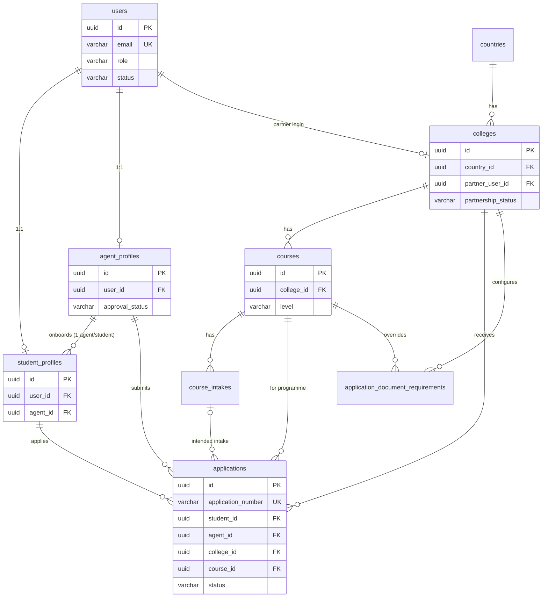
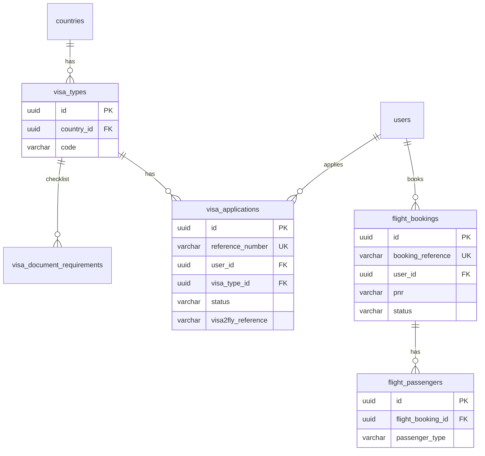
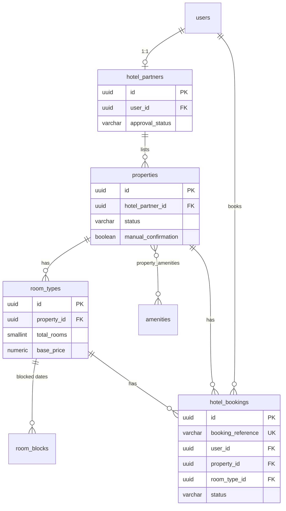
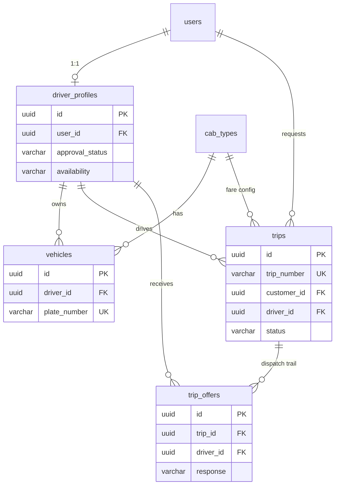
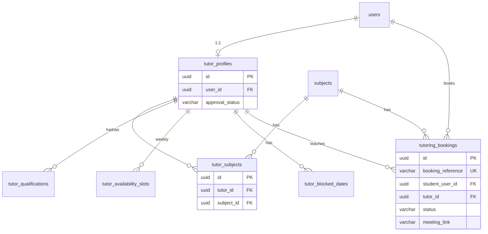
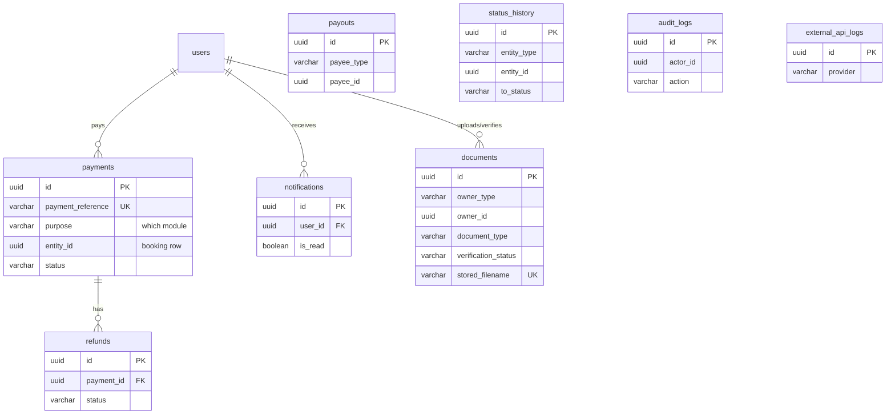

# Edunomo V1/MVP — Official Database Schema Specification

**Project:** Edunomo Multi-Service Platform — V1/MVP (Milestone 1)
**Database:** PostgreSQL 15+ · **Backend:** Python / FastAPI / SQLAlchemy 2.x / Alembic · **Cache:** Redis (limited, non-authoritative)
**Prepared from:** Edunomo module workflow documents v1.0 (Study Abroad, Agent Partner, Visa Services, Flight Booking, Hotel Listings & Booking, Cab Services, Tuition Services) — all authored by TechHelp Solutions, status *Draft*.
**Date:** 2026-08-29 · **Revised:** 2026-08-31 (Rev 1.1) · **Status:** For review by Edunomo product team & backend developers

> Source-of-truth note: every table, status, and rule in this document traces back to the provided workflow documents. Where a workflow document leaves something undecided, it is marked **TBD** here and collected in §12. Nothing marked TBD should be silently decided in code.

> **Rev 1.1 (2026-08-31) — client decisions applied:** ① Agent commissions are settled **internally between Edunomo and agents, entirely off-platform** — the commission table, statuses, and dashboards from the Agent Partner workflow doc are removed from V1 scope. ② Base currency is **INR** (India launch). ③ Payment gateway: **Razorpay preferred, not yet final**. ④ Both **students and agents** can create/submit Study Abroad applications (former TBD-6). Details in §12 "Resolved".

---

## Table of Contents

1. [Database Architecture Overview](#1-database-architecture-overview)
2. [Entity List](#2-entity-list)
3. [Detailed Table Definitions](#3-detailed-table-definitions)
4. [SQLAlchemy Model Mapping](#4-sqlalchemy-model-mapping)
5. [Relationships](#5-relationships)
6. [ER Diagrams](#6-er-diagrams)
7. [Status & Enum Definitions](#7-status--enum-definitions)
8. [Indexing Strategy](#8-indexing-strategy)
9. [Data Integrity & Security](#9-data-integrity--security)
10. [Alembic Migration Strategy](#10-alembic-migration-strategy)
11. [V1 Scope Boundaries](#11-v1-scope-boundaries)
12. [TBD / Decisions Required](#12-tbd--decisions-required)
13. [Final Quality Check](#13-final-quality-check)

---

## 1. Database Architecture Overview

### 1.1 One database, seven domains

Edunomo V1 uses a **single PostgreSQL database, single `public` schema**, organized into logical domains. No microservices, no per-module databases — one FastAPI monolith, one SQLAlchemy metadata, one Alembic migration head. This is the right shape for a small team and can be split later if ever needed.

| Domain | Tables |
| --- | --- |
| **Identity & Access** | `users`, `refresh_tokens`, `user_tokens` |
| **Profiles** | `student_profiles`, `agent_profiles`, `driver_profiles`, `tutor_profiles`, `hotel_partners` |
| **Study Abroad + Agent** | `countries`, `colleges`, `courses`, `course_intakes`, `application_document_requirements`, `applications` |
| **Visa** | `visa_types`, `visa_document_requirements`, `visa_applications` |
| **Flights** | `flight_bookings`, `flight_passengers` |
| **Hotels** | `properties`, `amenities`, `property_amenities`, `room_types`, `room_blocks`, `hotel_bookings` |
| **Cabs** | `cab_types`, `vehicles`, `trips`, `trip_offers` |
| **Tuition** | `subjects`, `tutor_subjects`, `tutor_qualifications`, `tutor_availability_slots`, `tutor_blocked_dates`, `tutoring_bookings` |
| **Payments** | `payments`, `refunds`, `payouts` |
| **Cross-cutting** | `documents`, `notifications`, `status_history`, `audit_logs`, `external_api_logs`, `internal_notes` |

**43 tables total.** Every table exists because a V1 workflow step reads or writes it. (Agent commissions are deliberately absent — settled off-platform per the Rev 1.1 client decision.)

### 1.2 Design conventions

- **Primary keys:** `UUID` generated by PostgreSQL (`gen_random_uuid()`, built into PG 13+). UUIDs appear in mobile-app and portal URLs, so they must be non-guessable — this also directly serves the secure-file-access requirement. Human-facing reference numbers (`APP-2026-000123`, `HTL-…`) are separate `VARCHAR` columns backed by per-module PostgreSQL sequences.
- **Timestamps:** `TIMESTAMPTZ` everywhere; every table has `created_at` (default `now()`); mutable tables also have `updated_at` (maintained by SQLAlchemy `onupdate`).
- **Naming:** `snake_case`, plural table names, `*_id` FK columns, explicit constraint names via SQLAlchemy naming convention (required for clean Alembic autogenerate — see §10).
- **Money:** `NUMERIC(12,2)` + `currency CHAR(3)`. Base currency: **INR** (India launch — client decision, Rev 1.1); single currency in V1 per all module docs. Currency columns default to `'INR'` and are kept so V2 multi-currency needs no schema change.
- **Statuses:** stored as `VARCHAR` with `CHECK` constraints, values governed by Python `enum.Enum` classes shared between models and Pydantic schemas. Rationale: several status lists in the workflow docs are still draft (e.g. flight statuses differ between sections); `CHECK` constraints can be swapped in one small Alembic migration, whereas native PG `ENUM` types make value changes noticeably more ceremony. See §10.3.
- **Soft delete:** only where a workflow requires "hide, don't destroy": `documents.deleted_at` (uploaded files are evidence), plus reversible business flags (`users.status = 'deactivated'`, `properties.status = 'hidden'`, `colleges.is_active`). No global `deleted_at` on every table — that would be over-engineering.
- **JSONB:** used only where the source data is genuinely semi-structured and external: gateway/API responses (`payments.gateway_response`, `external_api_logs`), the Adhiwa flight-offer snapshot (`flight_bookings.itinerary`), and per-visa-type conditional form fields (`visa_applications.extra_fields`). Core business fields are always real columns.

### 1.3 How it maps to FastAPI + SQLAlchemy

```
app/
  core/            # settings, security (JWT), db session, Redis client
  models/          # SQLAlchemy models, one module per domain
    base.py        #   Base = DeclarativeBase + naming_convention + TimestampMixin
    user.py  agent.py  study_abroad.py  visa.py  flight.py
    hotel.py  cab.py  tuition.py  payment.py  shared.py
  schemas/         # Pydantic (mirrors enums from models)
  api/             # routers per module
  services/        # business logic incl. file storage service
alembic/
  versions/        # single migration head
uploads/           # NOT inside app/ — see §9.6 (private filesystem storage)
```

- SQLAlchemy 2.x declarative style (`Mapped[]` / `mapped_column`), sync or async engine (developer's choice; schema is identical).
- All models inherit one `Base` so Alembic autogenerate sees the full metadata.
- FastAPI dependency provides a request-scoped session; RBAC is enforced in dependencies from the JWT `role` claim (`users.role`).

### 1.4 Where Redis fits (and where it doesn't)

Redis is **never the system of record**. V1 uses it only for:

| Use | Why |
| --- | --- |
| Driver live GPS location (5–10 s updates, per cab workflow §11) | Too write-hot for PostgreSQL; last-known position is *also* copied to `driver_profiles.last_lat/last_lng` on a slow cadence so the DB has a fallback. |
| Cab dispatch offer timers (~30 s accept window) | Key TTL drives the "move to next nearest driver" cascade; the durable record of each offer is `trip_offers`. |
| Rate limiting / short-lived OTP cache (optional) | `user_tokens` remains the durable fallback; team can start DB-only and add Redis later. |

### 1.5 File storage architecture (summary — details in §9.6)

Uploaded files live on the **application server filesystem** in a private directory outside the web root. PostgreSQL stores **metadata only** in the generic `documents` table: owner entity, type, original filename, UUID-based stored filename, MIME type, size, relative path, verification status, expiry. Files are served exclusively through authenticated FastAPI endpoints that check ownership via `documents.owner_type/owner_id`. Because the DB stores a *relative* path and an abstract owner reference, migrating to S3/R2 later means changing one storage-service class and adding a `storage_backend` column — no schema redesign.

---

## 2. Entity List

| Entity | Purpose | Main Relationships |
| --- | --- | --- |
| `users` | Single account table for all roles (customer/student, agent, college partner, hotel partner, driver, tutor, admin); login + JWT identity | 1–1 to each profile table; referenced by nearly everything as actor |
| `refresh_tokens` | JWT refresh-token store (hashed), revocation | N–1 `users` |
| `user_tokens` | Email verification, phone OTP, password reset / initial-password-set tokens | N–1 `users` |
| `student_profiles` | Student data for Study Abroad (personal + academic background); carries the **agent link** | 1–1 `users`; N–1 `agent_profiles`; 1–N `applications` |
| `agent_profiles` | Agent Partner registration, approval/KYC state (commissions settled off-platform — Rev 1.1) | 1–1 `users`; 1–N `student_profiles`, `applications` |
| `driver_profiles` | Cab driver onboarding, approval, availability, last location | 1–1 `users`; 1–N `vehicles`, `trips`, `trip_offers` |
| `tutor_profiles` | Tutor marketplace profile, fees, approval | 1–1 `users`; 1–N `tutor_subjects`, `tutor_qualifications`, availability, bookings |
| `hotel_partners` | Property owner/vendor business profile, approval, payout bank details | 1–1 `users`; 1–N `properties` |
| `countries` | Shared country catalogue (study abroad + visa) | 1–N `colleges`, `visa_types` |
| `colleges` | Partner colleges/institutions incl. partnership application state and partner login | N–1 `countries`; 1–1 `users` (partner login); 1–N `courses`, `applications` |
| `courses` | Programmes offered by a college | N–1 `colleges`; 1–N `course_intakes`, `applications` |
| `course_intakes` | Intake periods + application deadlines per course | N–1 `courses` |
| `application_document_requirements` | Configurable document checklist per college/course (mechanism TBD-4) | N–1 `colleges` / `courses` |
| `applications` | Study Abroad application — the **Student → Agent → College/Course** traceability record | N–1 `student_profiles`, `agent_profiles` (nullable), `colleges`, `courses`, `course_intakes` |
| `visa_types` | Visa product per country (Visit/Business/Student) + fees (TBD-8) | N–1 `countries`; 1–N `visa_applications`, `visa_document_requirements` |
| `visa_document_requirements` | Dynamic document checklist per visa type (common items have NULL type) | N–1 `visa_types` |
| `visa_applications` | Visa request: applicant data, status, Visa2fly reference | N–1 `users`, `visa_types` |
| `flight_bookings` | Flight booking record: search snapshot, fare, PNR, Adhiwa refs, status | N–1 `users`; 1–N `flight_passengers` |
| `flight_passengers` | Per-passenger details on a flight booking | N–1 `flight_bookings` |
| `properties` | Hotel/guesthouse listings, status, policies | N–1 `hotel_partners`, `countries`; 1–N `room_types`, `hotel_bookings`; N–N `amenities` |
| `amenities` | Amenity master list (filterable) | N–N `properties` via `property_amenities` |
| `property_amenities` | Join table property ↔ amenity | composite PK |
| `room_types` | Room categories: occupancy, count, base/weekend price | N–1 `properties`; 1–N `room_blocks`, `hotel_bookings` |
| `room_blocks` | Date-range blocks (maintenance/holds); availability = total − booked − blocked | N–1 `room_types` |
| `hotel_bookings` | Hotel booking with guest info and status lifecycle | N–1 `users`, `properties`, `room_types` |
| `cab_types` | Cab category (Economy/Standard) + fare config (base fare, per-km rate) | 1–N `vehicles`, `trips` |
| `vehicles` | Driver's vehicle + plate | N–1 `driver_profiles`, `cab_types` |
| `trips` | Ride request → assignment → completion; fares, cancellation info | N–1 `users` (customer), `driver_profiles`, `vehicles`, `cab_types` |
| `trip_offers` | Sequential dispatch offers to drivers (accept/reject/timeout trail) | N–1 `trips`, `driver_profiles` |
| `subjects` | Subject master list | N–N `tutor_profiles` via `tutor_subjects`; referenced by bookings |
| `tutor_subjects` | Tutor ↔ subject with grade levels, curriculum, per-subject rate | N–1 `tutor_profiles`, `subjects` |
| `tutor_qualifications` | Degrees/certifications rows (files in `documents`) | N–1 `tutor_profiles` |
| `tutor_availability_slots` | Weekly recurring availability | N–1 `tutor_profiles` |
| `tutor_blocked_dates` | Specific blocked dates | N–1 `tutor_profiles` |
| `tutoring_bookings` | Class booking incl. meeting link, hold/capture payment lifecycle | N–1 `users` (student), `tutor_profiles`, `subjects` |
| `payments` | One row per payment attempt across all modules; gateway refs | N–1 `users`; points at booking via `purpose` + `entity_id`; 1–N `refunds` |
| `refunds` | Refund records against a payment | N–1 `payments` |
| `payouts` | Minimal manual payout log (hotel partners, tutors) | polymorphic payee reference |
| `documents` | **Generic file metadata** for every upload on the platform | polymorphic owner (`owner_type` + `owner_id`); N–1 `users` (uploader, verifier) |
| `notifications` | In-app notifications (read/unread) + email-sent marker | N–1 `users`; polymorphic entity reference |
| `status_history` | Generic status-transition trail for applications/bookings/trips | polymorphic entity; N–1 `users` (actor) |
| `audit_logs` | Admin/system action trail | N–1 `users` (actor); polymorphic entity |
| `external_api_logs` | Request/response log for Visa2fly, Adhiwa, payment gateway | polymorphic entity |
| `internal_notes` | Admin support notes on records (required for flight bookings; reusable) | polymorphic entity; N–1 `users` (author) |

---

## 3. Detailed Table Definitions

Legend: **PK** primary key · **FK** foreign key · **UQ** unique · **CK** check constraint · **IX** noteworthy index (full index list in §8). All `id` columns are `UUID` `DEFAULT gen_random_uuid()`. `created_at`/`updated_at` are `TIMESTAMPTZ NOT NULL DEFAULT now()` and are omitted from the tables below unless something is unusual.

### 3.1 Identity & Access

#### `users`

One account per person per role. V1 assumption: **one role per account** (no workflow describes a multi-role user); revisit in V2 with a `user_roles` join table if needed (TBD-15).

| Column | PostgreSQL Type | Nullable | Default | Key/Constraint | Description |
| --- | --- | --- | --- | --- | --- |
| id | UUID | no | gen_random_uuid() | PK | |
| email | VARCHAR(255) | no | | UQ (functional: `lower(email)`) | Login identifier |
| phone | VARCHAR(20) | yes | | UQ partial (`WHERE phone IS NOT NULL`) | E.164; required in practice for customers/drivers |
| password_hash | VARCHAR(255) | no | | | bcrypt/argon2 hash — never the raw password |
| full_name | VARCHAR(150) | no | | | |
| role | VARCHAR(20) | no | | CK `user_role` | `customer` \| `agent` \| `college_partner` \| `hotel_partner` \| `driver` \| `tutor` \| `admin` |
| status | VARCHAR(24) | no | 'pending_verification' | CK `user_status` | `pending_verification` \| `active` \| `deactivated` \| `suspended` |
| email_verified_at | TIMESTAMPTZ | yes | | | Set by verification-link flow |
| phone_verified_at | TIMESTAMPTZ | yes | | | Set by OTP flow (visa module requires email/phone verification) |
| last_login_at | TIMESTAMPTZ | yes | | | |

Notes: "Students" are `role = 'customer'` users — the same customer account uses all consumer modules (visa, flights, hotels, cabs, tuition); a `student_profiles` row is created when they enter the Study Abroad flow. Admin accounts are created internally only (visa doc: "Admin accounts will be created and managed internally").

#### `refresh_tokens`

| Column | PostgreSQL Type | Nullable | Default | Key/Constraint | Description |
| --- | --- | --- | --- | --- | --- |
| id | UUID | no | gen_random_uuid() | PK | |
| user_id | UUID | no | | FK → users.id ON DELETE CASCADE, IX | |
| token_hash | VARCHAR(255) | no | | UQ | SHA-256 of the refresh token — raw token never stored |
| expires_at | TIMESTAMPTZ | no | | | |
| revoked_at | TIMESTAMPTZ | yes | | | Set on logout / rotation / admin deactivation |
| user_agent | VARCHAR(255) | yes | | | Diagnostic |
| ip_address | INET | yes | | | Diagnostic |

#### `user_tokens`

Single-use tokens for account flows (durable fallback even if Redis is added later).

| Column | PostgreSQL Type | Nullable | Default | Key/Constraint | Description |
| --- | --- | --- | --- | --- | --- |
| id | UUID | no | gen_random_uuid() | PK | |
| user_id | UUID | no | | FK → users.id ON DELETE CASCADE, IX | |
| purpose | VARCHAR(30) | no | | CK `token_purpose` | `email_verification` \| `phone_otp` \| `password_reset` \| `initial_password_set` |
| token_hash | VARCHAR(255) | no | | | Hash of token/OTP |
| expires_at | TIMESTAMPTZ | no | | | |
| used_at | TIMESTAMPTZ | yes | | | Single use |

`initial_password_set` covers every "credentials issued" flow in the workflows: agent-onboarded students, approved agents, approved college partners, approved hotel partners, approved drivers.

### 3.2 Profile tables

#### `student_profiles`

| Column | PostgreSQL Type | Nullable | Default | Key/Constraint | Description |
| --- | --- | --- | --- | --- | --- |
| id | UUID | no | gen_random_uuid() | PK | |
| user_id | UUID | no | | FK → users.id ON DELETE CASCADE, UQ | 1–1 with the customer account |
| agent_id | UUID | yes | | FK → agent_profiles.id ON DELETE RESTRICT, IX | **The student–agent link.** One agent per student, set at onboarding (Agent doc: "Each student can only be linked to one agent"). NULL = direct student. |
| date_of_birth | DATE | yes | | | |
| nationality | VARCHAR(100) | yes | | | |
| passport_number | VARCHAR(50) | yes | | | PII — see §9.4 |
| highest_qualification | VARCHAR(150) | yes | | | Application form, Study Abroad step 6 |
| institution_name | VARCHAR(200) | yes | | | |
| graduation_year | SMALLINT | yes | | | |
| grade_gpa | VARCHAR(50) | yes | | | Free-form ("3.6 GPA", "82%") |
| english_test_type | VARCHAR(30) | yes | | | `IELTS` \| `TOEFL` \| `self_declared` \| other (app-level enum) |
| english_test_score | VARCHAR(20) | yes | | | |

Design note: academic-background fields live on the profile (reused across applications); per-application text (personal statement, preferences) lives on `applications`. V1 does not snapshot profile data into applications — acceptable at MVP scale, revisit in V2 if colleges need immutable submissions.

#### `agent_profiles`

| Column | PostgreSQL Type | Nullable | Default | Key/Constraint | Description |
| --- | --- | --- | --- | --- | --- |
| id | UUID | no | gen_random_uuid() | PK | |
| user_id | UUID | no | | FK → users.id ON DELETE CASCADE, UQ | |
| agency_name | VARCHAR(200) | yes | | | NULL for individual counselors |
| region | VARCHAR(100) | yes | | | From registration form ("name, contact details, region") |
| address | TEXT | yes | | | |
| approval_status | VARCHAR(20) | no | 'pending' | CK `agent_approval_status`, IX | `pending` \| `approved` \| `rejected` \| `deactivated` |
| rejection_reason | TEXT | yes | | | "rejection notification with optional reason" |
| approved_by | UUID | yes | | FK → users.id ON DELETE SET NULL | Admin actor |
| approved_at | TIMESTAMPTZ | yes | | | |
| deactivated_at | TIMESTAMPTZ | yes | | | Admin "deactivate agents if needed" |

KYC files (ID, credentials) → `documents` with `owner_type='agent_profile'`.

#### `driver_profiles`

| Column | PostgreSQL Type | Nullable | Default | Key/Constraint | Description |
| --- | --- | --- | --- | --- | --- |
| id | UUID | no | gen_random_uuid() | PK | |
| user_id | UUID | no | | FK → users.id ON DELETE CASCADE, UQ | |
| address | TEXT | yes | | | Onboarding "Personal Information" |
| date_of_birth | DATE | yes | | | |
| emergency_contact_name | VARCHAR(150) | yes | | | |
| emergency_contact_phone | VARCHAR(20) | yes | | | |
| approval_status | VARCHAR(20) | no | 'pending' | CK `driver_approval_status`, IX | `pending` \| `approved` \| `rejected` (rejected may resubmit documents) |
| rejection_reason | TEXT | yes | | | |
| account_status | VARCHAR(20) | no | 'active' | CK `driver_account_status` | `active` \| `suspended` \| `deactivated` (admin actions) |
| availability | VARCHAR(10) | no | 'offline' | CK `driver_availability`, IX | `online` \| `offline` toggle |
| last_lat | NUMERIC(9,6) | yes | | | Last known location (authoritative live copy in Redis) |
| last_lng | NUMERIC(9,6) | yes | | | |
| location_updated_at | TIMESTAMPTZ | yes | | | |
| is_flagged | BOOLEAN | no | false | | "Repeated cancellations flagged for admin review" |
| approved_by | UUID | yes | | FK → users.id ON DELETE SET NULL | |
| approved_at | TIMESTAMPTZ | yes | | | |

Driver documents (national ID/passport, licence, RC, insurance, profile photo, vehicle photo) → `documents` (`owner_type='driver_profile'` or `'vehicle'`). Driver star ratings: **not modelled in V1** (cab doc: "Basic star rating only, if any" — TBD-11d).

#### `tutor_profiles`

| Column | PostgreSQL Type | Nullable | Default | Key/Constraint | Description |
| --- | --- | --- | --- | --- | --- |
| id | UUID | no | gen_random_uuid() | PK | |
| user_id | UUID | no | | FK → users.id ON DELETE CASCADE, UQ | |
| bio | TEXT | yes | | | "Short bio / teaching philosophy" |
| location | VARCHAR(150) | yes | | | |
| timezone | VARCHAR(50) | yes | | | IANA name, e.g. `Asia/Kolkata` |
| languages | TEXT[] | yes | | | Languages of instruction |
| years_experience | SMALLINT | yes | | | |
| experience_summary | TEXT | yes | | | Previous roles / institutions |
| specialisations | TEXT | yes | | | |
| default_hourly_rate | NUMERIC(12,2) | yes | | | Uniform rate; per-subject override on `tutor_subjects` |
| currency | CHAR(3) | yes | 'INR' | | INR — single market in V1 (Rev 1.1) |
| session_durations | SMALLINT[] | no | '{60}' | | Offered durations in minutes, e.g. `{45,60,90}` |
| approval_status | VARCHAR(20) | no | 'pending' | CK `tutor_approval_status`, IX | `pending` \| `info_requested` \| `approved` \| `rejected` \| `suspended` \| `deactivated` |
| rejection_reason | TEXT | yes | | | |
| approved_by | UUID | yes | | FK → users.id ON DELETE SET NULL | |
| approved_at | TIMESTAMPTZ | yes | | | |

Profile photo + ID + certificates + background check → `documents` (`owner_type='tutor_profile'`).

#### `hotel_partners`

| Column | PostgreSQL Type | Nullable | Default | Key/Constraint | Description |
| --- | --- | --- | --- | --- | --- |
| id | UUID | no | gen_random_uuid() | PK | |
| user_id | UUID | no | | FK → users.id ON DELETE CASCADE, UQ | |
| business_name | VARCHAR(200) | yes | | | |
| contact_person | VARCHAR(150) | yes | | | |
| approval_status | VARCHAR(20) | no | 'pending' | CK `partner_approval_status`, IX | `pending` \| `approved` \| `rejected` \| `suspended` (rejected may reapply) |
| rejection_reason | TEXT | yes | | | Sent with rejection notice |
| approved_by | UUID | yes | | FK → users.id ON DELETE SET NULL | |
| approved_at | TIMESTAMPTZ | yes | | | |
| bank_account_name | VARCHAR(150) | yes | | | Payout details collected at onboarding |
| bank_account_number | VARCHAR(64) | yes | | | **Sensitive** — see §9.4 (app-level encryption recommended) |
| bank_name | VARCHAR(150) | yes | | | |
| bank_branch_code | VARCHAR(30) | yes | | | IFSC/sort/routing — label per market |
| is_flagged | BOOLEAN | no | false | | "Admin flags partner account if cancellations are excessive" |

KYC (business registration, ID proof, ownership/lease doc) → `documents` (`owner_type='hotel_partner'`).

### 3.3 Study Abroad + Agent Partner

#### `countries`

| Column | PostgreSQL Type | Nullable | Default | Key/Constraint | Description |
| --- | --- | --- | --- | --- | --- |
| id | UUID | no | gen_random_uuid() | PK | |
| name | VARCHAR(100) | no | | UQ | |
| iso_code | CHAR(2) | no | | UQ | ISO 3166-1 alpha-2 |
| is_active | BOOLEAN | no | true | | Supported destination list is TBD-8b (visa) |

#### `colleges`

Combines the college record and its partnership application state (a separate "college_applications" table would duplicate every field for no V1 benefit).

| Column | PostgreSQL Type | Nullable | Default | Key/Constraint | Description |
| --- | --- | --- | --- | --- | --- |
| id | UUID | no | gen_random_uuid() | PK | |
| partner_user_id | UUID | yes | | FK → users.id ON DELETE SET NULL, UQ | College Partner login (role `college_partner`); NULL until account activated |
| name | VARCHAR(200) | no | | IX | |
| country_id | UUID | no | | FK → countries.id ON DELETE RESTRICT, IX | |
| city | VARCHAR(100) | yes | | | Search filter "Country / City" |
| address | TEXT | yes | | | |
| website | VARCHAR(255) | yes | | | |
| description | TEXT | yes | | | College overview |
| contact_person | VARCHAR(150) | yes | | | Partnership application field |
| contact_email | VARCHAR(255) | yes | | | |
| contact_phone | VARCHAR(20) | yes | | | |
| partnership_status | VARCHAR(20) | no | 'pending' | CK `partnership_status`, IX | `pending` \| `approved` \| `rejected` |
| rejection_reason | TEXT | yes | | | Emailed "with a brief reason" |
| approved_by | UUID | yes | | FK → users.id ON DELETE SET NULL | |
| approved_at | TIMESTAMPTZ | yes | | | |
| is_active | BOOLEAN | no | true | IX | Admin deactivate = hide from student-facing listings |

Logo + accreditation certificate + registration documents + representative ID → `documents` (`owner_type='college'`).

#### `courses`

| Column | PostgreSQL Type | Nullable | Default | Key/Constraint | Description |
| --- | --- | --- | --- | --- | --- |
| id | UUID | no | gen_random_uuid() | PK | |
| college_id | UUID | no | | FK → colleges.id ON DELETE CASCADE, IX | |
| title | VARCHAR(200) | no | | IX | |
| level | VARCHAR(30) | no | | CK `course_level` | `bachelor` \| `master` \| `diploma` \| `phd` \| `certificate` \| `other` (doc says "Bachelor/Master/etc." — final list TBD-16) |
| duration | VARCHAR(50) | yes | | | Display string, e.g. "3 years" |
| tuition_fee | NUMERIC(12,2) | yes | | IX | Filterable "Tuition fee range" |
| currency | CHAR(3) | yes | | | |
| entry_requirements | TEXT | yes | | | |
| available_seats | INTEGER | yes | | | Informational in V1 (no seat locking) |
| is_active | BOOLEAN | no | true | | |

UQ `(id, college_id)` — enables the composite FK from `applications` guaranteeing course-belongs-to-college (§9.1).

#### `course_intakes`

| Column | PostgreSQL Type | Nullable | Default | Key/Constraint | Description |
| --- | --- | --- | --- | --- | --- |
| id | UUID | no | gen_random_uuid() | PK | |
| course_id | UUID | no | | FK → courses.id ON DELETE CASCADE, IX | |
| intake_month | SMALLINT | no | | CK 1–12 | Filter "Intake period (e.g. Jan, Sep)" |
| year | SMALLINT | yes | | | NULL = recurring every year |
| application_deadline | DATE | yes | | | Shown on college detail page |
| is_open | BOOLEAN | no | true | | |

UQ `(course_id, intake_month, year)`.

#### `application_document_requirements`

Document checklist "configured per college/course" (Study Abroad step 7). Whether fixed per college/course or admin-set is **TBD-4** — this shape supports both.

| Column | PostgreSQL Type | Nullable | Default | Key/Constraint | Description |
| --- | --- | --- | --- | --- | --- |
| id | UUID | no | gen_random_uuid() | PK | |
| college_id | UUID | yes | | FK → colleges.id ON DELETE CASCADE, IX | NULL + NULL course = platform default set |
| course_id | UUID | yes | | FK → courses.id ON DELETE CASCADE, IX | Course-level overrides college-level |
| document_type | VARCHAR(64) | no | | | e.g. `passport`, `transcript`, `english_test`, `personal_statement`, `lor` |
| label | VARCHAR(150) | no | | | Shown to student/agent |
| is_required | BOOLEAN | no | true | | Doc: college-specific extras are "optional/conditional" |
| is_active | BOOLEAN | no | true | | |

#### `applications`

The central Study Abroad record. **Traceability: `student_id` → (`student_profiles.agent_id` =) `agent_id` → `college_id`/`course_id`.** `agent_id` is stored on the application itself (not only on the student) so history stays correct even if a student's agent link ever changes.

| Column | PostgreSQL Type | Nullable | Default | Key/Constraint | Description |
| --- | --- | --- | --- | --- | --- |
| id | UUID | no | gen_random_uuid() | PK | |
| application_number | VARCHAR(20) | no | | UQ | Human-readable, e.g. `APP-2026-000123` (per-module sequence) |
| student_id | UUID | no | | FK → student_profiles.id ON DELETE RESTRICT, IX | |
| agent_id | UUID | yes | | FK → agent_profiles.id ON DELETE RESTRICT, IX | Submitting agent. NULL = student-created application — **both paths are enabled in V1** (resolved, former TBD-6) |
| college_id | UUID | no | | FK → colleges.id ON DELETE RESTRICT, IX | |
| course_id | UUID | no | | FK (course_id, college_id) → courses (id, college_id) ON DELETE RESTRICT, IX | Composite FK guarantees the course belongs to the college |
| intake_id | UUID | yes | | FK → course_intakes.id ON DELETE SET NULL | Intended intake |
| status | VARCHAR(30) | no | 'draft' | CK `application_status`, IX | `draft` \| `submitted` \| `under_review` \| `documents_required` \| `submitted_to_college` \| `accepted` \| `rejected` \| `completed` |
| personal_statement | TEXT | yes | | | Application form field |
| preference_notes | TEXT | yes | | | "preferences" from agent form |
| info_request_note | TEXT | yes | | | Latest college/admin "what's missing" note (full trail in `status_history`) |
| rejection_reason | TEXT | yes | | | Optional per doc |
| terms_accepted_at | TIMESTAMPTZ | yes | | | Student T&C acceptance (direct flow) |
| created_by | UUID | no | | FK → users.id ON DELETE RESTRICT | Agent user or student user who created it |
| submitted_at | TIMESTAMPTZ | yes | | | |
| forwarded_at | TIMESTAMPTZ | yes | | | Admin "forward to college" |
| decided_at | TIMESTAMPTZ | yes | | | Accepted/rejected timestamp |
| completed_at | TIMESTAMPTZ | yes | | | Admin marks completed |

Application documents → `documents` (`owner_type='application'`). Status transitions → `status_history` (`entity_type='application'`), including which admin changed what — this is the "admin review information".

**Agent commissions — out of system scope (Rev 1.1).** The Agent Partner workflow doc described commission records (Pending → Approved → Paid), but Edunomo has decided commissions will be **settled internally between Edunomo and agents, entirely outside the platform**. No commission tables, statuses, notifications, or dashboard widgets exist in V1. If commission tracking is ever brought in-system, it is a purely additive change (one table keyed by `applications.id` + `agent_id` — the traceability chain above already provides everything a commission calculation would need).

### 3.4 Visa Services

#### `visa_types`

| Column | PostgreSQL Type | Nullable | Default | Key/Constraint | Description |
| --- | --- | --- | --- | --- | --- |
| id | UUID | no | gen_random_uuid() | PK | |
| country_id | UUID | no | | FK → countries.id ON DELETE RESTRICT, IX | Destination country |
| code | VARCHAR(20) | no | | CK `visa_type_code`; UQ (country_id, code) | `visit` \| `business` \| `student` (V1 supports exactly these three) |
| name | VARCHAR(100) | no | | | Display name |
| description | TEXT | yes | | | |
| service_charge | NUMERIC(12,2) | yes | | | Edunomo service charge — **TBD-8a** (fee structure from ops team) |
| visa_fee | NUMERIC(12,2) | yes | | | "if applicable" |
| currency | CHAR(3) | yes | | | |
| is_active | BOOLEAN | no | true | | Admin "manage visa types / destinations" |

#### `visa_document_requirements`

Dynamic checklist per destination + visa type (visa doc §7).

| Column | PostgreSQL Type | Nullable | Default | Key/Constraint | Description |
| --- | --- | --- | --- | --- | --- |
| id | UUID | no | gen_random_uuid() | PK | |
| visa_type_id | UUID | yes | | FK → visa_types.id ON DELETE CASCADE, IX | NULL = common to all visa types (passport, photo, proof of payment) |
| document_type | VARCHAR(64) | no | | | e.g. `passport`, `photo`, `bank_statement`, `acceptance_letter` |
| label | VARCHAR(150) | no | | | e.g. "Bank statement (last 3 months)" |
| is_required | BOOLEAN | no | true | | e.g. travel insurance "where applicable" → false |
| notes | VARCHAR(255) | yes | | | e.g. "minimum 6 months validity" |
| is_active | BOOLEAN | no | true | | |

#### `visa_applications`

| Column | PostgreSQL Type | Nullable | Default | Key/Constraint | Description |
| --- | --- | --- | --- | --- | --- |
| id | UUID | no | gen_random_uuid() | PK | |
| reference_number | VARCHAR(20) | no | | UQ | Edunomo Application Reference Number (issued at submission) |
| user_id | UUID | no | | FK → users.id ON DELETE RESTRICT, IX | Customer |
| visa_type_id | UUID | no | | FK → visa_types.id ON DELETE RESTRICT, IX | Carries the destination country |
| full_name | VARCHAR(150) | no | | | Form fields (visa doc §3 step 4) |
| date_of_birth | DATE | yes | | | |
| nationality | VARCHAR(100) | yes | | | |
| passport_number | VARCHAR(50) | yes | | | PII — §9.4 |
| passport_expiry | DATE | yes | | | Checklist rule: ≥ 6 months validity (app-level validation) |
| contact_email | VARCHAR(255) | yes | | | |
| contact_phone | VARCHAR(20) | yes | | | |
| travel_date_from | DATE | yes | | | |
| travel_date_to | DATE | yes | | | |
| purpose_of_travel | TEXT | yes | | | |
| extra_fields | JSONB | yes | | | Per-visa-type conditional fields (e.g. `{"university_name": "…"}` for Student) |
| status | VARCHAR(30) | no | 'draft' | CK `visa_application_status`, IX | `draft` \| `submitted` \| `under_review` \| `action_required` \| `documents_received` \| `processing` \| `approved` \| `rejected` \| `on_hold` |
| action_required_note | TEXT | yes | | | What the admin asked the customer to fix |
| processing_mode | VARCHAR(10) | yes | | CK (`manual`,`api`) | Which path was used (Visa2fly availability is TBD-7) |
| visa2fly_reference | VARCHAR(100) | yes | | IX | Reference returned by Visa2fly (relationship to Edunomo ref TBD-7b) |
| outcome_note | TEXT | yes | | | Rejection reason / approval note communicated to customer |
| submitted_at | TIMESTAMPTZ | yes | | | Set only after payment confirmed (hard gate) |
| decided_at | TIMESTAMPTZ | yes | | | |

Draft persistence ("save progress and return later") = row in `status='draft'`. Documents → `documents` (`owner_type='visa_application'`). Payment → `payments` (`purpose='visa_application'`). API request/response logging → `external_api_logs` (`provider='visa2fly'`).

### 3.5 Flights

#### `flight_bookings`

Search requests are **not persisted** (stateless pass-through to Adhiwa); a booking row is created when the customer proceeds to payment. Full offer payload is snapshotted in `itinerary` so support can always see what was sold.

| Column | PostgreSQL Type | Nullable | Default | Key/Constraint | Description |
| --- | --- | --- | --- | --- | --- |
| id | UUID | no | gen_random_uuid() | PK | |
| booking_reference | VARCHAR(20) | no | | UQ | Edunomo reference, e.g. `FLT-2026-000045` |
| user_id | UUID | no | | FK → users.id ON DELETE RESTRICT, IX | Customer |
| trip_type | VARCHAR(10) | no | | CK (`one_way`,`round_trip`) | |
| origin | VARCHAR(100) | no | | | City/airport code |
| destination | VARCHAR(100) | no | | | |
| departure_date | DATE | no | | | |
| return_date | DATE | yes | | CK: required iff round_trip | |
| cabin_class | VARCHAR(20) | yes | | | `economy` \| `business` — "if supported by Adhiwa API" |
| adults | SMALLINT | no | 1 | CK ≥ 1 | |
| children | SMALLINT | no | 0 | CK ≥ 0 | |
| infants | SMALLINT | no | 0 | CK ≥ 0 | |
| airline | VARCHAR(100) | yes | | | From selected offer |
| flight_number | VARCHAR(20) | yes | | | |
| itinerary | JSONB | yes | | | Full Adhiwa offer snapshot (times, duration, stops, segments, refundability, policy) |
| base_fare | NUMERIC(12,2) | yes | | | Fare breakdown: base + taxes + fees |
| taxes | NUMERIC(12,2) | yes | | | |
| fees | NUMERIC(12,2) | yes | | | |
| total_amount | NUMERIC(12,2) | no | | | |
| currency | CHAR(3) | no | | | |
| is_refundable | BOOLEAN | yes | | | "if provided by API" |
| pnr | VARCHAR(20) | yes | | IX | PNR from airline/GDS via Adhiwa — store & display only |
| adhiwa_reference | VARCHAR(100) | yes | | IX | Adhiwa booking id (if distinct from PNR — TBD-9) |
| status | VARCHAR(30) | no | 'payment_pending' | CK `flight_booking_status`, IX | See §7 |
| failure_reason | TEXT | yes | | | For `failed` (post-payment API error → manual review) |
| refund_amount | NUMERIC(12,2) | yes | | | As returned by Adhiwa on cancellation |
| cancelled_at | TIMESTAMPTZ | yes | | | |
| refunded_at | TIMESTAMPTZ | yes | | | |

E-ticket/itinerary PDF (if delivered as a file) → `documents` (`owner_type='flight_booking'`). Admin internal notes → `internal_notes`. API calls → `external_api_logs` (`provider='adhiwa'`).

#### `flight_passengers`

| Column | PostgreSQL Type | Nullable | Default | Key/Constraint | Description |
| --- | --- | --- | --- | --- | --- |
| id | UUID | no | gen_random_uuid() | PK | |
| flight_booking_id | UUID | no | | FK → flight_bookings.id ON DELETE CASCADE, IX | |
| full_name | VARCHAR(150) | no | | | "as per passport/ID" |
| date_of_birth | DATE | no | | | |
| nationality | VARCHAR(100) | yes | | | |
| passport_number | VARCHAR(50) | yes | | | "if required by airline" — PII §9.4 |
| passenger_type | VARCHAR(10) | no | 'adult' | CK (`adult`,`child`,`infant`) | |
| is_lead | BOOLEAN | no | false | | Lead passenger carries contact details |
| email | VARCHAR(255) | yes | | | Lead only |
| phone | VARCHAR(20) | yes | | | Lead only |

### 3.6 Hotels

#### `properties`

| Column | PostgreSQL Type | Nullable | Default | Key/Constraint | Description |
| --- | --- | --- | --- | --- | --- |
| id | UUID | no | gen_random_uuid() | PK | |
| hotel_partner_id | UUID | no | | FK → hotel_partners.id ON DELETE RESTRICT, IX | |
| name | VARCHAR(200) | no | | IX | |
| description | TEXT | yes | | | |
| property_type | VARCHAR(30) | no | | CK `property_type` | `hotel` \| `guesthouse` \| `serviced_apartment` \| `other` |
| star_rating | SMALLINT | yes | | CK 1–5 | "star/category rating" — filterable |
| address | TEXT | yes | | | |
| city | VARCHAR(100) | no | | IX | Search "destination (city or area)" |
| country_id | UUID | yes | | FK → countries.id ON DELETE RESTRICT | |
| latitude | NUMERIC(9,6) | yes | | | Location map |
| longitude | NUMERIC(9,6) | yes | | | |
| check_in_time | TIME | yes | | | Policy display |
| check_out_time | TIME | yes | | | |
| cancellation_policy | TEXT | yes | | | Shown before customer cancels |
| free_cancellation_hours | INTEGER | yes | | | Window before check-in with full refund — **value TBD-12b** |
| manual_confirmation | BOOLEAN | no | false | | Per-hotel "manual confirmation mode" (mechanics TBD-12c) |
| status | VARCHAR(20) | no | 'draft' | CK `property_status`, IX | `draft` \| `pending_review` \| `active` \| `hidden` \| `suspended` |
| is_featured | BOOLEAN | no | false | | Admin "basic manual flagging" |
| images_reviewed | BOOLEAN | no | false | | Admin reviews images before first go-live ("first upload only") |

Images → `documents` (`owner_type='property'`, `document_type='property_image'`, ordered by `sort_order`). Min 3 images for visibility = application-level rule.

#### `amenities`

| Column | PostgreSQL Type | Nullable | Default | Key/Constraint | Description |
| --- | --- | --- | --- | --- | --- |
| id | UUID | no | gen_random_uuid() | PK | |
| name | VARCHAR(100) | no | | UQ | WiFi, parking, pool, breakfast, … |
| is_active | BOOLEAN | no | true | | |

#### `property_amenities`

| Column | PostgreSQL Type | Nullable | Default | Key/Constraint | Description |
| --- | --- | --- | --- | --- | --- |
| property_id | UUID | no | | PK (composite), FK → properties.id ON DELETE CASCADE | |
| amenity_id | UUID | no | | PK (composite), FK → amenities.id ON DELETE CASCADE | |

Property-level amenities are a join table because customers **filter** by them. Room-level amenities are display-only → kept as JSONB on `room_types`.

#### `room_types`

| Column | PostgreSQL Type | Nullable | Default | Key/Constraint | Description |
| --- | --- | --- | --- | --- | --- |
| id | UUID | no | gen_random_uuid() | PK | |
| property_id | UUID | no | | FK → properties.id ON DELETE CASCADE, IX | |
| name | VARCHAR(100) | no | | | "Standard Single", "Deluxe Double", "Suite" |
| description | TEXT | yes | | | |
| bed_type | VARCHAR(50) | yes | | | |
| max_occupancy | SMALLINT | no | 1 | CK ≥ 1 | |
| total_rooms | SMALLINT | no | | CK ≥ 0 | "total room count per type" |
| base_price | NUMERIC(12,2) | no | | | Nightly price |
| weekend_price | NUMERIC(12,2) | yes | | | Optional (weekend definition TBD-12d) |
| amenities | JSONB | yes | | | Display-only room amenities list |
| is_active | BOOLEAN | no | true | | |

#### `room_blocks`

Availability model: **available = total_rooms − confirmed-booking overlap − blocked**, computed at query time. No per-day inventory rows in V1; no hold before payment ("No hold is placed on room inventory until payment succeeds").

| Column | PostgreSQL Type | Nullable | Default | Key/Constraint | Description |
| --- | --- | --- | --- | --- | --- |
| id | UUID | no | gen_random_uuid() | PK | |
| room_type_id | UUID | no | | FK → room_types.id ON DELETE CASCADE, IX | |
| start_date | DATE | no | | CK start ≤ end | Inclusive |
| end_date | DATE | no | | | Inclusive |
| rooms_blocked | SMALLINT | yes | | | NULL = block all rooms of this type |
| reason | VARCHAR(100) | yes | | | "maintenance or personal holds" |
| created_by | UUID | yes | | FK → users.id ON DELETE SET NULL | Partner or admin |

#### `hotel_bookings`

| Column | PostgreSQL Type | Nullable | Default | Key/Constraint | Description |
| --- | --- | --- | --- | --- | --- |
| id | UUID | no | gen_random_uuid() | PK | |
| booking_reference | VARCHAR(20) | no | | UQ | Generated at confirmation |
| user_id | UUID | no | | FK → users.id ON DELETE RESTRICT, IX | Customer |
| property_id | UUID | no | | FK → properties.id ON DELETE RESTRICT, IX | |
| room_type_id | UUID | no | | FK → room_types.id ON DELETE RESTRICT, IX | |
| check_in_date | DATE | no | | CK check_out > check_in | |
| check_out_date | DATE | no | | | |
| nights | SMALLINT | no | | | Stored (= check_out − check_in) for reporting |
| num_rooms | SMALLINT | no | 1 | CK ≥ 1 | |
| room_rate | NUMERIC(12,2) | no | | | **Price snapshot** at booking time (partner can change prices later) |
| total_amount | NUMERIC(12,2) | no | | | nights × rate × rooms |
| currency | CHAR(3) | no | | | |
| guest_name | VARCHAR(150) | no | | | Lead guest |
| guest_phone | VARCHAR(20) | yes | | | |
| guest_email | VARCHAR(255) | yes | | | |
| special_requests | TEXT | yes | | | Optional free text |
| status | VARCHAR(20) | no | 'pending' | CK `hotel_booking_status`, IX | `pending` \| `confirmed` \| `rejected` \| `checked_in` \| `checked_out` \| `completed` \| `cancelled` |
| cancelled_by | VARCHAR(10) | yes | | CK (`customer`,`partner`,`admin`) | |
| cancellation_reason | TEXT | yes | | | Partner cancellations need admin approval (workflow rule) |
| refund_amount | NUMERIC(12,2) | yes | | | Full/partial/none per policy |
| checked_in_at | TIMESTAMPTZ | yes | | | |
| checked_out_at | TIMESTAMPTZ | yes | | | |
| completed_at | TIMESTAMPTZ | yes | | | Who/when marks completed is TBD-12e |
| cancelled_at | TIMESTAMPTZ | yes | | | |

Payment → `payments` (`purpose='hotel_booking'`); refunds → `refunds`; payout → `payouts`.

### 3.7 Cab Services

#### `cab_types`

| Column | PostgreSQL Type | Nullable | Default | Key/Constraint | Description |
| --- | --- | --- | --- | --- | --- |
| id | UUID | no | gen_random_uuid() | PK | |
| name | VARCHAR(50) | no | | UQ | "Economy", "Standard" — V1: 1–2 types max |
| description | VARCHAR(255) | yes | | | |
| base_fare | NUMERIC(10,2) | no | | | Fare = base fare + distance × per-km rate |
| per_km_rate | NUMERIC(10,2) | no | | | Flat rate per km (no surge) |
| is_active | BOOLEAN | no | true | | |

#### `vehicles`

| Column | PostgreSQL Type | Nullable | Default | Key/Constraint | Description |
| --- | --- | --- | --- | --- | --- |
| id | UUID | no | gen_random_uuid() | PK | |
| driver_id | UUID | no | | FK → driver_profiles.id ON DELETE CASCADE, IX | |
| cab_type_id | UUID | yes | | FK → cab_types.id ON DELETE SET NULL | |
| make | VARCHAR(50) | yes | | | Vehicle detail fields not enumerated in doc — pragmatic set |
| model | VARCHAR(50) | yes | | | |
| year | SMALLINT | yes | | | |
| color | VARCHAR(30) | yes | | | |
| plate_number | VARCHAR(20) | no | | UQ | |
| is_active | BOOLEAN | no | true | UQ partial (driver_id) WHERE is_active | One active vehicle per driver in V1 |

RC, insurance, vehicle photo → `documents` (`owner_type='vehicle'`, with `expiry_date` for insurance).

#### `trips`

| Column | PostgreSQL Type | Nullable | Default | Key/Constraint | Description |
| --- | --- | --- | --- | --- | --- |
| id | UUID | no | gen_random_uuid() | PK | |
| trip_number | VARCHAR(20) | no | | UQ | e.g. `TRP-2026-001234` |
| customer_id | UUID | no | | FK → users.id ON DELETE RESTRICT, IX | |
| driver_id | UUID | yes | | FK → driver_profiles.id ON DELETE RESTRICT, IX | NULL until assigned |
| vehicle_id | UUID | yes | | FK → vehicles.id ON DELETE RESTRICT | Snapshot of vehicle used |
| cab_type_id | UUID | no | | FK → cab_types.id ON DELETE RESTRICT | |
| pickup_address | TEXT | no | | | Map pin or typed address |
| pickup_lat | NUMERIC(9,6) | no | | | |
| pickup_lng | NUMERIC(9,6) | no | | | |
| drop_address | TEXT | no | | | |
| drop_lat | NUMERIC(9,6) | yes | | | |
| drop_lng | NUMERIC(9,6) | yes | | | |
| status | VARCHAR(20) | no | 'requested' | CK `trip_status`, IX | `requested` \| `driver_assigned` \| `driver_en_route` \| `in_progress` \| `completed` \| `cancelled` |
| distance_km | NUMERIC(8,2) | yes | | | Set at completion |
| base_fare | NUMERIC(10,2) | yes | | | Fare snapshot from cab_type at request |
| distance_fare | NUMERIC(10,2) | yes | | | |
| total_fare | NUMERIC(10,2) | yes | | | Shown as fare breakdown |
| payment_method | VARCHAR(10) | yes | | CK (`cash`,`online`) | Cash-logging actor is TBD-11a |
| assigned_by | UUID | yes | | FK → users.id ON DELETE SET NULL | Set when **admin manually assigns/reassigns** |
| cancelled_by | VARCHAR(10) | yes | | CK (`customer`,`driver`,`admin`) | |
| cancellation_reason | TEXT | yes | | | Cancellations are "logged in history" |
| requested_at | TIMESTAMPTZ | no | now() | | |
| assigned_at | TIMESTAMPTZ | yes | | | |
| en_route_at | TIMESTAMPTZ | yes | | | |
| started_at | TIMESTAMPTZ | yes | | | Driver confirms pickup |
| completed_at | TIMESTAMPTZ | yes | | | |
| cancelled_at | TIMESTAMPTZ | yes | | | |

Payment/receipt → `payments` (`purpose='cab_trip'`; cash trips get a `method='cash'`, `status='paid'` row so every completed trip has a receipt). Reassignment history is visible through `trip_offers` + `status_history` + `assigned_by`.

#### `trip_offers`

Durable trail of the sequential nearest-first dispatch ("first driver to accept gets the ride"; timeout cascade). Live 30-second timers run in Redis; this table is the record.

| Column | PostgreSQL Type | Nullable | Default | Key/Constraint | Description |
| --- | --- | --- | --- | --- | --- |
| id | UUID | no | gen_random_uuid() | PK | |
| trip_id | UUID | no | | FK → trips.id ON DELETE CASCADE, IX | |
| driver_id | UUID | no | | FK → driver_profiles.id ON DELETE CASCADE, IX | |
| offered_at | TIMESTAMPTZ | no | now() | | |
| expires_at | TIMESTAMPTZ | no | | | offered_at + accept window (~30 s, value TBD-11b) |
| response | VARCHAR(10) | no | 'pending' | CK `offer_response` | `pending` \| `accepted` \| `rejected` \| `timeout` |
| responded_at | TIMESTAMPTZ | yes | | | |

### 3.8 Tuition Services

#### `subjects`

| Column | PostgreSQL Type | Nullable | Default | Key/Constraint | Description |
| --- | --- | --- | --- | --- | --- |
| id | UUID | no | gen_random_uuid() | PK | |
| name | VARCHAR(100) | no | | UQ | Mathematics, English, Physics, … |
| is_active | BOOLEAN | no | true | | |

#### `tutor_subjects`

| Column | PostgreSQL Type | Nullable | Default | Key/Constraint | Description |
| --- | --- | --- | --- | --- | --- |
| id | UUID | no | gen_random_uuid() | PK | |
| tutor_id | UUID | no | | FK → tutor_profiles.id ON DELETE CASCADE; UQ (tutor_id, subject_id) | |
| subject_id | UUID | no | | FK → subjects.id ON DELETE RESTRICT, IX | |
| grade_levels | VARCHAR(150) | yes | | | e.g. "Grades 6–10" |
| curriculum | VARCHAR(100) | yes | | | Cambridge / IB / National — free text in V1, filterable |
| hourly_rate | NUMERIC(12,2) | yes | | | Per-subject override of profile default |

#### `tutor_qualifications`

| Column | PostgreSQL Type | Nullable | Default | Key/Constraint | Description |
| --- | --- | --- | --- | --- | --- |
| id | UUID | no | gen_random_uuid() | PK | |
| tutor_id | UUID | no | | FK → tutor_profiles.id ON DELETE CASCADE, IX | |
| qualification_type | VARCHAR(30) | no | | CK (`degree`,`certification`,`licence`) | |
| title | VARCHAR(200) | no | | | e.g. "BSc Mathematics" |
| institution | VARCHAR(200) | yes | | | |
| year_completed | SMALLINT | yes | | | |

Certificate files → `documents` (`owner_type='tutor_profile'`, `document_type='qualification_certificate'`).

#### `tutor_availability_slots`

| Column | PostgreSQL Type | Nullable | Default | Key/Constraint | Description |
| --- | --- | --- | --- | --- | --- |
| id | UUID | no | gen_random_uuid() | PK | |
| tutor_id | UUID | no | | FK → tutor_profiles.id ON DELETE CASCADE; UQ (tutor_id, day_of_week, start_time) | |
| day_of_week | SMALLINT | no | | CK 0–6 (0 = Monday) | Weekly recurring |
| start_time | TIME | no | | CK start < end | Tutor-local time (see `tutor_profiles.timezone`) |
| end_time | TIME | no | | | |

#### `tutor_blocked_dates`

| Column | PostgreSQL Type | Nullable | Default | Key/Constraint | Description |
| --- | --- | --- | --- | --- | --- |
| id | UUID | no | gen_random_uuid() | PK | |
| tutor_id | UUID | no | | FK → tutor_profiles.id ON DELETE CASCADE; UQ (tutor_id, blocked_date) | |
| blocked_date | DATE | no | | | Holidays / personal leave |
| reason | VARCHAR(150) | yes | | | |

#### `tutoring_bookings`

| Column | PostgreSQL Type | Nullable | Default | Key/Constraint | Description |
| --- | --- | --- | --- | --- | --- |
| id | UUID | no | gen_random_uuid() | PK | |
| booking_reference | VARCHAR(20) | no | | UQ | |
| student_user_id | UUID | no | | FK → users.id ON DELETE RESTRICT, IX | Any customer account (not tied to `student_profiles`) |
| tutor_id | UUID | no | | FK → tutor_profiles.id ON DELETE RESTRICT, IX | |
| subject_id | UUID | no | | FK → subjects.id ON DELETE RESTRICT | |
| grade_level | VARCHAR(50) | yes | | | Selected at booking |
| session_date | DATE | no | | | |
| start_time | TIME | no | | | In `session_timezone` |
| session_timezone | VARCHAR(50) | no | | | Snapshot of tutor timezone at booking |
| duration_minutes | SMALLINT | no | | CK > 0 | From tutor's offered durations (45/60/90…) |
| amount | NUMERIC(12,2) | no | | | rate × duration |
| currency | CHAR(3) | no | | | |
| status | VARCHAR(30) | no | 'pending' | CK `tutoring_booking_status`, IX | `pending` \| `confirmed` \| `cancelled_by_tutor` \| `cancelled_by_student` \| `cancelled_timeout` \| `completed` \| `disputed` |
| response_deadline | TIMESTAMPTZ | yes | | | Tutor accept window (duration TBD-13a); timeout → `cancelled_timeout` + payment released |
| meeting_provider | VARCHAR(20) | yes | | CK (`google_meet`,`zoom`,`other`) | V1: manual link entry by tutor at acceptance |
| meeting_link | VARCHAR(500) | yes | | | Stored against the booking record; sent to both parties |
| cancellation_reason | TEXT | yes | | | |
| disputed_at | TIMESTAMPTZ | yes | | | "Either party has raised an issue; under admin review" |
| dispute_reason | TEXT | yes | | | |
| dispute_resolution | TEXT | yes | | | Admin outcome note (resolution states TBD-13d) |
| completed_at | TIMESTAMPTZ | yes | | | Who/when marks completed is TBD-13c |

Payment lifecycle (authorize on checkout → capture on tutor accept → release on reject/timeout) lives in `payments` (`purpose='tutoring_booking'`, uses `authorized` status). Tutor payout after completion (minus commission) → `payouts`.

### 3.9 Payments & Transactions

#### `payments`

One row **per payment attempt**. The booking is referenced by `purpose` + `entity_id` (the one deliberate polymorphic reference in the payment domain — see §9.1 for rationale). A booking's payment state is derived from its latest/successful payment row.

| Column | PostgreSQL Type | Nullable | Default | Key/Constraint | Description |
| --- | --- | --- | --- | --- | --- |
| id | UUID | no | gen_random_uuid() | PK | |
| payment_reference | VARCHAR(24) | no | | UQ | e.g. `PAY-2026-000789` |
| user_id | UUID | no | | FK → users.id ON DELETE RESTRICT, IX | Payer |
| purpose | VARCHAR(24) | no | | CK `payment_purpose`; IX (purpose, entity_id) | `visa_application` \| `flight_booking` \| `hotel_booking` \| `tutoring_booking` \| `cab_trip` |
| entity_id | UUID | no | | | The booking/application row |
| amount | NUMERIC(12,2) | no | | CK > 0 | |
| currency | CHAR(3) | no | 'INR' | | INR in V1 (Rev 1.1) |
| status | VARCHAR(24) | no | 'pending' | CK `payment_status`, IX | `pending` \| `authorized` \| `paid` \| `failed` \| `refunded` \| `partially_refunded` |
| method | VARCHAR(20) | yes | | | `card` \| `upi` \| `wallet` \| `netbanking` \| `cash` (cab) — matches Razorpay's method set (gateway tentative, TBD-10) |
| gateway | VARCHAR(30) | yes | | | `razorpay` expected (tentative — TBD-10); NULL for cash |
| gateway_order_id | VARCHAR(100) | yes | | IX | |
| gateway_payment_id | VARCHAR(100) | yes | | IX | |
| gateway_response | JSONB | yes | | | Raw response snapshot |
| authorized_at | TIMESTAMPTZ | yes | | | Tutoring hold |
| captured_at | TIMESTAMPTZ | yes | | | |
| failed_at | TIMESTAMPTZ | yes | | | |

Razorpay fit (tentative choice): `gateway_order_id` ↔ Razorpay **Order id**, `gateway_payment_id` ↔ Razorpay **Payment id**, `refunds.gateway_refund_id` ↔ **Refund id**; the tutoring authorize→capture hold maps to Razorpay's `payment_capture=false` flow. The columns are generic, so a different gateway changes nothing in the schema.

#### `refunds`

| Column | PostgreSQL Type | Nullable | Default | Key/Constraint | Description |
| --- | --- | --- | --- | --- | --- |
| id | UUID | no | gen_random_uuid() | PK | |
| payment_id | UUID | no | | FK → payments.id ON DELETE RESTRICT, IX | |
| amount | NUMERIC(12,2) | no | | CK > 0 | Full or partial |
| status | VARCHAR(20) | no | 'initiated' | CK `refund_status` | `initiated` \| `processed` \| `failed` |
| reason | TEXT | yes | | | e.g. cancellation policy outcome, admin dispute action |
| gateway_refund_id | VARCHAR(100) | yes | | | |
| initiated_by | UUID | yes | | FK → users.id ON DELETE SET NULL | Admin (refunds are admin-triggered in all modules) |
| processed_at | TIMESTAMPTZ | yes | | | |

#### `payouts`

Deliberately minimal — all workflows say payouts are processed **manually by admin** (bank transfer). This table only records that it happened. No automated settlement, no ledger.

| Column | PostgreSQL Type | Nullable | Default | Key/Constraint | Description |
| --- | --- | --- | --- | --- | --- |
| id | UUID | no | gen_random_uuid() | PK | |
| payee_type | VARCHAR(20) | no | | CK (`hotel_partner`,`tutor`) | Only hotel partners and tutors receive in-system payouts; agent commissions are settled off-platform (Rev 1.1) |
| payee_id | UUID | no | | IX (payee_type, payee_id) | FK enforced in app layer (polymorphic) |
| gross_amount | NUMERIC(12,2) | no | | | |
| commission_amount | NUMERIC(12,2) | no | 0 | | Platform fee (rates TBD-12a / TBD-13b) |
| net_amount | NUMERIC(12,2) | no | | | gross − commission |
| currency | CHAR(3) | no | | | |
| status | VARCHAR(20) | no | 'pending' | CK `payout_status` | `pending` \| `paid` |
| method | VARCHAR(20) | no | 'bank_transfer' | | |
| reference | VARCHAR(100) | yes | | | Bank transfer reference |
| details | JSONB | yes | | | Optional list of covered booking ids (granularity TBD-17) |
| paid_at | TIMESTAMPTZ | yes | | | |
| created_by | UUID | yes | | FK → users.id ON DELETE SET NULL | Admin |

### 3.10 Documents & File Management

#### `documents`

The single generic file-metadata table for **every** upload on the platform. Binary content lives on the server filesystem only (§9.6).

| Column | PostgreSQL Type | Nullable | Default | Key/Constraint | Description |
| --- | --- | --- | --- | --- | --- |
| id | UUID | no | gen_random_uuid() | PK | Also used in download URLs |
| owner_type | VARCHAR(32) | no | | CK `document_owner_type`; IX (owner_type, owner_id) | `user` \| `student_profile` \| `agent_profile` \| `application` \| `visa_application` \| `driver_profile` \| `vehicle` \| `tutor_profile` \| `hotel_partner` \| `property` \| `college` \| `flight_booking` |
| owner_id | UUID | no | | | The owning entity row |
| uploaded_by | UUID | yes | | FK → users.id ON DELETE SET NULL | Who uploaded (student, agent, partner, admin…) |
| document_type | VARCHAR(64) | no | | IX | App-level vocabulary: `passport`, `transcript`, `sop`, `lor`, `english_test`, `photo`, `id_proof`, `credential`, `driving_licence`, `vehicle_rc`, `vehicle_insurance`, `qualification_certificate`, `background_check`, `business_registration`, `ownership_or_lease`, `accreditation_certificate`, `registration_document`, `representative_id`, `property_image`, `logo`, `bank_statement`, `acceptance_letter`, `e_ticket`, … (kept as VARCHAR so new types don't need migrations) |
| original_filename | VARCHAR(255) | no | | | As uploaded — display only, never used on disk |
| stored_filename | VARCHAR(100) | no | | UQ | `<uuid4>.<ext>` — non-predictable, prevents enumeration |
| mime_type | VARCHAR(100) | no | | | Validated server-side (PDF/JPG/PNG per workflows) |
| file_size_bytes | BIGINT | no | | CK > 0 | Max size enforced in app (5 MB example — TBD-14) |
| storage_path | VARCHAR(500) | no | | | **Relative** path under the upload root, e.g. `application/2026/08/<uuid>.pdf` |
| verification_status | VARCHAR(20) | no | 'pending' | CK `document_verification_status`, IX | `pending` \| `verified` \| `insufficient` (used where a workflow verifies; images etc. just stay `pending`) |
| verified_by | UUID | yes | | FK → users.id ON DELETE SET NULL | Admin verifier |
| verified_at | TIMESTAMPTZ | yes | | | |
| verification_note | VARCHAR(255) | yes | | | Why insufficient / follow-up note |
| expiry_date | DATE | yes | | IX | Passport expiry, insurance expiry, licence expiry |
| sort_order | SMALLINT | yes | | | Ordering for property images |
| deleted_at | TIMESTAMPTZ | yes | | | Soft delete — file kept on disk until purge job |

### 3.11 Notifications

#### `notifications`

| Column | PostgreSQL Type | Nullable | Default | Key/Constraint | Description |
| --- | --- | --- | --- | --- | --- |
| id | UUID | no | gen_random_uuid() | PK | |
| user_id | UUID | no | | FK → users.id ON DELETE CASCADE; IX (user_id, is_read, created_at DESC) | Recipient |
| type | VARCHAR(64) | no | | | App-level vocabulary, e.g. `application_status_changed`, `booking_confirmed`, `documents_requested`, `agent_approved`, `ride_assigned`, `class_reminder_24h` |
| title | VARCHAR(200) | no | | | |
| body | TEXT | yes | | | |
| entity_type | VARCHAR(32) | yes | | | Deep-link target (`application`, `hotel_booking`, `trip`, …) |
| entity_id | UUID | yes | | | |
| is_read | BOOLEAN | no | false | | Bell icon unread state |
| read_at | TIMESTAMPTZ | yes | | | |
| email_sent_at | TIMESTAMPTZ | yes | | | Set when the corresponding email went out (email is the primary channel in every module) |

SMS (cab module "Push + SMS (basic)") sends through the same event pipeline; delivery logging beyond `email_sent_at` is deliberately out of schema scope for V1.

### 3.12 Audit & Admin Operations

#### `status_history`

Generic transition trail for every stateful record — applications, visa applications, flight/hotel/tutoring bookings, trips. This satisfies "Application status/history", trip history, and traceability requirements with one table.

| Column | PostgreSQL Type | Nullable | Default | Key/Constraint | Description |
| --- | --- | --- | --- | --- | --- |
| id | UUID | no | gen_random_uuid() | PK | |
| entity_type | VARCHAR(32) | no | | IX (entity_type, entity_id, created_at) | `application` \| `visa_application` \| `flight_booking` \| `hotel_booking` \| `tutoring_booking` \| `trip` \| `agent_profile` \| `college` \| `driver_profile` \| `tutor_profile` \| `property` |
| entity_id | UUID | no | | | |
| from_status | VARCHAR(40) | yes | | | NULL on creation |
| to_status | VARCHAR(40) | no | | | |
| changed_by | UUID | yes | | FK → users.id ON DELETE SET NULL | NULL = system (e.g. dispatch timeout) |
| note | TEXT | yes | | | e.g. college "request additional info" note, admin override reason |

#### `audit_logs`

Admin/system actions that are *not* status transitions (document verified, refund issued, manual assignment, listing edited, data exported, login events if desired).

| Column | PostgreSQL Type | Nullable | Default | Key/Constraint | Description |
| --- | --- | --- | --- | --- | --- |
| id | UUID | no | gen_random_uuid() | PK | |
| actor_id | UUID | yes | | FK → users.id ON DELETE SET NULL, IX | NULL = system |
| actor_role | VARCHAR(20) | yes | | | Snapshot of role at action time |
| action | VARCHAR(64) | no | | IX | e.g. `document.verified`, `refund.issued`, `trip.manual_assign`, `college.deactivated`, `bookings.exported` |
| entity_type | VARCHAR(32) | yes | | IX (entity_type, entity_id) | |
| entity_id | UUID | yes | | | |
| metadata | JSONB | yes | | | Small before/after or parameter snapshot |
| ip_address | INET | yes | | | |

#### `external_api_logs`

Required by both the visa doc ("API response is logged and reflected in the application record") and the flight doc ("All API responses are logged for debugging and support").

| Column | PostgreSQL Type | Nullable | Default | Key/Constraint | Description |
| --- | --- | --- | --- | --- | --- |
| id | UUID | no | gen_random_uuid() | PK | |
| provider | VARCHAR(20) | no | | CK (`visa2fly`,`adhiwa`,`payment_gateway`), IX (provider, created_at) | |
| entity_type | VARCHAR(32) | yes | | IX (entity_type, entity_id) | e.g. `visa_application`, `flight_booking`, `payment` |
| entity_id | UUID | yes | | | |
| endpoint | VARCHAR(200) | yes | | | e.g. `POST /create-booking` |
| request_payload | JSONB | yes | | | **Redact PII/card data before storing** (§9.4) |
| response_payload | JSONB | yes | | | |
| http_status | SMALLINT | yes | | | |
| success | BOOLEAN | no | | | |
| error_message | TEXT | yes | | | |

#### `internal_notes`

| Column | PostgreSQL Type | Nullable | Default | Key/Constraint | Description |
| --- | --- | --- | --- | --- | --- |
| id | UUID | no | gen_random_uuid() | PK | |
| entity_type | VARCHAR(32) | no | | IX (entity_type, entity_id) | Flight bookings in V1 ("Admin can add internal notes"); usable for any record |
| entity_id | UUID | no | | | |
| author_id | UUID | no | | FK → users.id ON DELETE RESTRICT | Admin |
| note | TEXT | no | | | Never customer-visible |

---

## 4. SQLAlchemy Model Mapping

All models inherit `Base` (SQLAlchemy 2.x `DeclarativeBase`) with the naming convention from §10.1 and a `TimestampMixin` (`created_at`, `updated_at`). Polymorphic references (`documents.owner_*`, `payments.purpose/entity_id`, `status_history`, `audit_logs`, `notifications.entity_*`, `internal_notes`, `payouts.payee_*`) are plain columns — **no SQLAlchemy relationship** — resolved by small service-layer helpers. Statuses use Python `enum.Enum` + `String` columns with CHECK constraints.

| Model | Table | Key relationships (SQLAlchemy) |
| --- | --- | --- |
| `User` | `users` | 1–1 → `StudentProfile`, `AgentProfile`, `DriverProfile`, `TutorProfile`, `HotelPartner` (each via `user_id`, `uselist=False`); 1–N → `RefreshToken`, `UserToken`, `Notification` |
| `RefreshToken` | `refresh_tokens` | N–1 `User` |
| `UserToken` | `user_tokens` | N–1 `User` |
| `StudentProfile` | `student_profiles` | 1–1 `User`; N–1 `AgentProfile` (`students` backref — the agent's student list); 1–N `Application` |
| `AgentProfile` | `agent_profiles` | 1–1 `User`; 1–N `StudentProfile`, `Application` |
| `DriverProfile` | `driver_profiles` | 1–1 `User`; 1–N `Vehicle`, `Trip`, `TripOffer` |
| `TutorProfile` | `tutor_profiles` | 1–1 `User`; 1–N `TutorSubject`, `TutorQualification`, `TutorAvailabilitySlot`, `TutorBlockedDate`, `TutoringBooking` |
| `HotelPartner` | `hotel_partners` | 1–1 `User`; 1–N `Property` |
| `Country` | `countries` | 1–N `College`, `VisaType` |
| `College` | `colleges` | N–1 `Country`; 1–1 `User` (partner login); 1–N `Course`, `Application`, `ApplicationDocumentRequirement` |
| `Course` | `courses` | N–1 `College`; 1–N `CourseIntake`, `Application` |
| `CourseIntake` | `course_intakes` | N–1 `Course` |
| `ApplicationDocumentRequirement` | `application_document_requirements` | N–1 `College` / `Course` (both optional) |
| `Application` | `applications` | N–1 `StudentProfile`, `AgentProfile` (nullable), `College`, `Course`, `CourseIntake` |
| `VisaType` | `visa_types` | N–1 `Country`; 1–N `VisaApplication`, `VisaDocumentRequirement` |
| `VisaDocumentRequirement` | `visa_document_requirements` | N–1 `VisaType` (nullable = common) |
| `VisaApplication` | `visa_applications` | N–1 `User`, `VisaType` |
| `FlightBooking` | `flight_bookings` | N–1 `User`; 1–N `FlightPassenger` (`cascade="all, delete-orphan"`) |
| `FlightPassenger` | `flight_passengers` | N–1 `FlightBooking` |
| `Property` | `properties` | N–1 `HotelPartner`, `Country`; 1–N `RoomType`, `HotelBooking`; N–N `Amenity` via `property_amenities` (`secondary=`) |
| `Amenity` | `amenities` | N–N `Property` |
| `RoomType` | `room_types` | N–1 `Property`; 1–N `RoomBlock`, `HotelBooking` |
| `RoomBlock` | `room_blocks` | N–1 `RoomType` |
| `HotelBooking` | `hotel_bookings` | N–1 `User`, `Property`, `RoomType` |
| `CabType` | `cab_types` | 1–N `Vehicle`, `Trip` |
| `Vehicle` | `vehicles` | N–1 `DriverProfile`, `CabType` |
| `Trip` | `trips` | N–1 `User` (customer), `DriverProfile` (nullable), `Vehicle`, `CabType`; 1–N `TripOffer` |
| `TripOffer` | `trip_offers` | N–1 `Trip`, `DriverProfile` |
| `Subject` | `subjects` | 1–N `TutorSubject`, `TutoringBooking` |
| `TutorSubject` | `tutor_subjects` | N–1 `TutorProfile`, `Subject` (association object, not plain `secondary`, because it carries grade/curriculum/rate) |
| `TutorQualification` | `tutor_qualifications` | N–1 `TutorProfile` |
| `TutorAvailabilitySlot` | `tutor_availability_slots` | N–1 `TutorProfile` |
| `TutorBlockedDate` | `tutor_blocked_dates` | N–1 `TutorProfile` |
| `TutoringBooking` | `tutoring_bookings` | N–1 `User` (student), `TutorProfile`, `Subject` |
| `Payment` | `payments` | N–1 `User`; 1–N `Refund`; polymorphic → booking (no ORM relationship) |
| `Refund` | `refunds` | N–1 `Payment` |
| `Payout` | `payouts` | polymorphic payee (no ORM relationship) |
| `Document` | `documents` | N–1 `User` (uploader, verifier); polymorphic owner |
| `Notification` | `notifications` | N–1 `User` |
| `StatusHistory` | `status_history` | N–1 `User` (actor); polymorphic entity |
| `AuditLog` | `audit_logs` | N–1 `User` (actor); polymorphic entity |
| `ExternalApiLog` | `external_api_logs` | polymorphic entity |
| `InternalNote` | `internal_notes` | N–1 `User` (author); polymorphic entity |

Guideline: keep `lazy="selectin"` on small collections used by list endpoints (passengers, intakes, tutor subjects), default `lazy="select"` elsewhere; never `lazy="joined"` on large collections.

---

## 5. Relationships

### 5.1 The Agent traceability chain (contract requirement)

```
User(role=customer) ──1:1── StudentProfile ──N:1── AgentProfile ──1:1── User(role=agent)
                                   │
                                   1:N
                                   ▼
                             Application ──N:1── College ──1:N── Course
                                                      (composite FK: course belongs to college)
```

Every Study Abroad application is traceable **by student** (`applications.student_id`), **by agent** (`applications.agent_id`, snapshotted at creation), **by institution** (`college_id`) and **by programme** (`course_id`) — the 4-way relationship demanded by the Agent Partner document. This same chain is what Edunomo will use to settle agent commissions **off-platform** (Rev 1.1): the admin panel can already answer "which accepted applications did agent X bring" without any commission table.

### 5.2 All V1 relationships

| Relationship | Type | Via |
| --- | --- | --- |
| User → Student Profile / Agent Profile / Driver Profile / Tutor Profile / Hotel Partner | 1–1 | `*_profiles.user_id` UQ |
| Agent → Students | 1–N | `student_profiles.agent_id` (one agent per student) |
| Agent → Applications | 1–N | `applications.agent_id` |
| Student → Applications | 1–N | `applications.student_id` |
| Application → College | N–1 | `applications.college_id` |
| Application → Course | N–1 | composite FK `(course_id, college_id)` |
| Country → Colleges / Visa Types | 1–N | FKs |
| College → Courses → Intakes | 1–N–N | FKs, CASCADE |
| College ↔ Partner login | 1–1 | `colleges.partner_user_id` UQ |
| College/Course → Document Requirements | 1–N | nullable FKs (platform defaults when both NULL) |
| Customer → Visa Applications / Flight Bookings / Hotel Bookings / Tutoring Bookings / Trips | 1–N | `user_id` / `customer_id` |
| Visa Application → Visa Type → Country | N–1–1 | FKs |
| Flight Booking → Passengers | 1–N | CASCADE |
| Hotel Partner → Properties → Room Types → Blocks | 1–N–N–N | FKs |
| Property ↔ Amenities | N–N | `property_amenities` |
| Hotel Booking → Property + Room Type | N–1 | RESTRICT FKs |
| Driver → Vehicles (one active) | 1–N | partial UQ index |
| Trip → Customer / Driver / Vehicle / Cab Type | N–1 | FKs; driver nullable until assigned |
| Trip → Offers | 1–N | dispatch trail |
| Tutor ↔ Subjects | N–N | `tutor_subjects` association object |
| Tutor → Qualifications / Availability / Blocked Dates | 1–N | CASCADE |
| Tutoring Booking → Student / Tutor / Subject | N–1 | FKs |
| Payment → Refunds | 1–N | FK |
| Payment / Document / Notification / StatusHistory / AuditLog / ApiLog / Note / Payout → any entity | polymorphic | `*_type` + `*_id` columns (app-enforced) |

---

## 6. ER Diagrams

Split by domain to stay readable. PK/FK columns only; `║` marks the traceability chain.

### 6.1 Identity, Agent & Study Abroad (core domain)



### 6.2 Visa & Flights



### 6.3 Hotels



### 6.4 Cabs



### 6.5 Tuition



### 6.6 Payments & cross-cutting (polymorphic)



`payments`, `payouts`, `documents`, `notifications`, `status_history`, `audit_logs`, `external_api_logs`, `internal_notes` reference module entities via `*_type` + `*_id` (dashed conceptual links — deliberately not drawn to every table).

---

## 7. Status & Enum Definitions

Central registry. Each is a Python `enum.Enum` (in `app/models/enums.py`) + DB `CHECK` constraint. Values are taken **verbatim from the workflow documents** (normalized to snake_case); anything the documents leave open is flagged.

| Enum | Values | Source |
| --- | --- | --- |
| `user_role` | `customer`, `agent`, `college_partner`, `hotel_partner`, `driver`, `tutor`, `admin` | All modules |
| `user_status` | `pending_verification`, `active`, `deactivated`, `suspended` | Admin actions across modules |
| `token_purpose` | `email_verification`, `phone_otp`, `password_reset`, `initial_password_set` | Auth flows |
| `agent_approval_status` | `pending`, `approved`, `rejected`, `deactivated` | Agent doc (approve/reject/deactivate) |
| `partnership_status` (college) | `pending`, `approved`, `rejected` | Study Abroad doc §4 |
| `partner_approval_status` (hotel) | `pending`, `approved`, `rejected`, `suspended` | Hotel doc (reapply allowed; suspend exists) |
| `driver_approval_status` | `pending`, `approved`, `rejected` | Cab doc §3 (resubmit allowed) |
| `driver_account_status` | `active`, `suspended`, `deactivated` | Cab doc §7 |
| `driver_availability` | `online`, `offline` | Cab doc §4 |
| `tutor_approval_status` | `pending`, `info_requested`, `approved`, `rejected`, `suspended`, `deactivated` | Tuition doc §3a/§3d ("More Info Needed" branch) |
| `application_status` | `draft`, `submitted`, `under_review`, `documents_required`, `submitted_to_college`, `accepted`, `rejected`, `completed` | Study Abroad doc §6 (draft = pre-submit state from Step 5) |
| `visa_application_status` | `draft`, `submitted`, `under_review`, `action_required`, `documents_received`, `processing`, `approved`, `rejected`, `on_hold` | Visa doc §6 (draft = "held in draft" pre-payment) |
| `flight_booking_status` | `payment_pending`, `payment_failed`, `booking_requested`, `confirmed`, `failed`, `cancellation_requested`, `cancelled`, `refund_requested`, `refunded` | Flight doc §5 table. Chart-only "Completed/Travelled" **not** included — TBD-9b |
| `hotel_booking_status` | `pending`, `confirmed`, `rejected`, `checked_in`, `checked_out`, `completed`, `cancelled` | Hotel doc §status table |
| `property_status` | `draft`, `pending_review`, `active`, `hidden`, `suspended` | Hotel doc admin actions (hide/deactivate, suspend; first-upload review) |
| `trip_status` | `requested`, `driver_assigned`, `driver_en_route`, `in_progress`, `completed`, `cancelled` | Cab doc §8 (verbatim REQUESTED → … → COMPLETED, CANCELLED) |
| `offer_response` | `pending`, `accepted`, `rejected`, `timeout` | Cab doc §6 dispatch |
| `tutoring_booking_status` | `pending`, `confirmed`, `cancelled_by_tutor`, `cancelled_by_student`, `cancelled_timeout`, `completed`, `disputed` | Tuition doc §status table + chart-only timeout state (reconciled — TBD-13e) |
| `document_verification_status` | `pending`, `verified`, `insufficient` | Study Abroad "✓ Verified / ✕ Insufficient"; hotel/tuition "verified / flagged" map to same |
| `payment_purpose` | `visa_application`, `flight_booking`, `hotel_booking`, `tutoring_booking`, `cab_trip` | Paid modules (Study Abroad has **no payments** in V1) |
| `payment_status` | `pending`, `authorized`, `paid`, `failed`, `refunded`, `partially_refunded` | Gateway flows; `authorized` = tutoring hold |
| `refund_status` | `initiated`, `processed`, `failed` | Hotel/flight/tuition refund flows |
| `payout_status` | `pending`, `paid` | Manual payouts |
| `visa_type_code` | `visit`, `business`, `student` | Visa doc §5 |
| `course_level` | `bachelor`, `master`, `diploma`, `phd`, `certificate`, `other` | "Bachelor/Master/etc." — final list TBD-16 |
| `property_type` | `hotel`, `guesthouse`, `serviced_apartment`, `other` | Hotel doc §onboarding |
| `trip_type` (flight) | `one_way`, `round_trip` | Flight doc §3 |
| `passenger_type` | `adult`, `child`, `infant` | Flight doc §3 |
| `cancelled_by` (hotel) | `customer`, `partner`, `admin` | Hotel cancellation flow |
| `cancelled_by` (trip) | `customer`, `driver`, `admin` | Cab cancellation flow |
| `meeting_provider` | `google_meet`, `zoom`, `other` | Tuition doc §meetings |
| `document_owner_type` | `user`, `student_profile`, `agent_profile`, `application`, `visa_application`, `driver_profile`, `vehicle`, `tutor_profile`, `hotel_partner`, `property`, `college`, `flight_booking` | Documents §3.10 |
| `api_provider` | `visa2fly`, `adhiwa`, `payment_gateway` | Integration docs |

Kept as **application-level vocabularies only** (VARCHAR, no CHECK — they will grow without migrations): `document_type`, `notification.type`, `audit_logs.action`, `status_history.entity_type`.

---

## 8. Indexing Strategy

PostgreSQL auto-indexes PKs and UNIQUEs; FKs are **not** auto-indexed — every FK used in a join or filter below gets one. Practical list, no speculative indexes:

| Area | Index | Serves |
| --- | --- | --- |
| Login | `UNIQUE INDEX ON users (lower(email))` | Case-insensitive login |
| | `UNIQUE INDEX ON users (phone) WHERE phone IS NOT NULL` | Phone login/OTP |
| | `refresh_tokens (token_hash)` UNIQUE; `refresh_tokens (user_id)` | Token verify / revoke-all |
| Student lookup | `student_profiles (user_id)` UQ; `student_profiles (agent_id)` | Admin search joins users (name/email); agent's student list |
| Agent–student | `student_profiles (agent_id)` | "Agent → Students" screen, dashboard counts |
| Applications | `applications (student_id)`, `(agent_id)`, `(college_id)`, `(course_id)` | All four traceability lookups |
| | `applications (status, created_at DESC)` | Admin pipeline filter "by status / date range" |
| | `applications (agent_id, status)` | Agent dashboard counters (pending/accepted) |
| Catalogue | `colleges (country_id)`, `(is_active)`, `(name)`; `courses (college_id)`, `(title)`, `(tuition_fee)`; `course_intakes (course_id, intake_month)` | Browse/filter by country, course, fee range, intake |
| Visa | `visa_applications (user_id)`, `(status, created_at DESC)`, `(visa_type_id)`, `(visa2fly_reference)` | My applications; admin dashboard filters (status/type/date/destination) |
| Flights | `flight_bookings (user_id, created_at DESC)`, `(status)`, `(pnr)` | My bookings; admin filter by status/PNR |
| Hotels | `properties (city, status)`, `(hotel_partner_id)`; `room_types (property_id)`; `room_blocks (room_type_id, start_date, end_date)` | Destination search; availability computation |
| | `hotel_bookings (user_id)`, `(property_id, status)`, `(room_type_id, check_in_date, check_out_date)` | Booking history; partner dashboard; overlap query |
| Cabs | `driver_profiles (availability) WHERE approval_status='approved' AND account_status='active'` (partial) | Dispatch candidate query |
| | `trips (customer_id, requested_at DESC)`, `(driver_id, requested_at DESC)`, `(status)` | Ride history; active-rides board |
| | `trip_offers (trip_id)`, `(driver_id, offered_at DESC)` | Dispatch cascade; driver offer log |
| Tuition | `tutor_subjects (subject_id)`, `(tutor_id)`; `tutoring_bookings (tutor_id, session_date)`, `(student_user_id, created_at DESC)`, `(status)` | Search by subject; schedules; admin overview |
| Payments | `payments (purpose, entity_id)`, `(user_id, created_at DESC)`, `(gateway_payment_id)`, `(status)` | Booking↔payment resolution; webhook lookup |
| Documents | `documents (owner_type, owner_id) WHERE deleted_at IS NULL` (partial), `(document_type)`, `(expiry_date) WHERE expiry_date IS NOT NULL` | Per-entity file lists; expiry sweeps |
| Notifications | `notifications (user_id, is_read, created_at DESC)` | Bell icon: unread-first feed |
| History/Audit | `status_history (entity_type, entity_id, created_at)`; `audit_logs (entity_type, entity_id)`, `(actor_id, created_at DESC)`; `external_api_logs (provider, created_at DESC)`, `(entity_type, entity_id)` | Timelines, traceability |

Don't add: full-text/trigram search (ILIKE is fine at V1 scale), PostGIS (nearest-driver over a few dozen drivers is fine with a bounding-box on `last_lat/last_lng`; upgrade to PostGIS/earthdistance only if the fleet grows).

---

## 9. Data Integrity & Security

### 9.1 Foreign-key strategy

- **`ON DELETE RESTRICT` is the default** for business references (bookings → users/properties/colleges/drivers…). Business records are never deleted by cascading; deactivation flags do the hiding, exactly as the workflows describe (deactivate agent/college/driver, hide property).
- **`ON DELETE CASCADE`** only for true child/detail rows that are meaningless without the parent: profile rows under `users`, `flight_passengers`, `course_intakes`, `room_blocks`, `trip_offers`, tutor sub-tables, `property_amenities`, tokens.
- **`ON DELETE SET NULL`** for actor/annotation references (`approved_by`, `verified_by`, `assigned_by`) so history survives account removal.
- **Composite FK** `applications (course_id, college_id) → courses (id, college_id)` guarantees at the DB level that an application's course actually belongs to its college.
- **Deliberate polymorphic exceptions** (`documents`, `payments`, `payouts`, `status_history`, `audit_logs`, `notifications.entity_*`, `external_api_logs`, `internal_notes`): FK integrity is enforced in the service layer. This is the standard trade-off for generic tables; the alternative (per-module document/payment/history tables — 20+ extra tables) contradicts the V1 simplicity requirement. Each such table constrains `*_type` with a CHECK so garbage types cannot appear.

### 9.2 Unique constraints that encode business rules

| Constraint | Rule it enforces |
| --- | --- |
| `student_profiles.user_id` UQ (likewise all profile tables) | One profile per account |
| `colleges.partner_user_id` UQ | One partner login per college |
| `vehicles (driver_id) WHERE is_active` partial UQ | One active vehicle per driver |
| `vehicles.plate_number` UQ | No duplicate vehicles |
| `visa_types (country_id, code)` UQ | One product per country+type |
| `course_intakes (course_id, intake_month, year)` UQ | No duplicate intakes |
| `tutor_subjects (tutor_id, subject_id)` UQ | No duplicate subject rows |
| All `*_reference` / `*_number` UQ | Reference numbers are collision-free |
| `documents.stored_filename` UQ | No filename collisions on disk |

### 9.3 Password & token handling

- Passwords: bcrypt or argon2id via `passlib`; only `password_hash` is stored. Initial-credential flows ("agent receives login credentials", drivers via SMS/email, partners via email) must send a **set-password link** (`user_tokens.initial_password_set`), never a plaintext password.
- JWT access tokens: short-lived (15–30 min), carry `sub` (user id) + `role`; never persisted.
- Refresh tokens, reset tokens, OTPs: stored **hashed** with expiry and single-use semantics; refresh tokens revocable per-device and all-at-once (account suspension must revoke).

### 9.4 PII & sensitive data

| Data | Where | Handling |
| --- | --- | --- |
| Passport numbers | `student_profiles`, `visa_applications`, `flight_passengers` | Serve only to owner + admin (+ owning agent for their students); mask in list views; exclude from logs |
| Bank account details | `hotel_partners` | Admin-only endpoints; recommend app-level encryption (e.g. Fernet via a `EncryptedString` TypeDecorator) — **decision TBD-18** |
| DOB, addresses, emergency contacts | profile tables | Standard access control; never in URLs |
| Card data | **nowhere** | Only gateway references/ids are stored — no PAN, no CVV, keeps Edunomo out of PCI scope |
| API/gateway payloads | `external_api_logs`, `payments.gateway_response` | Redact card fields and secrets before persisting |
| Uploaded KYC/visa files | filesystem | See 9.6; metadata-level `verification_status` only in DB |

### 9.5 File access authorization (who may read a document)

Enforced in the FastAPI download endpoint (`GET /documents/{id}`) from `documents.owner_type/owner_id`:

| owner_type | May read |
| --- | --- |
| `student_profile`, `application` | The student (owner), **their linked agent** (`student_profiles.agent_id`), admin; the college partner for applications in `submitted_to_college`+ states at that college |
| `agent_profile` | The agent, admin |
| `visa_application` | The applicant, admin |
| `driver_profile`, `vehicle` | The driver, admin |
| `tutor_profile` | The tutor, admin (public profile photo is the one exception, served via a dedicated public-safe route) |
| `hotel_partner` | The partner, admin |
| `property` (`property_image`) | Public **only when** property is `active` (images are the only publicly served documents; still routed through the app or an internal-redirect rule) |
| `college` | The college partner, admin (logo public when college active) |
| `flight_booking` | The booking's customer, admin |

### 9.6 Private filesystem storage & secure naming

```
/var/edunomo/uploads/                    # OUTSIDE the app dir and web root
  application/2026/08/<uuid4>.pdf
  visa_application/2026/08/<uuid4>.jpg
  property/2026/08/<uuid4>.png
  ...
```

- Directory owned by the app service user, mode `750`; files `640`. **No web-server static mapping to this path** — nginx/caddy must not serve it directly.
- Stored filename = fresh UUID4 + validated extension. Original filename is DB-metadata only (display), never used to build paths → no traversal, no enumeration, no leaked names.
- Upload validation in FastAPI: whitelist MIME types (PDF/JPG/PNG per workflows), size cap (5 MB example — TBD-14), extension–MIME agreement.
- Downloads: authenticated endpoint checks §9.5 matrix → streams with `FileResponse` (V1-simple) or `X-Accel-Redirect` to an nginx `internal` location (optional optimization, same schema).
- **S3/R2 migration path:** add `storage_backend VARCHAR DEFAULT 'local'` + swap the storage service class; `storage_path` becomes the object key. No other schema change — this satisfies the forward-compatibility requirement.

### 9.7 Backup requirement (V1 baseline)

| What | How | Cadence | Retention |
| --- | --- | --- | --- |
| PostgreSQL | `pg_dump -Fc` (custom format, compressed) via cron | Nightly | 7 daily + 4 weekly |
| Uploads directory | `rsync`/`tar` incremental of `/var/edunomo/uploads` | Nightly (same window as DB dump so metadata and files stay consistent) | Same |
| Off-site copy | Push both artifacts to storage on a **different machine/provider** | Nightly | ≥ 2 weeks |
| Restore drill | Restore dump + uploads to staging, run smoke test | Monthly | — |

Rule: a document row without its file (or vice versa) is an incident — back up DB and uploads together, restore them together.

### 9.8 Auditability

Every workflow-relevant mutation leaves a trail: status changes → `status_history` (with actor + note), admin actions → `audit_logs`, dispatch decisions → `trip_offers`, external calls → `external_api_logs`, document verifications → `documents.verified_by/at` + audit row, payments → immutable attempt rows in `payments`. History tables are **append-only** (no UPDATE/DELETE from app code).

---

## 10. Alembic Migration Strategy

### 10.1 Setup (do this first — it prevents 90% of Alembic pain)

```python
# app/models/base.py
from sqlalchemy import MetaData
from sqlalchemy.orm import DeclarativeBase

NAMING_CONVENTION = {
    "ix": "ix_%(column_0_label)s",
    "uq": "uq_%(table_name)s_%(column_0_name)s",
    "ck": "ck_%(table_name)s_%(constraint_name)s",
    "fk": "fk_%(table_name)s_%(column_0_name)s_%(referred_table_name)s",
    "pk": "pk_%(table_name)s",
}

class Base(DeclarativeBase):
    metadata = MetaData(naming_convention=NAMING_CONVENTION)
```

- `alembic/env.py` imports `Base.metadata` from a module that imports **all** model files (so autogenerate never misses tables).
- `compare_type=True`, `compare_server_default=True` in `context.configure`.
- One migration head, linear history; merge conflicts resolved with `alembic merge` only if unavoidable.

### 10.2 Initial migration

- Migration 0001: **entire V1 schema in one revision** (all 43 tables, constraints, indexes) — generated by autogenerate, then hand-reviewed (autogenerate misses partial indexes and functional indexes like `lower(email)`; add them with `op.create_index(..., postgresql_where=...)` / `sa.text("lower(email)")`).
- Migration 0002: **seed reference data** (`countries`, `amenities`, `subjects`, `cab_types`, `visa_types`, platform-default document requirements) as a data migration with `op.bulk_insert`, so every environment starts consistent.

### 10.3 Enum/status changes

Because statuses are `VARCHAR + CHECK` (not native PG enums), a value change is one short migration:

```python
def upgrade():
    op.drop_constraint("ck_applications_application_status", "applications")
    op.create_check_constraint(
        "ck_applications_application_status", "applications",
        "status IN ('draft','submitted','under_review','documents_required',"
        "'submitted_to_college','accepted','rejected','completed','deferred')")
```

No `ALTER TYPE`, no enum-rename dance, fully transactional, trivially downgradable. (If the team prefers native enums anyway: adding a value needs `op.execute("ALTER TYPE ... ADD VALUE ...")` and on PG < 12/within transactions requires autocommit handling; removing a value needs a full type rebuild — that friction is why this spec chose CHECKs.)

### 10.4 Everyday changes

- **New table/column:** additive migrations; new NOT NULL columns arrive as *nullable + backfill + set NOT NULL* (single migration is fine at V1 data sizes; split into steps once tables are large).
- **FK changes:** create the new FK alongside, backfill, then drop the old one — never mutate in place.
- **Renames:** autogenerate sees drop+create; hand-edit to `op.alter_column(..., new_column_name=...)` / `op.rename_table` to preserve data.
- Every migration gets a **downgrade** while the project is pre-launch; post-launch, downgrades are best-effort and restores come from backups.

### 10.5 Production practice

1. Migrations run as a deliberate deploy step (`alembic upgrade head`) — never automatically at app import.
2. `pg_dump` snapshot immediately before migrating (see §9.7).
3. Test each migration against a copy of production data in staging first.
4. Avoid long table locks: no rewriting defaults on big tables; create indexes `postgresql_concurrently=True` (with `op.get_context().autocommit_block()`) once tables have real volume.
5. CI check: `alembic upgrade head` on an empty DB + `alembic check` (or a metadata-diff test) so models and migrations can't drift.

---

## 11. V1 Scope Boundaries

### Required for V1 (this schema supports all of it)

- **Auth/RBAC:** email(+phone) login, JWT + refresh, roles per §7, email/phone verification, admin-created admin accounts.
- **Agent Partner:** registration + document upload, admin approval/rejection, student onboarding & one-agent-per-student linking, agent-created applications, document upload, status tracking, dashboard counters (students + applications by status), student mobile-app visibility (profile, linked agent, applications, uploads, notifications). **Commissions: settled off-platform between Edunomo and agents (Rev 1.1) — nothing commission-related is built or stored.**
- **Study Abroad:** college browsing/filtering (country/city, course, fee range, intake), college & course detail, application form + documents, status flow §7, college-partner onboarding/portal (profile, courses, accept/reject/request-info), admin verification/forwarding/manual overrides, email + in-app notifications.
- **Visa:** country/visa-type selection (visit/business/student), dynamic checklist, form + uploads with draft save, pay-before-submit gate, reference number, status flow §7, admin dashboard with filters, request-missing-documents loop, manual processing with **conditional** Visa2fly forwarding, API logging.
- **Flights:** one-way/round-trip search via Adhiwa (not persisted), offer selection, passenger capture, pay-then-book, PNR storage, booking history, admin dashboard + internal notes + resend, cancellation/refund via API only, failure flagging + manual review.
- **Hotels:** partner onboarding + KYC + approval, property/room/amenity/pricing management (base + optional weekend price), date-range blocks, search by destination/dates + filters, booking with price snapshot, status flow §7 incl. optional manual confirmation, cancellation with policy-based refunds, admin oversight (suspend/hide/feature, CSV export, refunds), manual payouts with commission deduction.
- **Cabs:** driver onboarding + document verification + resubmission, online/offline, sequential nearest-first dispatch with timeout cascade + offer trail, trip status flow §7, admin manual assignment/reassignment/cancellation, distance+base fare, cash + one digital method with receipts, basic location (Redis live + last-known in DB), push/SMS-basic notifications, 1–2 cab types.
- **Tuition:** tutor onboarding (profile/subjects/qualifications/fees/documents) + approval incl. info-requested loop, weekly availability + blocked dates, search/filter, booking with authorize→capture-on-accept→release-on-timeout, manual meeting-link entry at acceptance, status flow §7, reminders (24 h/1 h), disputes flagged for admin, manual tutor payouts.
- **Payments:** single gateway — Razorpay preferred, not final (TBD-10) — in INR, one `payments` row per attempt, refund records, minimal manual payout log.
- **Cross-cutting:** generic documents on private filesystem, in-app+email notifications, status history, audit logs, API logs, backups.

### Future / V2 (deliberately NOT in this schema)

Advanced CRM & lead automation · commission calculation engine & automated payouts · hierarchical/multi-level agent structures, agent ranking/leaderboards · bulk import/export (beyond hotel bookings CSV) · university/UCAS/Common App APIs, OCR/AI document verification, AI recommendations, scholarship listings, in-app chat · visa: SMS, bulk/group applications, refund/cancellation workflow, interview scheduling, sub-agents · flights: multi-city/open-jaw, seat selection, ancillaries, group (10+) bookings, price alerts, multi-supplier aggregation, automated refund disbursement · hotels: channel managers, dynamic pricing, OTA sync, loyalty, reviews (V1.1), multi-currency/language · cabs: surge, pooling/carpooling, matching algorithms, driver wallet/earnings dashboards, SOS, scheduled rides, corporate accounts, route optimization, driver ratings (beyond TBD) · tuition: in-house video, LMS/courses/exams/homework, AI tutoring, recorded lectures, ratings & reviews, packages/subscriptions, auto Meet-link generation (V1.1), push/SMS · platform: multi-currency, multi-language, native mobile apps where excluded by module docs, advanced analytics dashboards.

**Handled outside the system entirely (not V1, not V2 — a business process):** agent commission eligibility, amounts, approval, and payment — settled directly between Edunomo and agents (Rev 1.1 client decision).

**Consequence for the schema:** no commission tables, no ratings/reviews tables, no wallet/ledger tables, no agent-hierarchy columns, no fare-rules tables, no per-day inventory tables, no channel-manager sync tables. Adding any of these later is additive — nothing in V1 blocks them.

---

## 12. TBD / Decisions Required

### Resolved (client decisions — do not re-open in code)

| # | Decision | Resolution |
| --- | --- | --- |
| TBD-1, TBD-2 | Commission trigger event & amount model | **Resolved 2026-08-31: commissions are not handled through the system at all.** They are managed internally between Edunomo and agents, entirely off-platform. All commission tables, statuses, and dashboard widgets are removed from the schema (Rev 1.1). The Student → Agent → Application traceability chain (§5.1) gives Edunomo everything needed to settle them externally. |
| TBD-6 | Do students create applications directly in V1? | **Resolved: yes — both paths.** Students can self-submit and agents can submit on behalf of their students. `applications.agent_id` stays nullable; `created_by` records who authored each application. |
| TBD-10 (part) | Base currency | **Resolved: INR** (India launch). Currency columns default to `'INR'`. |

### Still open — confirm with Edunomo before or during early development

Numbering is kept stable from Rev 1.0 (resolved ids are not reused).

| # | Decision | Module | Schema impact |
| --- | --- | --- | --- |
| TBD-3 | Student account creation on agent onboarding: automatic or agent-triggered? | Agent | `users.status` initial value + credential flow |
| TBD-4 | Document requirements: fixed per college/course or admin-configured (and by whom)? | Study Abroad/Agent | Who writes `application_document_requirements` |
| TBD-5 | Partner Portal reuse vs extension for the agent module | Agent | None (frontend), but confirms single `users` table serves both |
| TBD-7 | Visa2fly: API availability, spec, auth; (b) is Visa2fly's reference the same as Edunomo's?; (c) documents as URLs or encoded files | Visa | `visa2fly_reference` semantics; possible extra columns after spec arrives |
| TBD-8 | (a) Visa fee structure from ops team; (b) initial supported destination list | Visa | `visa_types` seed data + fee columns |
| TBD-9 | Adhiwa: API contract/endpoints; (b) is a post-travel `completed` status wanted (chart-only)? | Flights | `flight_booking_status` value addition; `adhiwa_reference` semantics |
| TBD-10 | **Payment gateway: Razorpay preferred, awaiting final confirmation** | Payments | None — `gateway`/`gateway_order_id`/`gateway_payment_id` are generic and map 1:1 to Razorpay's Orders/Payments/Refunds (§3.9); development is not blocked |
| TBD-11 | Cabs: (a) who logs cash — driver (chart) or admin (doc)?; (b) accept-window seconds, dispatch radius, polling interval (all "e.g." values); (c) customer signup flow reference; (d) driver star ratings in or out | Cabs | (a) endpoint permissions; (b) config values (not schema); (d) would add a `rating` column/table if in |
| TBD-12 | Hotels: (a) commission/service-fee rate; (b) free-cancellation window & partial-refund %; (c) manual-confirmation mode mechanics; (d) weekend definition; (e) who/when marks `checked_out → completed`; (f) payout schedule | Hotels | Config + `free_cancellation_hours` values; payout cadence |
| TBD-13 | Tuition: (a) tutor response-window duration; (b) commission rate; (c) who marks `completed`; (d) dispute resolution states; (e) confirm `cancelled_timeout` as distinct status | Tuition | `response_deadline` computation; possible extra dispute statuses |
| TBD-14 | Max upload size (5 MB appears as an example) and per-type limits | Documents | App config only |
| TBD-15 | One-role-per-account confirmed? (no workflow shows multi-role) | Auth | If multi-role: replace `users.role` with `user_roles` join table (small early migration) |
| TBD-16 | Final `course_level` value list | Study Abroad | CHECK constraint values |
| TBD-17 | Payout granularity: per booking or per period batch? | Payments | `payouts.details` usage; possible `payout_items` table in V1.1 |
| TBD-18 | App-level encryption for bank account numbers: required for launch? | Hotels/Security | Column type wrapper only |

---

## 13. Final Quality Check

| Check | Result |
| --- | --- |
| Every workflow step maps to persistent data | ✔ Traced all 7 module docs step-by-step: registration/onboarding → profile tables + `documents`; approvals → status fields + `status_history`; every booking/application lifecycle → its table + §7 enum; dispatch → `trip_offers`; meetings → `tutoring_bookings.meeting_link`; payments/refunds/payouts → §3.9; notifications → §3.11 |
| Every major V1 feature has data | ✔ See §11 "Required for V1" — each bullet names its tables |
| FK consistency | ✔ All FKs typed UUID→UUID; delete rules per §9.1; course-college pairing enforced by composite FK; polymorphic refs CHECK-constrained |
| No duplicate entities | ✔ One users table (no separate admins/students tables); one generic documents table (no per-module file tables); college partnership state folded into `colleges`; single payments table across modules |
| No table exists for an unsupported feature | ✔ No commission tables (off-platform per Rev 1.1), no reviews/ratings, wallets, ledgers, hierarchies, fare-rules, per-day inventory, channel-manager tables. Every table is cited by a workflow step or client decision |
| Implementable with PostgreSQL + SQLAlchemy + Alembic | ✔ No exotic features: UUID PKs, CHECKs, partial/functional indexes, JSONB, arrays — all first-class in SQLAlchemy 2.x; migration plan in §10 |
| Works cleanly with FastAPI | ✔ Request-scoped sessions, Pydantic-mirrored enums, JWT role claim ↔ `users.role`, download endpoint contract in §9.5 |
| Local-filesystem file storage, private | ✔ §9.6 — metadata-only in PG, UUID names, private dir, authenticated serving, S3-ready |
| Sensitive files not publicly accessible | ✔ §9.5 authorization matrix; only active-property images/logos public |
| Suitable for V1/MVP scope | ✔ 43 tables, no speculative structures; all deferred features listed in §11; open questions in §12 rather than silently decided |

---

*End of specification. Review §12 with the Edunomo product team before development begins — every other section is implementation-ready.*


