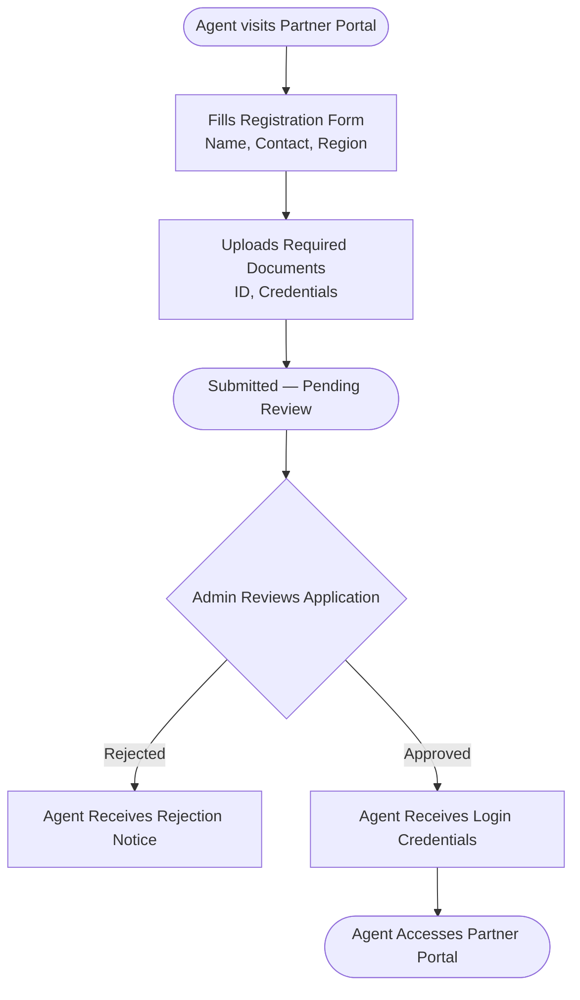
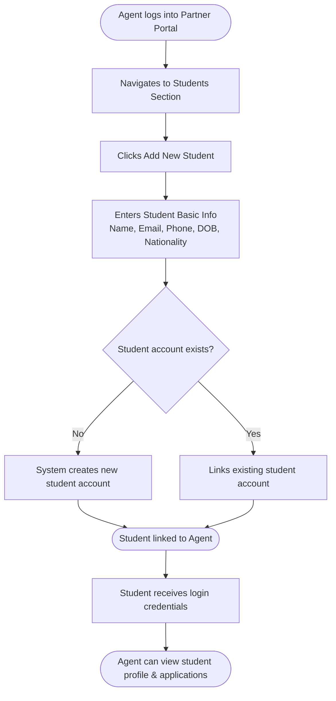
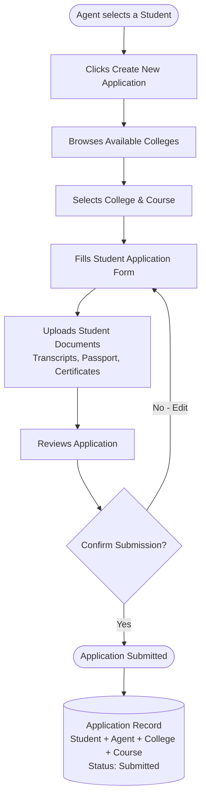

# Edunomo Agent Partner Module — Workflow (V1)

## Overview

The **Agent Partner module** introduces a new user role into the Edunomo platform: the **Agent Partner** (also referred to as a counselor or referral partner).

An Agent Partner is an individual or organisation that:

- Brings students to Edunomo by referring them to the platform
- Onboards and manages student profiles on their behalf
- Creates and submits Study Abroad applications for their students
- Remains linked to every student and application they create

The Agent Partner accesses Edunomo through the **existing Edunomo Partner Portal** — no separate agent application is required. Agent-specific features (student management, application management) are added as a dedicated section within the Partner Portal.

> Agent commission is **managed and paid internally by Edunomo** and is not part of the platform — see [Commission / Payments](#commission--payments).

*Prepared by TechHelp Solutions · Version: V1 / MVP · Status: Draft for Review*

## Actors / Roles

- **Agent Partner** — A counselor or referral partner who registers on the platform, gets approved by an Edunomo Admin, and then manages students and Study Abroad applications via the Partner Portal.
- **Student / Customer** — A student referred by an Agent. The student has their own Edunomo account (mobile app), can view their profile, linked agent, applications, and application status, and can upload documents when requested.
- **Edunomo Admin** — The internal Edunomo team. Admins approve/reject agents, verify documents, process applications, and have full oversight of the module.

## Workflows

### Agent Onboarding Workflow

**Detailed Flow**

1. Agent visits the Edunomo Partner Portal and submits a registration application.
2. Agent fills in basic personal/business information (name, contact details, region, etc.).
3. Agent uploads required onboarding documents (ID, credentials, etc.).
4. The registration is submitted and sits at `Submitted — Pending Review`. The Edunomo Admin receives a notification and reviews the application.
5. Admin either **approves** or **rejects** the application:
   - **If rejected:** Agent receives a rejection notification with optional reason.
   - **If approved:** Agent receives login credentials and gains access to the Partner Portal.

> The Agent Partner uses the **existing Edunomo Partner Portal**. No new application is needed.

### Agent Student Onboarding

**Detailed Flow**

Once an Agent is approved and logged into the Partner Portal:

1. Agent navigates to the **Students** section.
2. Agent clicks **Add New Student**.
3. Agent enters the student's basic information (name, email, phone, date of birth, nationality, etc.).
4. The system creates a new Edunomo student account OR links an existing account to the agent.
5. The student is now **linked to the agent** in the database.
6. The student receives login credentials to the Edunomo mobile app.
7. The agent can now view the student's profile and all their applications.

> Each student can only be linked to one agent. The link is established at onboarding and is stored on the student record.

### Agent Study Abroad Application Workflow

**Detailed Flow**

1. Agent logs into the Partner Portal.
2. Agent navigates to **Students** and selects a student.
3. Agent clicks **Create New Application**.
4. Agent browses available colleges and selects a college.
5. Agent selects the desired course from the college's course list.
6. Agent fills in the student application form (academic background, personal statement, preferences, etc.).
7. Agent uploads required student documents (transcripts, passport, certificates, etc.).
8. Agent reviews the complete application. If not ready to submit (`No - Edit` in the chart), the agent returns to editing the application form.
9. Agent submits the application.

**On submission, the application record stores:**

- Student (linked student profile)
- Agent (the agent who submitted it)
- College (destination institution)
- Course (specific programme)
- Application Status (default: `Submitted / Under Review`)
- Submission timestamp

> Note: the chart's Application Record node shows `Status: Submitted`, while the doc gives the default as `Submitted / Under Review` — see Rules / Conditions for the flagged discrepancy.

### Student Workflow (Mobile App)

*(Doc-only workflow — the chart contains no diagram for it.)*

After the agent links the student and creates an application:

1. Student logs into the **Edunomo mobile app**.
2. Student views their **Profile** (personal information filled in by their agent).
3. Student can see their **Linked Agent** (name and contact).
4. Student views **My Applications** — a list of all their applications, whether created by their agent or by themselves.
5. Student views **Application Status** for each application.
6. If a document is requested or flagged as missing, the student receives a notification and can **upload the document** directly from the app.
7. Student receives **status update notifications** as their application progresses.

> Students can **also create and submit applications themselves** in V1, following the Student Workflow in the Study Abroad module — applications created by their agent and by themselves appear together in My Applications. *(Project decision, 2026-08-31: the source Agent Partner doc said applications were agent-created only; this was changed to match the Study Abroad module, resolving the previously flagged cross-module conflict.)*

### Admin Workflow

*(Doc-only workflow — the chart contains no diagram for it.)*

Edunomo Admins have full oversight through the Admin Panel:

**Agent Management**

- View all registered agents and their approval status
- Approve or reject pending agent applications
- View each agent's linked students and submitted applications
- Deactivate agents if needed

**Application Management**

- View all applications submitted by agents
- Verify student documents attached to each application
- Process and forward applications to colleges
- Update application status (`Under Review` → `Accepted` / `Rejected` / etc.)

## Statuses

**Agent registration states** (from the onboarding flow): `Submitted — Pending Review` → `Approved` or `Rejected`. Approved agents can later be deactivated by an Admin.

**Application Status** — current stage of a Study Abroad application: `Submitted`, `Under Review`, `Accepted`, `Rejected`, etc. Default on submission: `Submitted / Under Review` (doc) / `Submitted` (chart). Admins update the status as the application progresses (`Under Review` → `Accepted` / `Rejected` / etc.).

There are no commission statuses in the platform — commission is managed and paid internally by Edunomo (see [Commission / Payments](#commission--payments)).

## Rules / Conditions

- Each student can only be linked to **one agent**. The link is established at onboarding and is stored on the student record.
- **Both Agent Partners and Students can create and submit Study Abroad applications in V1.** Agents submit on behalf of their linked students; students submit their own directly via the Study Abroad module. *(Project decision, 2026-08-31 — the source doc restricted application creation to agents; see Notes.)*
- Agents can create and manage applications **for their own students only**.
- An Agent must be **approved by an Edunomo Admin** before gaining access to the Partner Portal.
- The Agent Partner accesses Edunomo through the **existing Edunomo Partner Portal** — no separate agent application is required.
- Commission is **managed and paid internally by Edunomo**, outside the platform — the module has no commission records, statuses, screens, or notifications.
- **Application Relationship** — Every Study Abroad application in the system has a clear 4-way relationship: `Student → Agent → Application → College / Course`. This ensures that every application is fully traceable — by student, by agent, by institution, and by programme.

| Field | Description |
|---|---|
| Student | The applicant whose profile and documents are attached |
| Agent | The Partner who created and submitted the application (for student-created applications: the student's linked agent, if any — otherwise no agent link) |
| College | The destination institution |
| Course | The specific programme the student is applying for |
| Application Status | Current stage (Submitted, Under Review, Accepted, Rejected, etc.) |

**Chart-vs-doc conflicts (flagged, not resolved):**

1. **Default application status on submission** — The doc states the application record stores Application Status "default: Submitted / Under Review", while the chart's Application Record node shows `Status: Submitted`. Both are documented here.

## Documents Required

- **Agent onboarding:** required onboarding documents — ID, credentials, etc.
- **Study Abroad application:** required student documents — transcripts, passport, certificates, etc.
- Open question (TBD): are document upload requirements fixed per college/course, or are they set by the Admin?

## Notifications

- Edunomo Admin receives a notification when an agent submits a registration application.
- Agent receives a **rejection notification with optional reason** if the registration is rejected.
- Agent receives **login credentials** if the registration is approved.
- Student receives **login credentials** to the Edunomo mobile app when onboarded by the agent.
- Student receives a **notification when a document is requested or flagged as missing**, and can upload the document directly from the app.
- Student receives **status update notifications** as their application progresses.

## Permissions & Access

**Agent Partner**

- Manage own students (add, view, edit)
- Create and manage applications for own students only
- Upload student documents
- View application status for own applications

**Student**

- View own profile
- View linked agent name and contact
- Create and submit own applications (via the Study Abroad module)
- View own applications and application status
- Upload required/requested documents
- Receive status update notifications

**Admin**

- Full management of all agents (approve, reject, deactivate)
- Full management of all students
- Full management of all applications (review, process, update status)
- Approve agents and verify documents
- Process and forward applications to colleges

**Access notes:** Agents use the existing Edunomo Partner Portal (agent-specific features added as a dedicated section within it); students use the Edunomo mobile app; Admins use the Admin Panel.

## V1 Scope

**In scope (V1 / MVP):**

- Agent registration form and document upload
- Admin approval/rejection of agents
- Agent login via the existing Edunomo Partner Portal
- Agent student onboarding and student–agent linking
- Study Abroad application creation by agent on behalf of student
- Document upload for applications
- Application status tracking
- Agent dashboard with summary stats
- Student view of applications and status in the mobile app

**Out of scope (explicitly excluded from V1; may be considered for future phases):**

- Advanced CRM features and lead management automation
- Commission management of any kind (tracking, calculation, payouts) — commission is managed and paid internally by Edunomo, outside the platform
- Multi-level or hierarchical referral structures
- Agent ranking, leaderboards, or performance scoring
- Agent-to-agent referral programmes
- Advanced analytics and reporting dashboards
- Complex sales pipeline management
- Automated marketing campaigns or email sequences
- Bulk import / export tools

## Commission / Payments

Agent commission is **managed and paid internally by Edunomo** — it is not part of the platform.

- The module contains no commission records, statuses, workflows, screens, or notifications.
- The source PDFs describe an in-platform commission-tracking workflow (`Pending` → `Approved` → `Paid`, with the eligibility event and amount marked TBD). That workflow was removed from this documentation by project decision (2026-08-31) in favour of internal handling; refer to the source PDFs if the historical design is needed.

## Notes

**Agent Dashboard** — The Agent's home screen in the Partner Portal provides a clear summary.

Summary Stats (top of dashboard):

- Total Students
- Total Applications
- Pending Applications
- Accepted Applications

Main Navigation Sections:

| Section | Description |
|---|---|
| Students | List of all linked students; add new students |
| Applications | All applications submitted by the agent, filterable by status |
| Colleges | Browse available colleges and courses |
| Profile | Agent's own profile and account settings |

**Notes & Open Questions** (from the doc, all TBD):

1. **Student account creation** — Does the student receive an automatic account upon being added by the agent, or does the agent need to trigger this manually?
2. **Document requirements** — Are document upload requirements fixed per college/course, or are they set by the Admin?
3. **Existing Partner Portal** — Confirm which sections of the current Partner Portal will be reused vs. extended for the Agent module.

*(The doc's two commission-related open questions — eligibility event and amount/rules — were dropped along with the commission workflow: commission is managed and paid internally by Edunomo.)*

**Other notes:**

- **Application creation (project decision, 2026-08-31):** the source doc stated "Students do not create applications themselves in V1" — this restriction has been lifted. Both students (directly, via the Study Abroad module) and agents (on behalf of their linked students) can create and submit applications. This also resolves the cross-module conflict previously flagged between this doc and the Study Abroad doc.
- The chart's four flow columns carry no individual titles; they are titled here using the matching workflow-section names from the doc PDF. The chart's fourth column (Commission Workflow) is intentionally not reproduced — see Commission / Payments.
- *Document prepared by TechHelp Solutions. All workflows are subject to review and confirmation with the Edunomo product team before development begins.*

## Related Workflows

- [Study Abroad](../study-abroad/study-abroad-workflow.md) — Agent Partners create and submit Study Abroad applications on behalf of their students; students can also create and submit their own applications directly (its Student Workflow).

## Source Documents

- Edunomo Agent Partner Module — Workflow & Specification v1 chart.pdf (1 landscape page, "Edunomo Agent Partner Module — V1 / MVP — Visual Diagrams & Workflows — Prepared by TechHelp Solutions")
- Edunomo Agent Partner Module — Workflow & Specification v1 doc.pdf (6 pages, "Edunomo Agent Partner Module — Workflow & Specification (V1/MVP)", Prepared by TechHelp Solutions, Status: Draft for Review)
