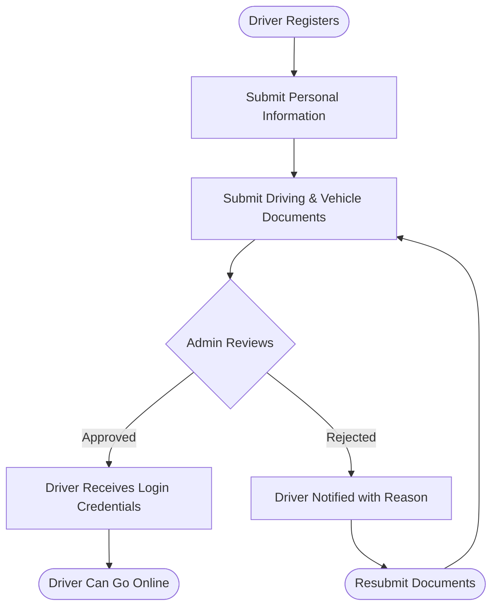
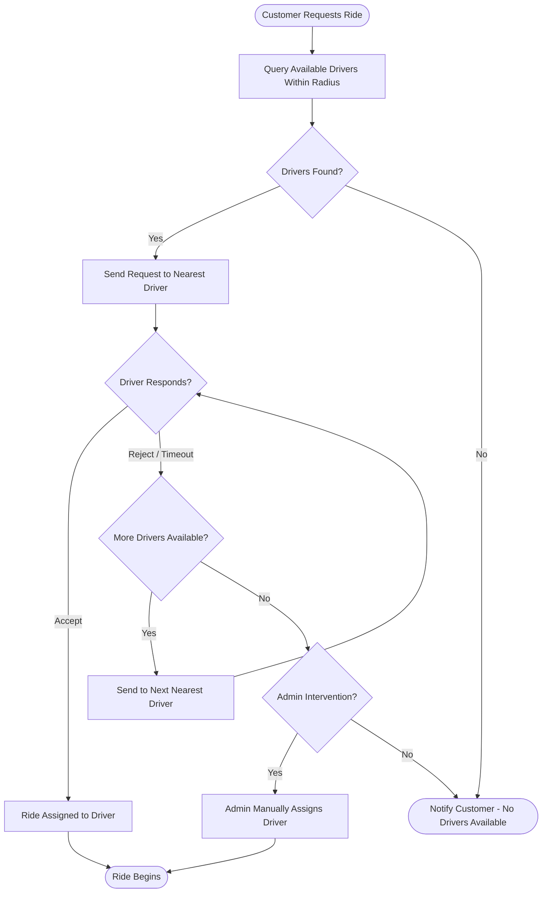
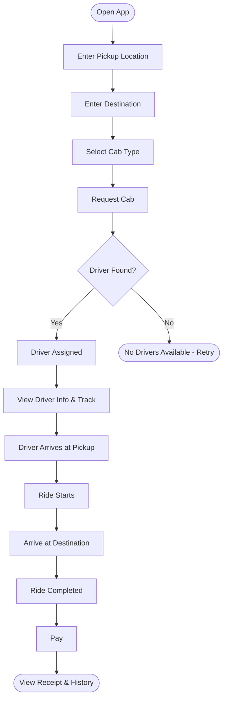
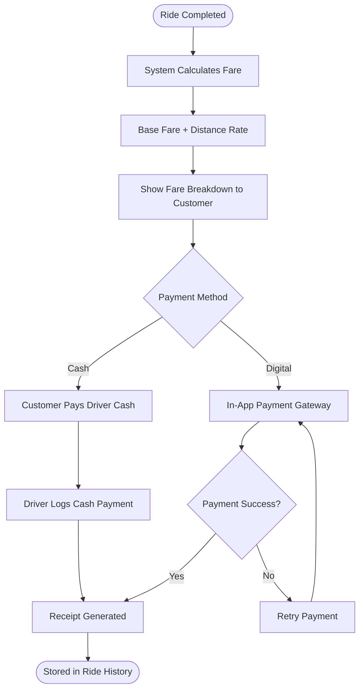
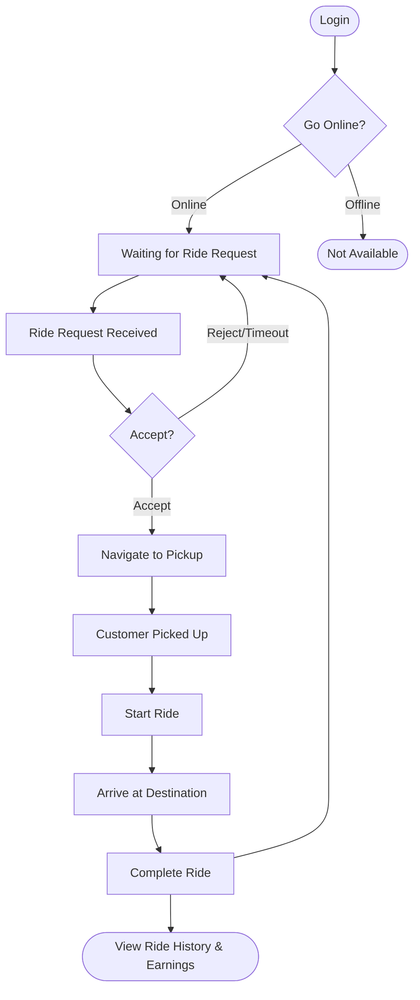
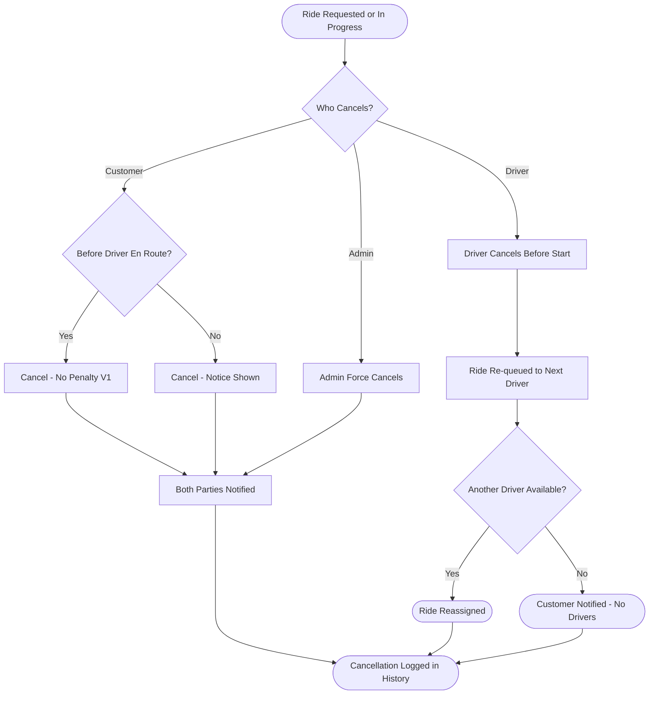
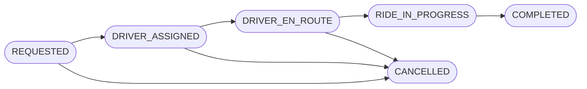

# Edunomo Cab Services Module — Workflow (V1)

## Overview

The Edunomo Cab Services module is a lightweight, MVP-grade cab booking system built to serve three core actors: Customers, Drivers, and an Admin. It covers the end-to-end journey from booking a cab through ride completion and payment — without the complexity of a full ride-hailing platform.

- **Version:** 1.0 (MVP)
- **Prepared for:** Edunomo Platform
- **Scope:** Simple cab booking system for a small freelance team to realistically deliver.
- **Prepared by:** TechHelp Solutions ("We Code Your Success")
- **Design principle:** Keep it simple, ship it fast, and iterate.

## Actors / Roles

- **Customer**
  - Books rides via the app
  - Tracks the assigned driver
  - Pays for completed rides
  - Views ride history
- **Driver**
  - Registers and is onboarded by Admin
  - Goes online/offline to accept requests
  - Navigates to the customer and completes rides
  - Views personal ride history
- **Edunomo Admin**
  - Reviews and approves/rejects driver applications
  - Monitors active rides
  - Manages driver accounts
  - Handles basic operational issues

## Workflows

### Driver Onboarding Flow

**Detailed Flow**

1. **Register** — Driver registers by submitting name, phone number, and email.
2. **Submit Personal Information** — Full name, address, date of birth, emergency contact.
3. **Submit Driving & Vehicle Documents** — Driver uploads the required documents (see [Documents Required](#documents-required)).
4. **Admin Reviews** — Admin inspects the submitted documents in the dashboard.
5. **Approved** — Driver Receives Login Credentials via SMS/email, then **Driver Can Go Online**. Driver logs in and can begin accepting rides.
6. **Rejected** — Driver Notified with Reason; the driver may **Resubmit Documents**, which loops back to the document submission step.

### Driver Assignment Logic

**Detailed Flow**

1. **Customer Requests Ride** — A customer places a booking.
2. **Query Available Drivers Within Radius** — The system queries for available (online) drivers within a defined radius (e.g. 5 km).
3. **Drivers Found?**
   - **No** — Notify Customer - No Drivers Available.
   - **Yes** — Send Request to Nearest Driver (the request is sent to the nearest available driver first).
4. **Driver Responds?**
   - **Accept** — Ride Assigned to Driver. The first driver to accept gets the ride.
   - **Reject / Timeout** — If the driver does not respond within the timeout window, evaluate **More Drivers Available?**
5. **More Drivers Available?**
   - **Yes** — Send to Next Nearest Driver, which loops back to **Driver Responds?**
   - **No** — **Admin Intervention?**
6. **Admin Intervention?**
   - **Yes** — Admin Manually Assigns Driver. The Admin can manually assign a driver from the dashboard if auto-assignment fails or a customer complains.
   - **No** — Notify Customer - No Drivers Available.
7. **Ride Begins** — Reached from Ride Assigned to Driver or Admin Manually Assigns Driver.

> No complex matching algorithms. No surge. No pooling.

### Customer Booking Workflow

**Detailed Flow**

1. **Open App** — Customer opens the app.
2. **Enter Pickup Location** — Via map pin or typed address.
3. **Enter Destination** — Via map pin or typed address.
4. **Select Cab Type** — Select cab / service type, e.g. Economy, Standard (V1 keeps options minimal).
5. **Request Cab** — Confirm booking.
6. **Driver Found?**
   - **Yes** — **Driver Assigned**: the system assigns an available nearby driver.
   - **No** — **No Drivers Available - Retry**.
7. **View Driver Info & Track** — Driver name, photo, vehicle details, rating; real-time location on the map while the driver is en route.
8. **Driver Arrives at Pickup**.
9. **Ride Starts** — Ride begins when the driver confirms pickup.
10. **Arrive at Destination**.
11. **Ride Completed** — Ride ends at the destination.
12. **Pay** — In-app payment (cash or basic card/wallet integration).
13. **View Receipt & History** — See past rides and receipts.

### Payment Flow

**Detailed Flow**

1. **Ride Completed** — The ride is completed.
2. **System Calculates Fare** — Fare is calculated based on **distance + base fare** (flat rate per km).
3. **Base Fare + Distance Rate** — The fare components applied.
4. **Show Fare Breakdown to Customer** — The customer sees the fare breakdown.
5. **Payment Method**
   - **Cash** — Customer Pays Driver Cash, then Driver Logs Cash Payment. (The doc PDF states the driver collects and the admin logs it — see the conflict note in [Fare & Payments](#fare--payments).)
   - **Digital** — In-App Payment Gateway (in-app card / UPI / wallet; basic payment gateway integration), then **Payment Success?**
     - **Yes** — Receipt Generated.
     - **No** — Retry Payment, which loops back to the In-App Payment Gateway.
6. **Receipt Generated** — Receipt is generated.
7. **Stored in Ride History** — The receipt is stored in ride history.

### Driver Workflow

**Detailed Flow**

1. **Login** — Authenticate with phone/email and password.
2. **Go Online?** — Toggle availability status.
   - **Offline** — Not Available.
   - **Online** — Waiting for Ride Request.
3. **Ride Request Received** — Notification of an incoming request with pickup details.
4. **Accept?** — Driver has a short window (e.g. 30 seconds) to respond.
   - **Reject/Timeout** — Loops back to Waiting for Ride Request.
   - **Accept** — Navigate to Pickup (in-app map directions to the pickup location).
5. **Customer Picked Up**.
6. **Start Ride** — Confirm pickup; ride status changes to "In Progress".
7. **Arrive at Destination**.
8. **Complete Ride** — Mark the ride as done at the destination. The driver then either returns to Waiting for Ride Request (loop-back for the next ride) or proceeds to **View Ride History & Earnings** — see past completed rides and earnings summary.

### Cancellation Flow

**Detailed Flow**

1. **Ride Requested or In Progress** — A cancellation can occur while the ride is requested or in progress.
2. **Who Cancels?** — Customer, Admin, or Driver.
3. **Customer** — **Before Driver En Route?**
   - **Yes** — **Cancel - No Penalty V1**: the customer can cancel before the driver is en route.
   - **No** — **Cancel - Notice Shown**: after the driver is en route, a small cancellation notice may be shown (V1: informational only, no fee enforced).
4. **Admin** — **Admin Force Cancels**: the Admin can cancel any active ride from the dashboard.
5. Both customer cancellation outcomes and the admin cancellation lead to **Both Parties Notified**.
6. **Driver** — **Driver Cancels Before Start**: the driver can cancel before starting the ride. The ride is **Re-queued to Next Driver**, then **Another Driver Available?**
   - **Yes** — **Ride Reassigned**.
   - **No** — **Customer Notified - No Drivers**.
7. **Cancellation Logged in History** — All cancellation outcomes are logged in history. Repeated driver cancellations are flagged for admin review.

## Statuses

Happy path: `REQUESTED` → `DRIVER_ASSIGNED` → `DRIVER_EN_ROUTE` → `RIDE_IN_PROGRESS` → `COMPLETED`, with `CANCELLED` as the alternate terminal status.

| Status | Description |
| --- | --- |
| `REQUESTED` | Customer has placed a booking |
| `DRIVER_ASSIGNED` | A driver has accepted the request |
| `DRIVER_EN_ROUTE` | Driver is navigating to pickup |
| `RIDE_IN_PROGRESS` | Ride has started (driver confirmed pickup) |
| `COMPLETED` | Driver marked ride as done |
| `CANCELLED` | Customer or driver cancelled before completion |

> **Conflict note:** The doc PDF's status table describes `CANCELLED` as "Customer or driver cancelled before completion", but both the chart's Cancellation Flow and the doc's Cancellation section also allow the **Admin** to cancel rides. Additionally, the chart's Ride Status Flow draws `CANCELLED` as reachable only from `REQUESTED`, `DRIVER_ASSIGNED`, and `DRIVER_EN_ROUTE` (no arrow from `RIDE_IN_PROGRESS`), while the Cancellation Flow starts from "Ride Requested or In Progress" and the doc says the Admin can cancel any active ride. Both versions are documented here as given in the sources.

## Rules / Conditions

**Driver assignment rules** (V1 assignment logic is intentionally simple):

1. When a customer requests a ride, the system queries for **available (online) drivers within a defined radius** (e.g. 5 km).
2. The request is sent to the **nearest available driver first**.
3. If the driver **does not respond** within the timeout window, the request moves to the **next nearest driver**.
4. The **first driver to accept** gets the ride.
5. **Admin can manually assign** a driver from the dashboard if auto-assignment fails or a customer complains.
6. No complex matching algorithms. No surge. No pooling.

**Driver response rule:**

- The driver has a short window (e.g. 30 seconds) to accept or reject an incoming ride request.

**Onboarding rules:**

- A driver must be approved by the Admin before receiving login credentials and going online.
- Approved: driver receives login credentials via SMS/email. Rejected: driver is notified with the reason and may resubmit documents.

**Cancellation rules:**

- Customer can cancel before the driver is en route (no penalty in V1).
- After the driver is en route, a small cancellation notice may be shown (V1: informational only, no fee enforced).
- Driver can cancel before starting the ride; the request is re-queued to the next available driver.
- Repeated driver cancellations are flagged for admin review.
- Admin can cancel any active ride from the dashboard; both parties are notified.

**Location tracking rules:**

- Driver app shares real-time GPS coordinates when online.
- Customer app displays the driver location on a map while the driver is en route to pickup and while the ride is in progress.
- Location updates at a polling interval (e.g. every 5-10 seconds for MVP).
- Tracking stops when the ride is completed or cancelled.

**Admin workflow:**

1. **Verify Drivers** — Review documents, approve or reject applications.
2. **Manage Drivers** — Activate, deactivate, or suspend driver accounts.
3. **View Active Rides** — Live list of all rides currently in progress.
4. **View Ride History** — Full historical log of all completed/cancelled rides.
5. **Handle Basic Issues** — Manually cancel rides, reassign drivers, resolve disputes.

## Documents Required

Driver onboarding documents submission:

- National ID / Passport
- Driver's licence
- Vehicle registration certificate
- Vehicle insurance document
- Profile photo + vehicle photo

## Fare & Payments

- Fare is calculated based on **distance + base fare** (flat rate per km); simple, distance-based fare calculation.
- The customer sees the fare breakdown before paying.
- Payment methods:
  - **Cash** — driver collects; admin logs it.
  - **In-app card / UPI / wallet** — basic payment gateway integration.
- A receipt is generated and stored in ride history.

> **Conflict note:** For cash payments, the chart's Payment Flow has the node "Driver Logs Cash Payment", while the doc PDF says "Cash (driver collects; admin logs it)". The sources disagree on who logs the cash payment; both versions are recorded here.

> **V1 does not include:** surge pricing, driver wallet, automated commission splits, or complex fare rules.

## Notifications

| Event | Customer | Driver | Admin |
| --- | --- | --- | --- |
| Ride requested | Confirmation | Incoming request alert | — |
| Driver assigned | Driver details sent | Pickup details confirmed | — |
| Driver en route | "Driver is on the way" | — | — |
| Ride started | "Ride in progress" | — | — |
| Ride completed | Receipt + fare | Earnings summary | — |
| Ride cancelled | Cancellation notice | Cancellation notice | Alert if repeated |
| Driver approved | — | Login credentials | — |
| Driver rejected | — | Rejection notice | — |

Notifications delivered via: **Push notification + SMS (basic)**.

## Permissions & Access

| Feature | Customer | Driver | Admin |
| --- | --- | --- | --- |
| Book a ride | Yes | No | No |
| Go online/offline | No | Yes | No |
| Accept/reject rides | No | Yes | No |
| View own ride history | Yes | Yes | Yes |
| View all rides | No | No | Yes |
| Manage driver accounts | No | No | Yes |
| Approve drivers | No | No | Yes |
| Manually assign rides | No | No | Yes |
| Cancel any ride | No | No | Yes |

## V1 Scope

**In Scope (V1/MVP):**

- Customer app: booking, tracking, payment, history
- Driver app: onboarding, availability toggle, ride accept/reject, navigation handoff, history
- Admin dashboard: driver management, ride oversight, manual intervention
- Basic real-time location sharing
- Simple fare calculation (distance-based)
- Cash and one basic digital payment method
- Push + SMS notifications
- Single cab type (or 2 at most)

**Out of Scope (Not in V1):**

| Feature | Reason Excluded |
| --- | --- |
| Surge pricing | Adds fare complexity and customer expectation management |
| Ride sharing / pooling | Requires matching multiple customers — significant complexity |
| Complex driver matching algorithms | MVP uses simple nearest-available logic |
| Driver wallet / earnings dashboard | Out of MVP scope; admin manages manually |
| Advanced commission systems | Not needed at V1 scale |
| SOS / emergency systems | Requires third-party integrations and legal considerations |
| Loyalty programs / rewards | Not a V1 priority |
| Advanced route optimization | Device map app handles navigation |
| Corporate rides / accounts | Separate billing and account structures needed |
| Scheduled / future rides | Adds booking queue and timing complexity |
| Multiple fleet management levels | Single-tier admin is sufficient for MVP |
| Driver ratings & reviews (complex) | Basic star rating only, if any |

## Notes

- **Location tracking (V1 exclusions):** V1 does not include built-in turn-by-turn navigation (uses the device map app), route optimization, geofencing, or heat maps.
- **Cab / service type:** e.g. Economy, Standard — V1 keeps options minimal (single cab type, or 2 at most).
- The customer's **Pay** step supports in-app payment: cash or basic card/wallet integration.
- The Driver Workflow chart includes a loop-back from **Complete Ride** to **Waiting for Ride Request**, allowing the driver to take the next ride while remaining online.
- Chart-vs-doc conflicts found (both documented above rather than silently resolved):
  1. Cash payment logging — chart: "Driver Logs Cash Payment"; doc: "driver collects; admin logs it" (see Fare & Payments).
  2. `CANCELLED` status description — doc table says "Customer or driver cancelled", while the chart and the doc's Cancellation section also include Admin cancellation; the Ride Status Flow diagram has no `RIDE_IN_PROGRESS` → `CANCELLED` arrow even though the Cancellation Flow covers rides "Requested or In Progress" (see Statuses).
- Source document metadata: Document version: 1.0 | Status: Draft.

## Source Documents

- Edunomo Cab Services — Module Workflow doc.pdf (8 pages)
- Edunomo Cab Services — Module Workflow chart.pdf (1 page, 7 sub-flow diagrams)
