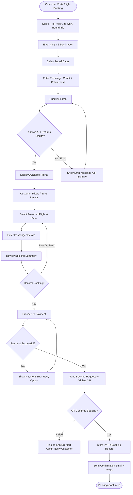
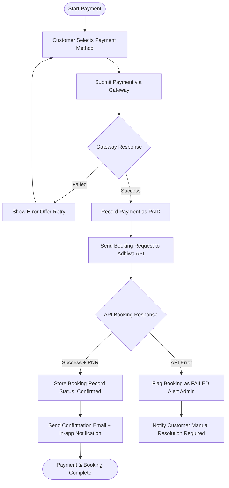
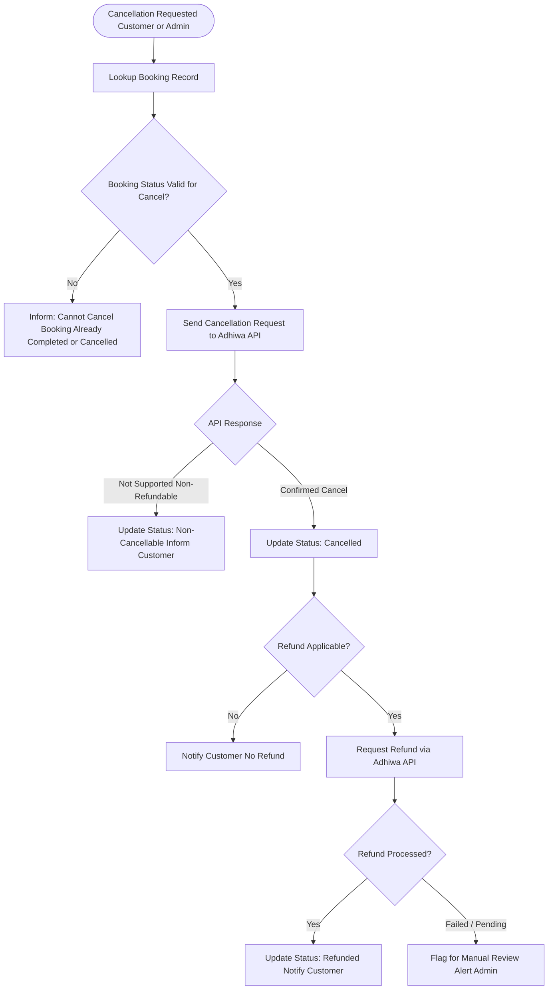
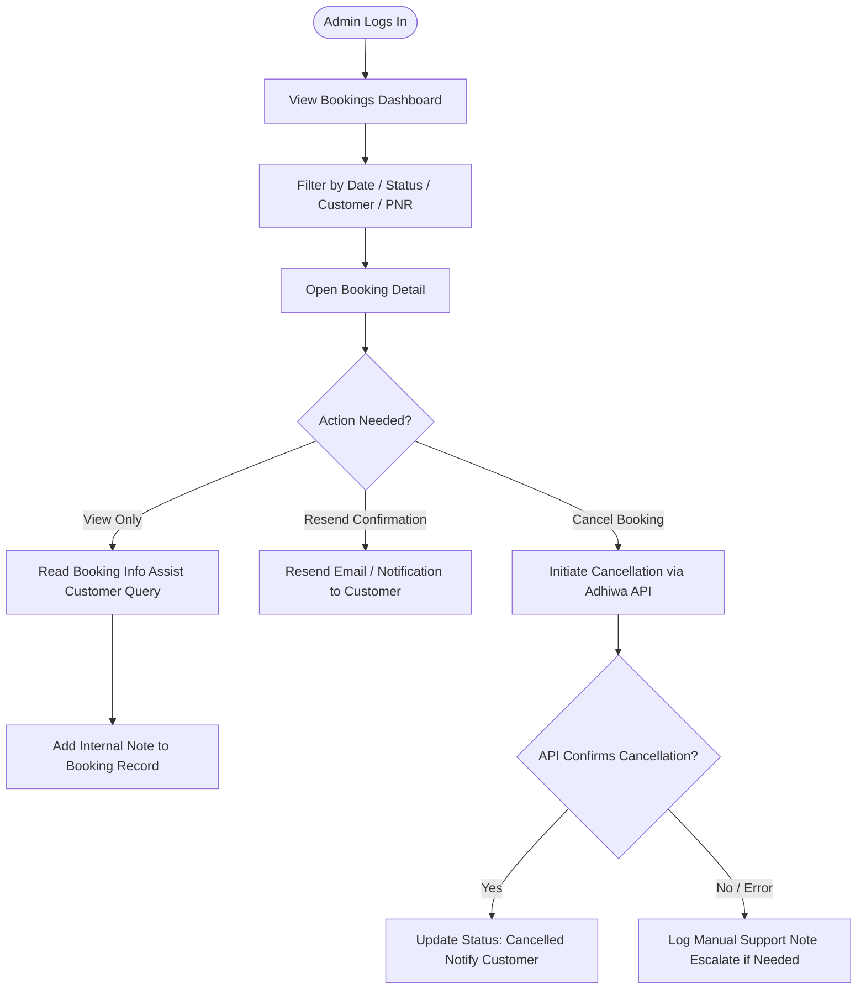
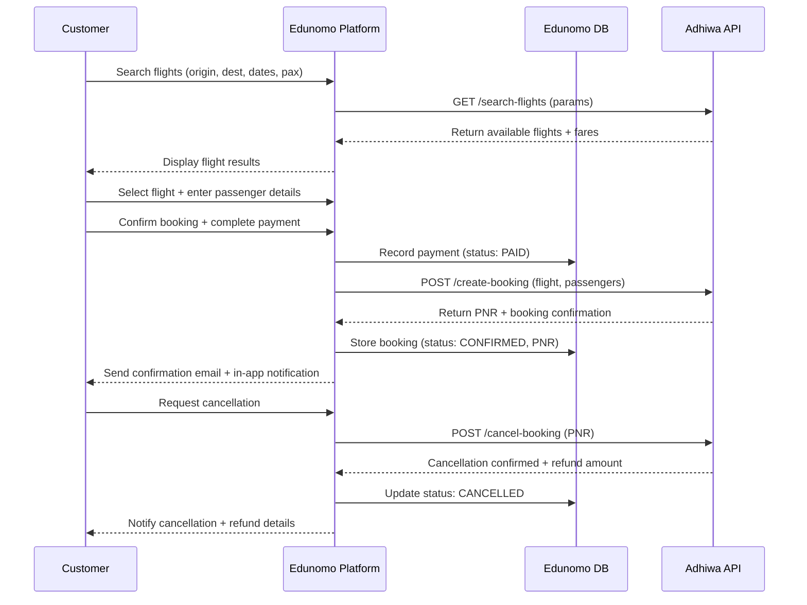

# Edunomo Flight Booking Module — Workflow (V1)

> **Prepared by:** TechHelp Solutions · **Version:** 1.0 — MVP · **Status:** Draft
>
> **Note (from source):** Adhiwa API integration is planned but not yet confirmed. All booking, cancellation, refund, and fare capabilities described herein are subject to Adhiwa API availability and contract.

## Overview

The Edunomo Flight Booking module is a streamlined, API-driven feature that allows customers to search, compare, book, and manage flight tickets directly within the Edunomo platform. The V1/MVP is intentionally scoped to cover only core booking workflows, delegating all live flight data, inventory, fare retrieval, and ticketing operations to the **Adhiwa API**.

Key design principles for V1:

- Simple, API-driven architecture — Edunomo does not manage airline inventory or fares
- All real-time flight data is fetched from Adhiwa API
- Booking records are stored in Edunomo's database for reference and support
- Payment is processed through Edunomo's existing payment infrastructure
- The module is built to be extended in future versions without breaking V1 flows

## Actors / Roles

- **Customer** — The end-user who searches for, books, and manages their own flight reservations through the Edunomo platform. Capabilities: search for available flights; view, compare, and select fares; enter passenger details and complete booking; make payment; receive e-ticket / PNR confirmation; view booking history and status.
- **Edunomo Admin** — An internal Edunomo staff member responsible for platform operations and customer support. Capabilities: view all bookings and their statuses; look up individual booking details; handle basic customer support queries; initiate cancellations where supported by Adhiwa API; no ability to modify airline inventory or fares (managed entirely by Adhiwa API).
- **Adhiwa API (External System)** — The third-party flight data and booking provider. All real-time data flows through this integration. Responsibilities (subject to API confirmation): return available flight search results; provide fare breakdowns and seat availability; create and confirm bookings (PNR generation); support cancellation and refund requests where available; return booking status updates.

> **Important (from source):** The depth and availability of these capabilities are entirely dependent on the Adhiwa API contract and technical specification. Edunomo V1 will only expose features that are confirmed available via the API.

## Workflows

### Customer Booking Workflow



**Detailed Flow**

1. **Search Flights** — Customer navigates to the Flight Booking section and selects trip type: **One-way** or **Round-trip**.
2. Customer enters: **Origin** (city or airport code), **Destination** (city or airport code), **Departure date** (and return date if round-trip), **Number of passengers** (adults / children / infants), and **Cabin class** (Economy / Business — if supported by Adhiwa API).
3. Customer submits the search. The system sends search parameters to Adhiwa API and retrieves available flight options. If the API returns no results or an error, an error message is shown and the customer is asked to retry.
4. **View and Compare Flights** — System displays a list of available flights returned by Adhiwa API. Each result shows: airline name and flight number; departure and arrival times; duration and number of stops; fare (total price including taxes, subject to Adhiwa API data); refundable / non-refundable indicator (if provided by API).
5. Customer can sort or filter results (basic filtering: price, duration, stops), then selects a preferred flight/fare.
6. **Enter Passenger Information** — Customer enters details for each passenger: full name (as per passport/ID), date of birth, nationality, passport / national ID number (if required by airline), and contact email and phone number (for lead passenger). Customer reviews entered details before proceeding.
7. **Review Booking** — System displays a full booking summary: flight details (route, times, airline, flight number), passenger details, fare breakdown (base fare + taxes + fees), total amount payable, and cancellation/refund policy (if provided by Adhiwa API). Customer confirms the booking details and proceeds to payment; declining ("No - Go Back") returns to flight/fare selection.
8. **Make Payment** — Customer selects a payment method (via Edunomo's payment gateway) and completes payment. System records a pending transaction. On successful payment, system sends the booking request to Adhiwa API; on failure, a payment error with a retry option is shown.
9. **Booking Confirmation** — Adhiwa API returns a confirmed PNR (Passenger Name Record) / booking reference. Edunomo stores the booking record with status: **Confirmed**. Customer receives a confirmation notification (email / in-app) containing: PNR / booking reference, e-ticket or itinerary, passenger details, and payment receipt. If the API fails to confirm the booking after payment, the booking is flagged as FAILED, admin is alerted, and the customer is notified.
10. **View Booking History** — Customer can access "My Bookings" to view: all past and upcoming bookings; current status of each booking (Confirmed / Cancelled / Pending); option to view e-ticket / itinerary; option to request cancellation (where supported).

### Payment Flow



**Detailed Flow**

1. Customer reaches the payment step after reviewing booking details.
2. Edunomo presents available payment methods (existing payment gateway).
3. Customer completes payment.
4. Payment gateway returns success / failure response.
5. **On success:** Edunomo records payment with status: Paid; booking request is sent to Adhiwa API; on API confirmation: booking status → Confirmed, PNR stored, customer notified; on API failure after payment: booking flagged as **Failed**, admin alerted for manual resolution.
6. **On failure:** no booking request is sent; customer is shown an error and can retry; no amount is charged (or charge is reversed per gateway policy).

### Cancellation Flow



**Detailed Flow**

1. Customer or Admin initiates a cancellation request.
2. System checks if cancellation is supported for the booking (via Adhiwa API).
3. **If cancellation is supported:** cancellation request is sent to Adhiwa API; Adhiwa API returns confirmation and any applicable refund amount; booking status updated to: **Cancelled**; refund amount (if any) is communicated to the customer; refund is processed per API/airline rules.
4. **If cancellation is not supported:** customer is informed that the ticket is non-refundable / non-cancellable; Admin can log a manual support note.
5. Customer is notified of the outcome via email / in-app notification.
6. If a refund is applicable but fails or stays pending, the booking is flagged for manual review and admin is alerted.

> **Important (from source):** All cancellation and refund capabilities depend entirely on the Adhiwa API and the airline's policy. Edunomo V1 does not implement independent refund logic.

### Admin Workflow



**Detailed Flow**

1. **View Bookings** — Admin can view a full list of all bookings made on the platform; filterable by: date range, status, customer name, PNR, booking reference. Each record shows: customer name, route, travel date, PNR, status, amount paid.
2. **View Booking Status** — Admin can open any individual booking to view full details. Status reflects the latest data available (from Adhiwa API where applicable). Statuses: **Pending**, **Confirmed**, **Cancelled**, **Refund Requested**, **Refunded**, **Failed**.
3. **Handle Basic Support** — Admin can view booking details to assist customers with queries; add internal notes to a booking record; resend confirmation email/notification to the customer.
4. **Handle Cancellations (Where Supported)** — Admin can initiate a cancellation request on behalf of a customer; system sends cancellation request to Adhiwa API; if Adhiwa API confirms cancellation: booking status updated to **Cancelled**; refund initiation depends on Adhiwa API response and airline policy; Admin records the cancellation and notifies the customer.

> **Important (from source):** Admin cannot override airline policies or issue refunds outside of what the Adhiwa API permits.

### Adhiwa API Integration — Sequence Diagram



**Detailed Flow**

1. Customer searches flights (origin, dest, dates, pax); Edunomo Platform calls Adhiwa API `GET /search-flights (params)`; Adhiwa API returns available flights + fares; platform displays flight results.
2. Customer selects a flight, enters passenger details, then confirms booking and completes payment.
3. Platform records payment in Edunomo DB (status: PAID), then calls Adhiwa API `POST /create-booking (flight, passengers)`; Adhiwa API returns PNR + booking confirmation; platform stores booking in Edunomo DB (status: CONFIRMED, PNR) and sends confirmation email + in-app notification to the customer.
4. On a cancellation request, platform calls Adhiwa API `POST /cancel-booking (PNR)`; Adhiwa API returns cancellation confirmed + refund amount; platform updates Edunomo DB status: CANCELLED and notifies the customer of cancellation + refund details.

## Statuses

Booking status flow (from the chart):

```mermaid
flowchart LR
    statusInitiated(["Initiated"]) --> statusPaymentPending(["Payment Pending"])
    statusPaymentPending --> paymentResult{"Payment Result"}
    paymentResult -->|Failed| statusPaymentFailed(["Payment Failed"])
    paymentResult -->|Success| statusBookingRequested(["Booking Requested"])
    statusBookingRequested --> bookingApiResponse{"API Response"}
    bookingApiResponse -->|Confirmed| statusConfirmed(["Confirmed / PNR Issued"])
    bookingApiResponse -->|Error| statusFailedManual(["Failed - Manual Review"])
    statusConfirmed --> statusAction{"Action"}
    statusAction -->|No Action| statusCompleted(["Completed / Travelled"])
    statusAction -->|Cancel Request| statusCancellationRequested(["Cancellation Requested"])
    statusCancellationRequested --> cancelApiResp{"API Response"}
    cancelApiResp -->|Confirmed| statusCancelledFinal(["Cancelled"])
    cancelApiResp -->|Not Supported| statusNonRefundable(["Non-Refundable / No Cancel"])
    statusCancelledFinal --> statusRefundRequested(["Refund Requested"])
    statusRefundRequested --> statusRefunded(["Refunded"])
```



The doc PDF (Section 5 — Booking Status Flow) presents this textual flow:

```
[Initiated]
    ↓
[Payment Pending]
    ↓
[Payment Successful] → [Booking Request Sent to Adhiwa API]
    ↓                        ↓
[Payment Failed]        [Confirmed / PNR Issued]
    ↓                        ↓
[Booking Cancelled]     [Cancellation Requested]
                             ↓
                        [Cancelled by Airline/API]
                             ↓
                        [Refund Requested] → [Refunded]
```

**Status definitions (doc PDF):**

| Status | Description |
| --- | --- |
| `Payment Pending` | Customer has initiated payment but not yet completed |
| `Payment Failed` | Payment was unsuccessful; no booking created |
| `Booking Requested` | Payment successful; booking request sent to Adhiwa API |
| `Confirmed` | Adhiwa API returned a confirmed PNR |
| `Cancellation Requested` | Cancellation request submitted to Adhiwa API |
| `Cancelled` | Cancellation confirmed by Adhiwa API or airline |
| `Refund Requested` | Refund request submitted (subject to API/airline policy) |
| `Refunded` | Refund confirmed and processed |
| `Failed` | Booking failed at API level after successful payment (requires manual review) |

Admin-facing status enumeration (doc Section 4.2): `Pending`, `Confirmed`, `Cancelled`, `Refund Requested`, `Refunded`, `Failed`.

> **Conflict note (chart vs doc):** The chart's Booking Status Flow and the doc's textual Section 5 flow do not use identical state names or transitions. The chart uses `Booking Requested`, `Failed - Manual Review`, `Completed / Travelled`, and `Non-Refundable / No Cancel`; the doc's textual flow instead names `Payment Successful`, `Booking Request Sent to Adhiwa API`, `Cancelled by Airline/API`, and shows `[Payment Failed] → [Booking Cancelled]` (a transition absent from the chart, where `Payment Failed` is terminal). The doc's own status-definitions table matches the chart's naming (`Booking Requested`) rather than the textual flow. Both versions are reproduced above; neither has been silently normalized. Additionally, the customer-facing status list in doc Step 7 ("Confirmed / Cancelled / Pending") is a subset of the fuller admin status list.

## Rules / Conditions

- Adhiwa API integration is planned but not yet confirmed; all booking, cancellation, refund, and fare capabilities are subject to Adhiwa API availability and contract.
- Edunomo V1 will only expose features that are confirmed available via the Adhiwa API.
- Edunomo does not manage airline inventory or fares — these are managed entirely by the Adhiwa API.
- Admin cannot override airline policies or issue refunds outside of what the Adhiwa API permits. Admin does not book on behalf of customers in V1.
- A cancellation is only sent to Adhiwa API if the booking status is valid for cancel (not already completed or cancelled).
- All cancellation and refund capabilities depend entirely on the Adhiwa API and the airline's policy; Edunomo V1 does not implement independent refund logic.
- Refund terms are airline-defined and relayed via Adhiwa API; Edunomo does not control them.
- PNR is generated by the airline/GDS via Adhiwa API — Edunomo stores and displays it only.
- Payment failure: no booking request is sent, customer can retry, and no amount is charged (or the charge is reversed per gateway policy).
- Booking failure after successful payment: booking is flagged as **Failed** and requires manual review by admin.
- Error handling (V1): if Adhiwa API is unavailable, customer sees a friendly error and no booking is created; if the API returns an error mid-booking (post-payment), the booking is flagged as Failed and admin is alerted; API timeouts are handled with retry logic (basic, V1); all API responses are logged for debugging and support.
- Features outside V1 scope should be formally deferred to avoid delays (scope creep control).

## APIs / Integrations

The Adhiwa API is the backbone of all real-time flight operations. Edunomo acts as a front-end layer that formats and routes requests to the API and displays responses to users.

**Integration points (planned, subject to API confirmation):**

| Operation | Edunomo Action | Adhiwa API Call |
| --- | --- | --- |
| Flight search | Customer submits search form | Search flights endpoint |
| Fare retrieval | Display fare options to customer | Get fares / availability endpoint |
| Booking creation | Customer confirms and pays | Create booking / PNR endpoint |
| Booking retrieval | View booking status | Get booking details endpoint |
| Cancellation | Admin/Customer requests cancel | Cancel booking endpoint |
| Refund inquiry | Admin checks refund eligibility | Refund policy / initiation endpoint |

Illustrative endpoint names from the chart's sequence diagram: `GET /search-flights (params)`, `POST /create-booking (flight, passengers)`, `POST /cancel-booking (PNR)`.

Search parameters sent to the API: origin, destination, dates, passengers (pax). Data returned/consumed: available flights + fares, fare breakdowns and seat availability, PNR + booking confirmation, booking status updates, cancellation confirmation + refund amount.

> **Important (from source):** This integration plan is based on the anticipated Adhiwa API specification. Final implementation details will be adjusted once the API documentation and credentials are confirmed.

## Notifications

All notifications are triggered automatically based on booking events:

| Event | Recipient | Channel |
| --- | --- | --- |
| Booking confirmed | Customer | Email + In-app |
| Payment failed | Customer | Email + In-app |
| Booking failed (post-payment) | Customer + Admin | Email + In-app |
| Cancellation confirmed | Customer | Email + In-app |
| Refund processed | Customer | Email + In-app |
| New booking created | Admin | In-app dashboard alert |
| Cancellation request received | Admin | In-app dashboard alert |

V1 notification scope: email notifications (transactional); in-app notifications; SMS is **out of scope for V1**.

## Permissions & Access

| Feature | Customer | Edunomo Admin |
| --- | --- | --- |
| Search flights | Yes | Yes (read-only, no booking) |
| View flight results | Yes | Yes |
| Make a booking | Yes | No (admin does not book on behalf) |
| Make payment | Yes | No |
| View own bookings | Yes | N/A |
| View all bookings | No | Yes |
| View booking details | Own only | Yes — All |
| Resend confirmation | No | Yes |
| Add internal notes | No | Yes |
| Request cancellation | Yes (own) | Yes (any) |
| Access admin dashboard | No | Yes |
| Manage users | No | Yes (basic user lookup) |
| Modify fares or inventory | No | No (API-managed) |

## V1 Scope

**In Scope (V1/MVP):**

- Flight search (one-way and round-trip)
- Origin/destination selection with airport/city lookup
- Date and passenger count selection
- Display of available flights returned by Adhiwa API
- Basic filtering and sorting of search results
- Passenger information entry
- Booking review and confirmation
- Payment processing via existing Edunomo payment gateway
- PNR / e-ticket retrieval and display
- Booking history for customers
- Admin booking management dashboard (view, search, filter)
- Basic cancellation flow (via Adhiwa API where supported)
- Transactional email and in-app notifications
- Basic error handling and failed-booking alerts

**Out of Scope (V1)** — intentionally excluded to keep the implementation simple and on schedule; may be considered for future versions:

| Feature | Reason for Exclusion |
| --- | --- |
| Airline inventory management | Fully managed by Adhiwa API |
| Complex fare management / fare rules engine | Managed by Adhiwa API; V1 displays what the API returns |
| Loyalty programs / frequent flyer miles | Significant scope; not part of V1 |
| Advanced refund automation | Depends on complex airline policy logic; V1 relies on API response only |
| Multi-city / open-jaw bookings | Future enhancement |
| Group bookings (10+ passengers) | Future enhancement |
| Seat selection | Depends on API support; deferred to V2 |
| Ancillary services (meals, baggage upgrades) | Future enhancement |
| SMS notifications | Future enhancement |
| Real-time price alerts | Future enhancement |
| Admin booking on behalf of customer | Out of scope for V1 |
| Partial cancellations (single passenger from group) | Future enhancement |
| Automated refund disbursement | Requires deeper financial integration; future scope |
| Multi-currency support | Future enhancement |
| Travel insurance integration | Future enhancement |

## Payments & Refunds

- Payment is processed through Edunomo's existing payment infrastructure (payment gateway); the gateway returns a success / failure response.
- On success, payment is recorded with status Paid (chart: `Record Payment as PAID`) and only then is the booking request sent to Adhiwa API.
- On failure, no booking request is sent; the customer is shown an error and can retry; no amount is charged (or the charge is reversed per gateway policy).
- Payment refunds are processed based on airline cancellation policy as communicated by Adhiwa API. Edunomo does not auto-process refunds in V1 beyond what the API supports.
- Refund amount (if any) is returned by Adhiwa API on cancellation and communicated to the customer; refunds that fail or stay pending are flagged for manual review and admin is alerted.

## Notes

- **Key assumptions and risks (doc Section 12):**
  - *Adhiwa API availability* — Integration is planned but not yet confirmed. All flight-related capabilities are contingent on API access.
  - *API documentation* — Full API spec must be provided before development begins on flight search, booking, and cancellation flows.
  - *Payment gateway* — Assumes Edunomo's existing payment gateway can be reused with minimal modification.
  - *Refund policy* — Edunomo does not control refund terms; these are airline-defined and relayed via Adhiwa API.
  - *PNR generation* — PNR is generated by the airline/GDS via Adhiwa API; Edunomo stores and displays it only.
  - *Scope creep* — Features outside V1 scope should be formally deferred to avoid delays.
- The module is built to be extended in future versions without breaking V1 flows.
- Document footer (doc PDF): "This document was prepared by TechHelp Solutions for the Edunomo platform." — tagline "We Code Your Success".

## Source Documents

- Edunomo Flight Booking Module v1 chart.pdf
- Edunomo Flight Booking Module v1 doc.pdf
