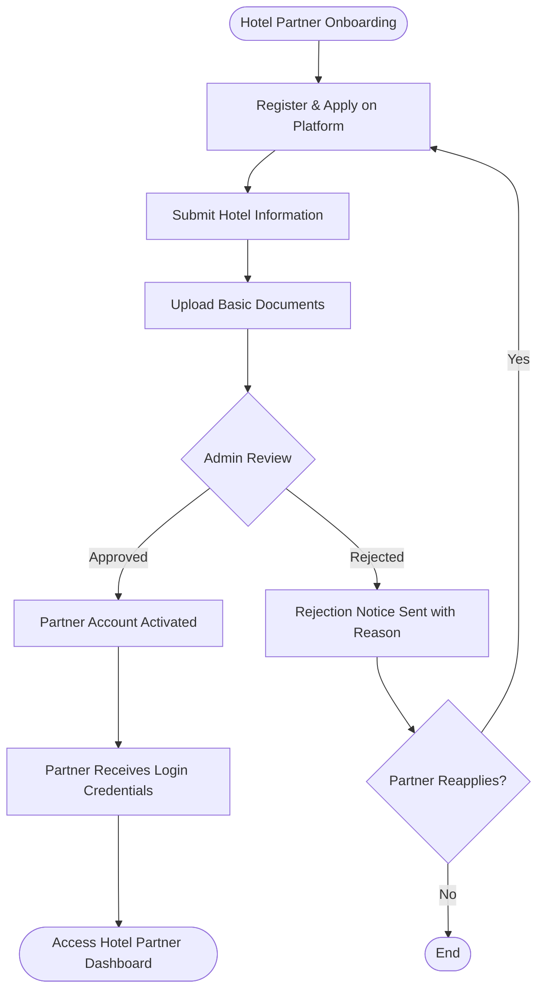
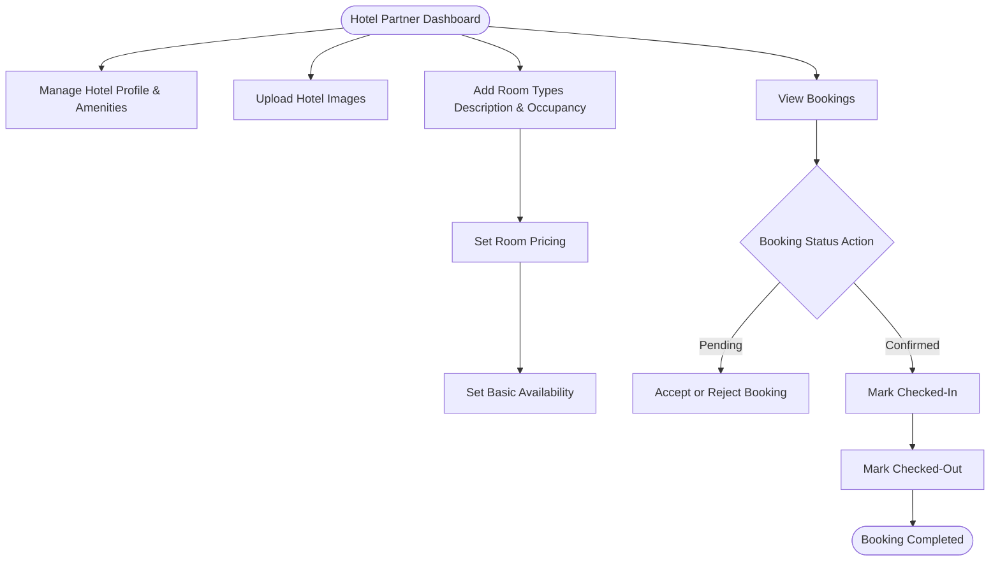
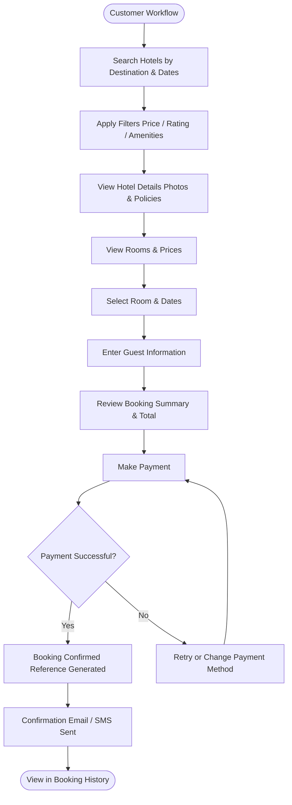
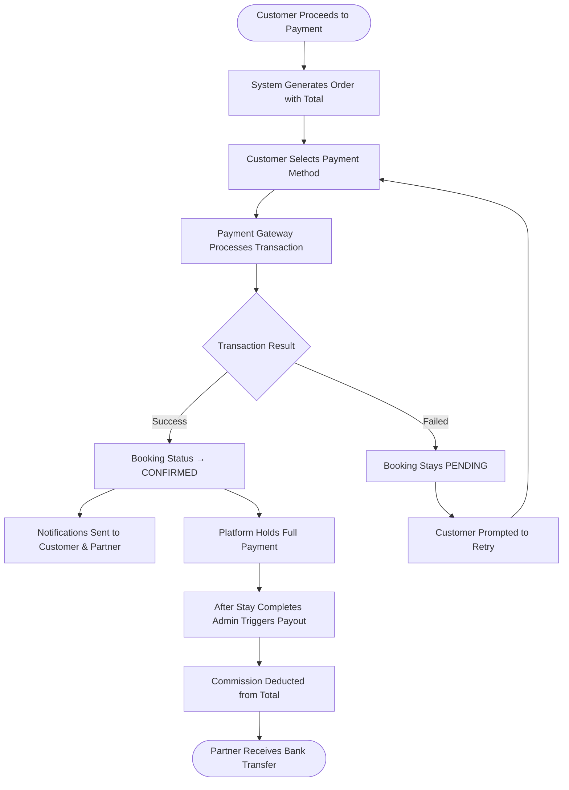
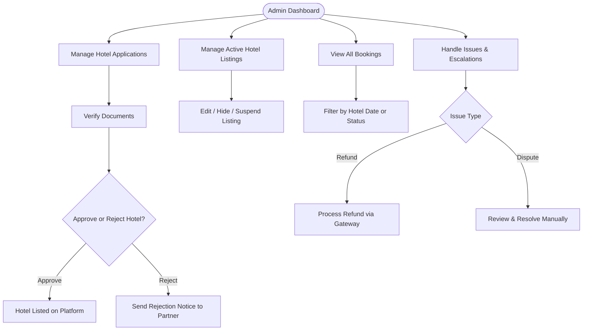
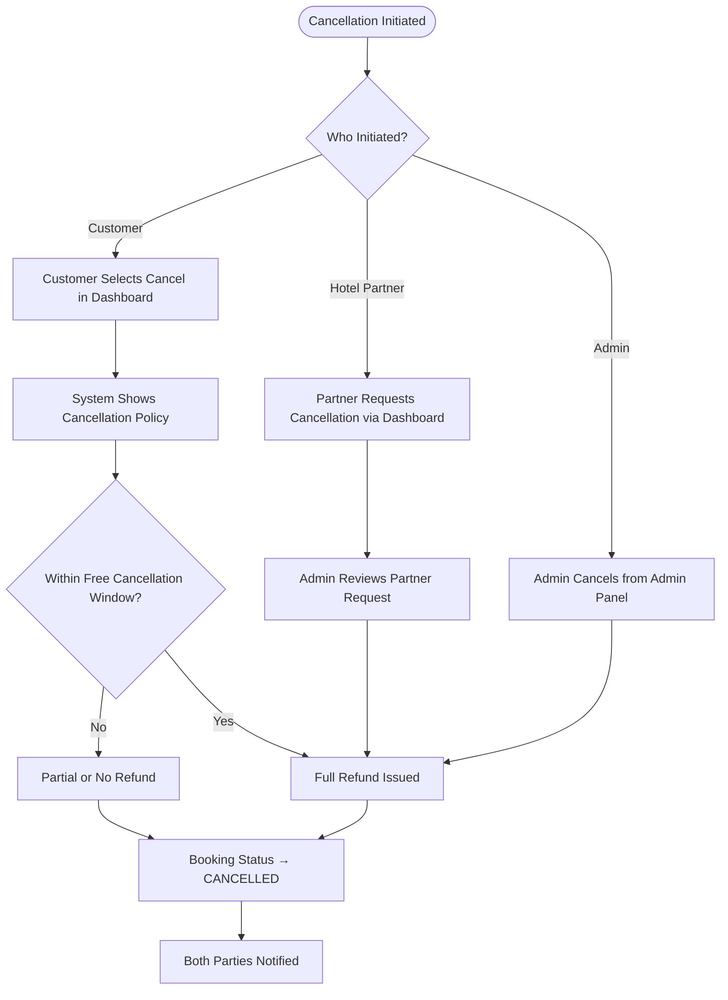
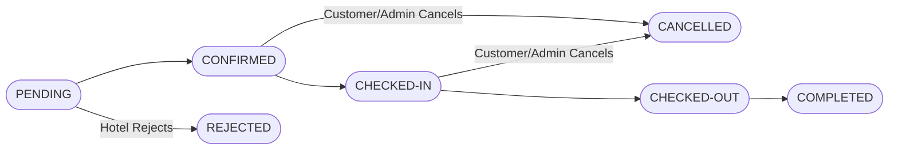

# Edunomo Hotel Listings and Booking Module — Workflow (V1)

## Overview

The Edunomo Hotel Listings & Booking module is a simple marketplace that connects **customers** looking for accommodation with **hotel/property partners** who list their properties on the platform. An **Edunomo Admin** oversees all listings, onboarding, and operations.

The V1 model is intentionally lightweight — focused on core listing, searching, booking, and payment flows without enterprise-level complexity.

**Core Capabilities (V1):**

- Hotel partner onboarding and profile management
- Room listing with pricing and basic availability
- Customer search, filter, and booking flow
- Secure payment collection
- Booking status management
- Admin oversight and controls
- Basic notification system

**Prepared by:** TechHelp Solutions | **Version:** 1.0 | **Status:** MVP Scope

## Actors / Roles

- **Customer** — A registered user who searches for hotels, views listings, selects rooms, makes payments, and manages their bookings. (Chart role card: search & book hotels; view booking history; manage cancellations; make payments.)
- **Hotel / Property Partner** — A registered business or property owner who lists their hotel, manages rooms and pricing, sets availability, and handles booking requests. (Chart role card: manage hotel profile; add rooms & pricing; set availability; view & manage bookings.)
- **Edunomo Admin** — A platform operator who reviews hotel applications, verifies documents, approves or rejects listings, monitors bookings, and resolves issues. (Chart role card: approve hotel partners; verify documents; manage all listings; handle issues & refunds.)

## Workflows

### Hotel Partner Onboarding

**Detailed Flow**

1. **Register / Apply** — Partner visits the Edunomo platform and clicks **"List Your Property"**, fills in basic contact and business details, and submits an application to join as a hotel partner.
2. **Submit Hotel Information** — Hotel name, address, and location; property type (hotel, guesthouse, serviced apartment, etc.); brief description and star/category rating; contact details and business name.
3. **Upload Basic Documents** — Business registration certificate, owner/manager ID proof, property ownership or lease document, bank account details for payouts.
4. **Admin Review** — Edunomo Admin receives notification of the new application, reviews submitted hotel information and documents, and may request corrections or additional information.
5. **Approve / Reject** — **If Approved:** partner account is activated. **If Rejected:** partner is notified with reason and may reapply after corrections (loops back to Register and Apply).
6. **Partner Receives Login** — Approved partner receives login credentials via email and is directed to the Hotel Partner Dashboard to begin setup.

### Hotel Partner Dashboard

**Detailed Flow**

1. Once onboarded, the hotel partner manages their presence on the platform through a dedicated dashboard.
2. **Manage Hotel Profile** — Update hotel name, description, address, contact details; update property type and amenities list (e.g. WiFi, parking, pool); set check-in / check-out policies.
3. **Upload Hotel Images** — Upload photos of the property, lobby, and room types. Minimum 3 images required for the listing to be visible. Images are reviewed by admin before going live (first upload only).
4. **Add Rooms** — Define room types (e.g. Standard Single, Deluxe Double, Suite); set room name, description, bed type, max occupancy, and amenities; set total room count per type.
5. **Set Room Price** — Set a base nightly price per room type; optionally set weekend pricing. All prices are in the platform's base currency.
6. **Set Basic Availability** — Mark rooms as available or unavailable by date range; block dates for maintenance or personal holds. Availability automatically updates when bookings are confirmed.
7. **View Bookings** — View list of upcoming, active, and past bookings; see guest name, room type, check-in/check-out dates, and payment status.
8. **Manage Booking Status** — Accept or reject pending booking requests (if manual confirmation is enabled); mark bookings as checked-in and checked-out; flag issues for admin support.

### Customer Workflow

**Detailed Flow**

1. **Search Hotels** — Customer enters destination (city or area) and travel dates; system returns matching available hotels.
2. **Filter Hotels** — Filter by price range, star rating / property type, and amenities (WiFi, parking, breakfast, etc.).
3. **View Hotel Details** — View hotel description, photos, location map, and amenities; read guest reviews (if available in V1); see hotel policies (check-in time, cancellation policy).
4. **View Rooms / Prices** — View all available room types for the selected dates; see room photos, description, occupancy, and nightly price.
5. **Select Room** — Customer selects preferred room type and number of rooms (if more than 1 is needed).
6. **Select Dates** — Confirm check-in and check-out dates; system calculates total nights and total price.
7. **Enter Guest Information** — Lead guest name and contact details; special requests (optional free-text field).
8. **Pay** — Review booking summary and total cost; select payment method (card, wallet, or other gateway); complete secure payment. On failure, the customer can retry or change payment method and attempt payment again.
9. **Confirm Booking** — Customer receives booking confirmation on-screen and via email/SMS; a booking reference number is generated; the hotel partner is notified of the new booking.
10. **View Booking History** — Customer can view all past and upcoming bookings and access booking details, confirmation, and the cancellation option.

### Payment Flow

**Detailed Flow**

1. **Standard Payment Flow** — Customer completes booking form and proceeds to payment. The system generates an order with the total amount (nights × room rate). Customer selects payment method and completes the transaction. Payment gateway confirms success. Booking status moves from **Pending → Confirmed**. Customer receives confirmation email/SMS and the hotel partner receives a new booking notification.
2. **Payment Failure** — If payment fails, the booking remains in **Pending** status; the customer is prompted to retry or use a different method (loops back to selecting a payment method). No hold is placed on room inventory until payment succeeds.
3. **Payout to Hotel Partner (Basic V1)** — Platform collects full payment from the customer. Admin manually or via scheduled batch processes partner payouts. Commission/service fee is deducted before payout. Payout method: bank transfer (details provided during onboarding).

### Admin Dashboard

**Detailed Flow**

1. **Manage Hotel Applications** — View all pending, approved, and rejected hotel applications; access full application details and uploaded documents.
2. **Verify Documents** — Review business registration, ID proof, and property documents; mark documents as verified or flag as insufficient.
3. **Approve / Reject Hotels** — Approve hotel listings to make them visible on the platform; reject applications with a reason note sent to the partner; ability to suspend an active hotel listing if issues arise.
4. **Manage Hotel Listings** — Edit or override hotel profile details if needed; hide or deactivate a listing without deleting it; feature or promote specific hotels (basic manual flagging).
5. **View Bookings** — Access all bookings across the platform; filter by hotel, date range, or booking status; export booking data (CSV).
6. **Handle Basic Issues** — Receive escalated issues from customers and hotel partners; manually update booking status in edge cases; issue refunds (trigger refund in payment gateway); send platform notifications to users.

### Cancellation Flow

**Detailed Flow**

1. **Customer-Initiated Cancellation** — Customer navigates to booking history and selects the booking, clicks **"Cancel Booking"**. The system displays the hotel's cancellation policy. Customer confirms cancellation. Booking status moves to **Cancelled**. Refund eligibility is determined by cancellation policy: **Free cancellation window:** full refund issued; **Outside cancellation window:** partial or no refund per policy. Customer and hotel partner receive cancellation notification.
2. **Hotel Partner-Initiated Cancellation** — Partner may request cancellation via dashboard (with reason). Admin reviews and approves the cancellation. Customer receives a full refund. Admin flags the partner account if cancellations are excessive.
3. **Admin-Initiated Cancellation** — Admin can cancel any booking from the admin panel. Reason is logged; customer is refunded as appropriate. Both parties are notified. (See conflict note under Notes: the chart routes the Admin path directly to "Full Refund Issued".)

## Statuses

| Status | Description |
| --- | --- |
| `Pending` | Booking submitted, awaiting confirmation |
| `Confirmed` | Payment received, booking confirmed by system or hotel |
| `Rejected` | Hotel partner rejected the booking (if manual mode) |
| `Checked-In` | Guest has arrived and checked in |
| `Checked-Out` | Guest has departed |
| `Completed` | Booking fully closed; eligible for review |
| `Cancelled` | Booking cancelled by customer or admin |

The doc PDF presents the main status path as text: `PENDING → CONFIRMED → CHECKED-IN → CHECKED-OUT → COMPLETED`, with downward branches to `REJECTED` and `CANCELLED`.

## Rules / Conditions

- Minimum 3 images are required for a hotel listing to be visible.
- Images are reviewed by admin before going live (first upload only).
- All prices are in the platform's base currency.
- Availability automatically updates when bookings are confirmed.
- Pending booking requests are accepted or rejected by the partner only if manual confirmation is enabled.
- No hold is placed on room inventory until payment succeeds; on payment failure the booking remains in `Pending` status.
- Refund eligibility on customer cancellation is determined by the hotel's cancellation policy: full refund within the free cancellation window; partial or no refund outside it, per policy.
- Hotel partner-initiated cancellations require admin review and approval; the customer receives a full refund and the admin flags the partner account if cancellations are excessive.
- Admin-initiated cancellations: reason is logged and the customer is refunded as appropriate.
- Commission/service fee is deducted before partner payout; payouts are processed manually by admin or via scheduled batch, by bank transfer.
- Rejected onboarding applicants are notified with reason and may reapply after corrections.

## Documents Required

Uploaded by the hotel partner during onboarding (Step 3 — Upload Basic Documents):

- Business registration certificate
- Owner/manager ID proof
- Property ownership or lease document
- Bank account details for payouts

Admin verifies these documents and marks them as verified or flags them as insufficient.

## Notifications

| Event | Customer | Hotel Partner | Admin |
| --- | --- | --- | --- |
| Booking confirmed | Email + SMS | Email | — |
| Booking rejected | Email | — | — |
| Booking cancelled | Email + SMS | Email | — |
| New application submitted | — | — | Email |
| Application approved | — | Email | — |
| Application rejected | — | Email | — |
| Payment received | Email | Email | — |
| Refund issued | Email | — | — |
| Issue escalated | — | — | Email |

All notifications are sent via email in V1. SMS is optional and dependent on gateway integration.

## Permissions & Access

| Permission | Customer | Hotel Partner | Admin |
| --- | --- | --- | --- |
| Search and view listings | Yes | Yes | Yes |
| Make a booking | Yes | — | — |
| Manage own bookings | Yes | — | — |
| View all platform bookings | — | — | Yes |
| View own hotel bookings | — | Yes | — |
| Create/edit hotel profile | — | Yes | — |
| Approve/reject hotels | — | — | Yes |
| Manage hotel listings (admin) | — | — | Yes |
| Issue refunds | — | — | Yes |
| Suspend/deactivate hotel | — | — | Yes |
| Upload documents | — | Yes | — |
| Verify documents | — | — | Yes |

## V1 Scope

**In Scope (V1 / MVP):**

- Hotel partner registration, onboarding, and document upload
- Admin review, approval, and rejection of hotel applications
- Hotel profile management (name, description, photos, amenities, policies)
- Room type management (name, description, pricing, occupancy, count)
- Basic date-based availability management
- Customer search by destination and dates
- Filters: price, rating, property type, amenities
- Hotel detail page with photos, rooms, and pricing
- Booking flow: room selection → dates → guest info → payment → confirmation
- Payment via third-party gateway (e.g. Stripe, Flutterwave, Paystack)
- Booking status management (Pending, Confirmed, Checked-In, Checked-Out, Completed, Cancelled)
- Cancellation flow with basic policy enforcement
- Customer booking history
- Hotel partner booking dashboard
- Admin panel: listings, bookings, applications, basic issue handling
- Email notifications for key events
- Basic role-based permissions

**Out of Scope (V1 — Future Phases):**

- Channel manager integrations (e.g. Cloudbeds, SiteMinder)
- Dynamic or AI-based pricing
- Advanced inventory synchronization across OTAs
- Complex commission/settlement engines or automated reconciliation
- Loyalty or rewards programs
- Multi-currency or multi-language support
- Airbnb / Booking.com-level feature parity
- Reviews and rating system (may be added in V1.1)
- Advanced analytics and reporting dashboards
- Mobile native apps (web-responsive first)
- API integrations for third-party services (beyond payment gateway)

## Notes

- **Chart vs doc — transitions into `CANCELLED` and `REJECTED`:** the chart draws `Hotel Rejects` from `PENDING` to `REJECTED`, and `Customer/Admin Cancels` edges from `CONFIRMED` and from `CHECKED-IN` into `CANCELLED`. The doc PDF's text rendering of the status flow places its downward arrow to `REJECTED` roughly beneath `CONFIRMED` and its arrow to `CANCELLED` roughly beneath `CHECKED-OUT` (column alignment in the text diagram is imprecise). The doc's status table descriptions ("Hotel partner rejected the booking (if manual mode)", "Booking cancelled by customer or admin") are consistent with the chart's topology, which this file follows; both renderings are noted here rather than silently reconciled.
- **Chart vs doc — Admin-initiated cancellation refund:** the chart routes the Admin path directly to "Full Refund Issued", while the doc says "Reason is logged; customer is refunded as appropriate." Both are documented; the sources were not reconciled.
- **Source formatting artifact:** in the doc PDF's Customer-Initiated Cancellation list, the final step ("Customer and hotel partner receive cancellation notification") is numbered "1." due to a list-numbering glitch in the source; by position it is the last step of that flow and is documented as such above.
- Guest reviews on the hotel detail page are qualified "if available in V1" in the doc; the reviews and rating system is listed as out of scope for V1 (may be added in V1.1).
- Booking flow summary (from V1 scope): room selection → dates → guest info → payment → confirmation.
- Payment is via a third-party gateway (e.g. Stripe, Flutterwave, Paystack). SMS notifications are optional and dependent on gateway integration.
- The doc closes with: "Document prepared by TechHelp Solutions — 'We Code Your Success'" and "© 2026 Edunomo. All rights reserved. Internal use only."

## Source Documents

- Edunomo Hotel Listings & Booking Module Workflow chart.pdf (1 landscape page — flowchart)
- Edunomo Hotel Listings & Booking Module Workflow doc.pdf (11 pages — workflow and product specification)
