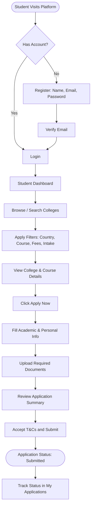
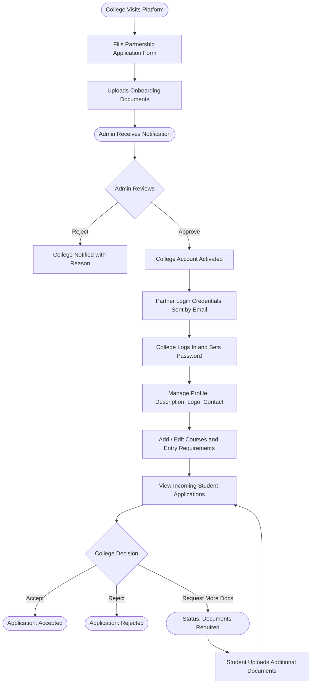
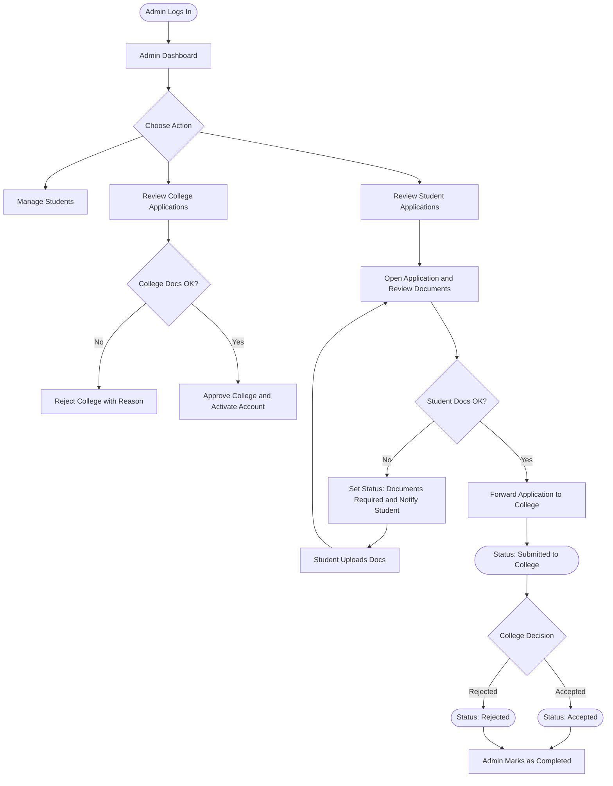
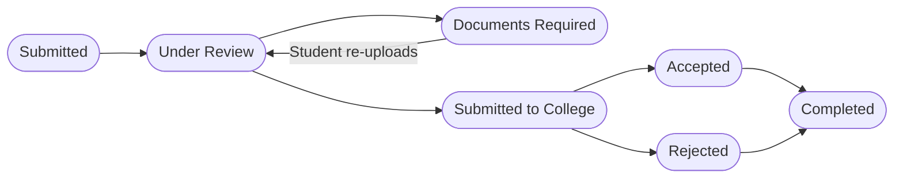

# Edunomo Study Abroad Module — Workflow (V1)

## Overview

The **Edunomo Study Abroad Module** is a web-based platform that connects students with partner colleges offering international study opportunities. The V1/MVP focuses on a streamlined application and management workflow for three core user types: **Students**, **Edunomo Admins**, and **College Partners**.

**Core Goals (V1):**

- Allow students to discover, filter, and apply to partner colleges
- Allow college partners to manage their profile, courses, and received applications
- Allow Edunomo admin to vet college partners, verify student documents, and manage the application pipeline
- Provide a clear, trackable application status for all parties

**Tech Stack Assumption:** Standard web application (frontend + backend + database). No third-party university API integrations in V1.

## Actors / Roles

- **Student / Customer** — Registers and logs into the platform; browses and searches college listings; submits study abroad applications; uploads required documents; tracks their application status. (Chart summary: Browse, apply, track.)
- **Edunomo Admin** — Full platform access; reviews and approves/rejects college partnership applications; verifies student documents; manages college listings; forwards student applications to colleges; updates application statuses. (Chart summary: Verify, approve, forward, manage all.)
- **College Partner** — Applies for platform partnership (one-time onboarding); receives a partner login upon approval; manages their college profile and course listings; views, accepts, rejects, or requests additional info for student applications. (Chart summary: Onboard, manage courses, review applications.)

## Workflows

### Student Workflow

**Detailed Flow**

1. **Register / Login** — Student visits the Edunomo platform. If they have no account, they click **Sign Up** and fill in: Name, Email, Password, Phone Number (the chart's register node lists only "Name, Email, Password" — see the conflict note in Notes). They verify their email via a confirmation link, then log in to their student dashboard.
2. **Browse Colleges** — Student lands on the college listing page; views all active partner colleges with basic info (name, country, programs, fees); can paginate or scroll through results.
3. **Search & Filter Colleges** — Available filters: Country / City; Course / Program type; Tuition fee range; Intake period (e.g. Jan, Sep).
4. **View College & Course Details** — Student clicks on a college card; views college overview, available courses, entry requirements, fees, and application deadlines. Each course has a **"Apply Now"** button.
5. **Start Application** — Student clicks **Apply Now** on a course. The system checks if the student is logged in (redirects to login if not). An application draft is created and the student enters the application form.
6. **Enter Academic & Personal Information** — Fields include: Full name, date of birth, nationality, passport number; Highest qualification, institution name, graduation year, grades/GPA; English language proficiency (IELTS/TOEFL score or self-declaration); Intended start date.
7. **Upload Required Documents** — Typical documents (configured per college/course): Passport copy; Academic transcripts / certificates; English language test results; Personal statement / motivation letter; Any college-specific documents. Upload format: PDF or image files. Max size per file: defined at system level (e.g. 5MB).
8. **Review & Submit Application** — Student reviews all entered information and uploaded files on a summary screen; accepts terms and conditions; clicks **Submit Application**. Application status changes to `Submitted` and the student receives a confirmation email.
9. **Track Application Status** — Student visits **My Applications** in their dashboard; sees all applications with current status; receives email/in-app notifications on status changes. If status is `Documents Required`, the student can upload additional documents.

### College Partner Workflow

**Detailed Flow**

1. **College Submits Partnership Application** — College representative visits the Edunomo website; clicks **Become a Partner** or **Register as College**; fills in: College name, country, contact person, website, brief description; uploads partnership documents: Accreditation certificate, registration documents, authorised representative ID.
2. **Admin Reviews Application / Documents** — Admin receives notification of new college application; reviews submitted information and documents in the admin panel; verifies authenticity and eligibility.
3. **Admin Approves / Rejects** — **If Approved:** College account is activated; partner login credentials are sent via email. **If Rejected:** College is notified via email with a brief reason.
4. **Approved College Gets Partner Login** — College logs in with credentials received by email; is prompted to set a new password on first login; lands on the **College Partner Dashboard**.
5. **College Manages Basic Profile & Courses** — Profile management: update college description, logo, country, address, contact info. Course management: add / edit / remove courses; each course: title, level (Bachelor/Master/etc.), duration, fees, entry requirements, intake dates, available seats.
6. **College Views Student Applications** — In the dashboard, the college sees a list of student applications sent to them by the admin. Each application shows: Student name, applied course, submission date, documents, current status.
7. **College Accepts / Rejects / Requests Additional Info** —
   - **Accept:** Marks application as `Accepted`; admin and student are notified.
   - **Reject:** Marks as `Rejected` with optional reason; admin and student are notified.
   - **Request Additional Info:** College adds a note specifying what's missing; application status changes to `Documents Required`; student is notified. Once the student uploads additional documents, the application returns to the college's incoming applications list (loop-back in the chart).

### Admin Workflow

**Detailed Flow**

1. **Manage Students** — View all registered students; search students by name, email, or nationality; view individual student profiles and their applications; deactivate/reactivate student accounts if needed.
2. **Review College Applications** — View list of pending college partnership applications; open individual application to review all details and uploaded documents; approve or reject with a note. Approval activates the college partner account; rejection triggers a notification email to the college with a reason.
3. **Verify Documents** — For both college onboarding docs and student application docs, admin manually reviews uploaded files and marks documents as `Verified` or flags them as `Insufficient`.
4. **Review Student Applications** — View all applications across all colleges; filter by status, college, or date range; open individual application to review all info and documents.
5. **Verify Student Documents** — Admin reviews each uploaded document; marks documents as `Verified` / `Insufficient`. If insufficient: changes application status to `Documents Required` and notifies the student. After the student uploads the requested documents, the admin re-reviews them (loop-back in the chart).
6. **Forward Application to College** — Once student documents are verified, admin forwards the application to the relevant college; application status changes to `Submitted to College`; college receives an in-app notification.
7. **College Decision and Completion** — After the college decides, the status becomes `Accepted` or `Rejected`, and the admin marks the application as `Completed`.
8. **Update Application Status** — Admin can manually update the status at any stage if needed (e.g. to reflect offline communications).

## Statuses

Application Status Flow (as drawn in the chart):

The doc PDF presents the same flow linearly: `Submitted` → `Under Review` (Admin is reviewing documents) → `Documents Required` (Student must upload additional docs; can loop back to `Under Review`) → `Submitted to College` (Admin forwarded to college partner) → `Accepted` OR `Rejected` → `Completed`.

**Status Descriptions:**

| Status | Triggered By | Meaning |
|---|---|---|
| `Submitted` | Student | Application submitted, awaiting admin review |
| `Under Review` | Admin | Admin is reviewing documents |
| `Documents Required` | Admin / College | Student needs to provide more documents |
| `Submitted to College` | Admin | Application forwarded to the college |
| `Accepted` | College | College has accepted the student |
| `Rejected` | Admin / College | Application rejected |
| `Completed` | Admin | Process fully completed (e.g. visa / enrolment confirmed) |

Document verification statuses (per document, not per application): `Verified` / `Insufficient`.

## Rules / Conditions

- The system checks if the student is logged in when clicking **Apply Now** (redirects to login if not); an application draft is created before the form is entered.
- Student must review the application summary and accept terms and conditions before submitting.
- If status is `Documents Required`, the student can upload additional documents; re-uploads send the application back to `Under Review`.
- Admin forwards an application to the college only once student documents are verified.
- College rejection of a student application may include an optional reason; admin rejection of a college partnership application includes a brief reason.
- Admin can manually update the application status at any stage if needed (e.g. to reflect offline communications).
- Access notes (from chart): College login only active after admin approval; Admin has override on all statuses; Students can only see their own applications.

## Documents Required

**Student Application Documents:**

- Passport copy (required)
- Academic transcripts / degree certificates (required)
- English language proof — IELTS/TOEFL or equivalent (required)
- Personal statement / motivation letter (required)
- Other documents as specified by college (optional/conditional)

**College Onboarding Documents:**

- Accreditation certificate
- Government registration / licence
- Authorised representative ID / authorisation letter

**Document Rules (V1):**

- Accepted formats: PDF, JPG, PNG
- Max file size: 5MB per file
- Stored securely on server / cloud storage
- Admin can download any uploaded document

## Notifications

All notifications are delivered via **Email** and **In-App** (dashboard bell icon).

| Event | Who Gets Notified |
|---|---|
| Student submits application | Admin |
| Admin requests documents | Student |
| Admin forwards to college | College |
| College requests additional documents | Student + Admin |
| College accepts application | Student + Admin |
| College rejects application | Student + Admin |
| New college partnership application | Admin |
| College application approved | College |
| College application rejected | College |
| Application status updated | Student |

Chart note summary (Notifications V1): Student submits → Admin notified; Docs required → Student notified; Forwarded to college → College notified; College decision → Student + Admin notified; College approved/rejected → College notified.

## Permissions & Access

| Feature | Student | College Partner | Admin |
|---|---|---|---|
| Register / Login | Yes | Yes (after approval) | Yes |
| Browse & search colleges | Yes | — | Yes |
| Submit application | Yes | — | — |
| View own applications | Yes | — | — |
| Manage college profile & courses | — | Yes | Yes |
| View received applications | — | Yes | Yes |
| Accept / Reject student apps | — | Yes | — |
| Forward apps to college | — | — | Yes |
| Verify documents | — | — | Yes |
| Approve / Reject college partners | — | — | Yes |
| Manage all users | — | — | Yes |
| Update application status manually | — | — | Yes |

Access notes (from chart): College login only active after admin approval; Admin has override on all statuses; Students can only see their own applications.

## V1 Scope

**In Scope (V1 / MVP):**

- Student registration, login, profile
- College browsing, search and filter
- College detail and course detail pages
- Full application form with document upload
- Application status tracking (student-facing)
- College partner onboarding workflow
- College profile and course management
- College application management (accept / reject / request docs)
- Admin panel: manage students, colleges, applications, documents
- Email notifications for key events
- In-app notification bell
- Basic role-based access (Student / College / Admin)
- Application status flow as defined in the Statuses section

(The chart's condensed "V1 In Scope" note lists: Student registration & application; College browsing, search & filter; Document upload & verification; College partner onboarding; Admin management panel; Email + in-app notifications; Role-based access control — a condensed form of the doc's full list above.)

**Out of Scope (Future Phases):**

- Third-party university / UCAS / Common App integrations
- Automated document verification / OCR
- AI-based college recommendations
- In-platform live chat or messaging system
- Payment processing / application fees
- Visa application tracking
- Student accommodation search
- Mobile app (iOS / Android)
- Multi-language support
- Advanced analytics / reporting dashboard
- CRM integrations
- Scholarship listings

(The chart's condensed "Out of Scope (V1)" note lists: University API integrations; Automated OCR / AI verification; AI college recommendations; In-app live chat; Payment processing; Mobile app; Scholarship listings; Multi-language support — a subset of the doc's full list above.)

## Notes

- **Document metadata:** Prepared by TechHelp Solutions ("We Code Your Success"). Version: 1.0 — MVP. Status: Draft — For Client and Developer Review.
- **Tech stack assumption:** Standard web application (frontend + backend + database); no third-party university API integrations in V1.
- **Chart-vs-doc conflict (registration fields):** The chart's register node reads "Register: Name, Email, Password", while the doc PDF's Student Workflow Step 1 lists Name, Email, Password, **Phone Number**. Both are recorded here; the discrepancy is not resolved in the sources.
- **File size wording:** The doc's Student Workflow Step 7 says max size per file is "defined at system level (e.g. 5MB)", while the doc's Documents section and the chart note state a flat "Max file size: 5MB per file". Both wordings are preserved here.
- **Glossary (from doc):**
  - MVP — Minimum Viable Product, the simplest working version
  - Admin — Edunomo internal staff with full platform access
  - College Partner — An approved educational institution listed on the platform
  - Application — A student's formal request to study at a partner college
  - Documents Required — A status indicating the student must upload additional files
  - Intake — The academic enrolment period (e.g. September, January)

## Source Documents

- `Edunomo_Study_Abroad_V1_Workflow_doc.pdf` — Edunomo Study Abroad Module, Workflow Document (V1/MVP), 8 pages
- `Edunomo_Study_Abroad_V1_Workflow_chart.pdf` — Edunomo Study Abroad Module, Workflow Diagrams (V1/MVP), 1 landscape page
