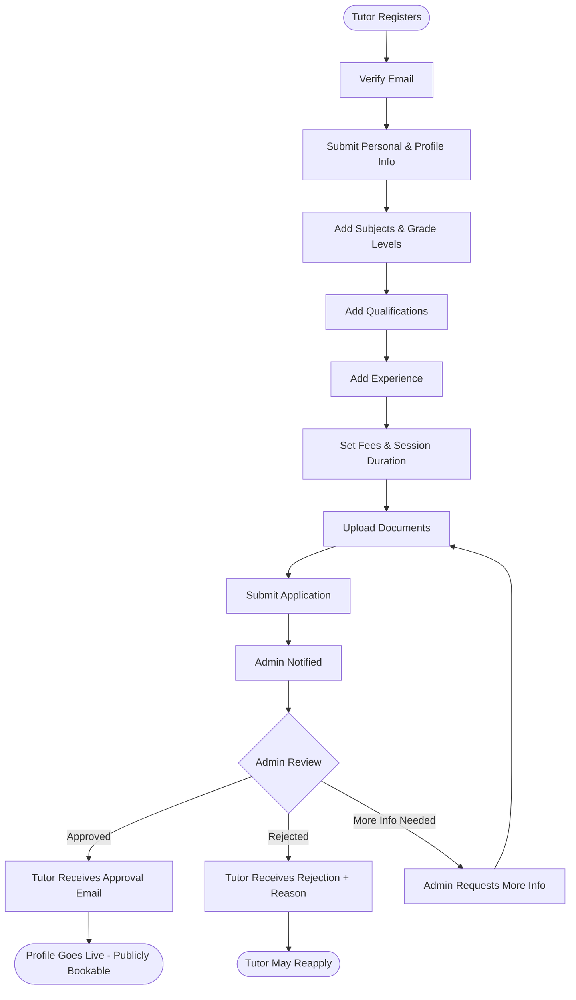
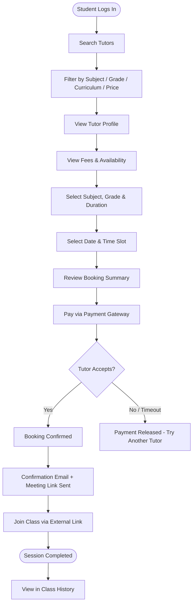
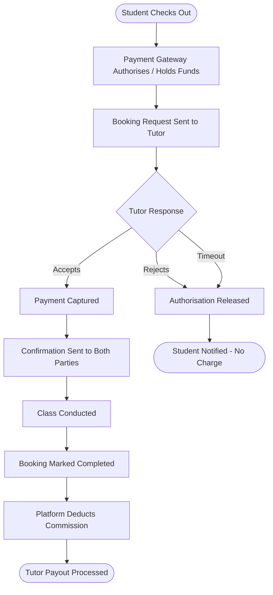
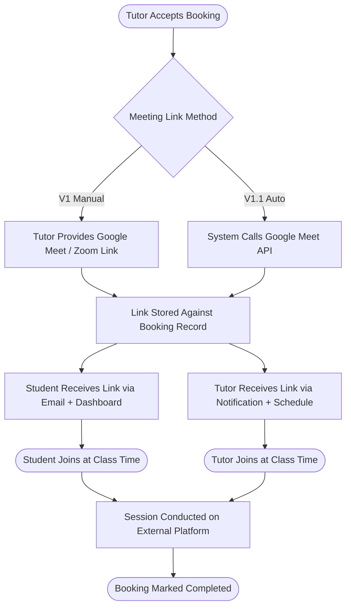
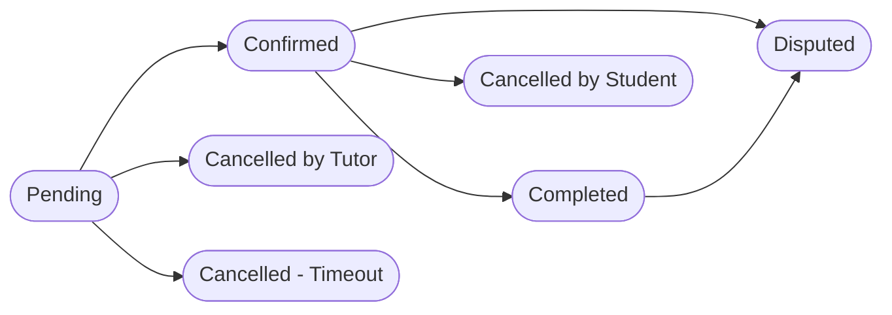

# Edunomo Tuition Services Module — Workflow (V1)

## Overview

The Edunomo Tuition Services module is a **simple tutor marketplace** that connects students with qualified tutors. The core purpose is tutor discovery, profile browsing, class booking, payment processing, and coordination of external video meetings.

This is **not** a full learning management system. There is no in-house video, no in-app chat, no course management, and no AI tutoring. The V1/MVP focus is exclusively on connecting students with tutors and facilitating bookings.

**Core Value Proposition:**

- Students find and book tutors easily
- Tutors manage their availability and earn income
- Edunomo admin oversees quality and trust
- All classes are conducted via external meeting links (Google Meet, Zoom, etc.)

## Actors / Roles

- **Student / Customer** — A registered user who searches for tutors, views profiles, books classes, and pays for sessions. Students join classes via external meeting links provided at booking confirmation.
- **Tutor** — A registered professional who creates a profile, lists subjects and qualifications, sets fees and availability, and accepts or rejects booking requests. Tutors conduct classes via external meeting links.
- **Edunomo Admin** — A platform administrator who reviews tutor applications, verifies documents, approves or rejects tutor profiles, manages the platform, views all bookings, and handles disputes.

## Workflows

### Tutor Onboarding Flow

**Detailed Flow**

1. **Register** — Tutor visits the platform and creates an account; provides email address and sets a password; verifies email via confirmation link.
2. **Submit Personal & Profile Information** — Full legal name, profile photo, short bio / teaching philosophy, location / time zone, languages of instruction.
3. **Add Subjects** — Select subjects they are qualified to teach (e.g. Mathematics, English, Physics); specify grade levels or academic levels per subject; specify curriculum compatibility (e.g. Cambridge, IB, National Curriculum, etc.).
4. **Add Qualifications** — Degree(s) and institution(s), teaching certifications or licences, year of completion.
5. **Add Experience** — Years of teaching experience, previous roles or institutions, specialisations or notable achievements.
6. **Set Basic Fees** — Hourly rate (per subject or uniform), currency selection, session duration options (e.g. 45 min, 60 min, 90 min).
7. **Submit Documents** — National ID or passport copy, relevant qualification certificates, any background check documentation (where applicable).
8. **Submit Application / Admin Notified** — Admin receives notification of a new tutor application.
9. **Admin Reviews** — Reviews submitted profile, qualifications, and documents; may request additional information from the tutor (the flow loops back to document upload/resubmission).
10. **Approve / Reject** —
    - **Approved:** Tutor receives confirmation email; profile goes live.
    - **Rejected:** Tutor receives rejection email with reason; may reapply after addressing issues.
11. **Tutor Profile Becomes Available** — Profile is publicly visible in the tutor marketplace; students can search and book the tutor.

### Student Booking Flow

**Detailed Flow**

1. **Search & Discovery** — Student logs in and searches tutors by keyword (name, subject). Results can be filtered by: subject, grade level, curriculum (e.g. Cambridge, IB, National), price range, availability (day/time), and rating (post-V1 enhancement).
2. **View Tutor Profile** — View tutor bio, photo, subjects, qualifications, experience; view fees and session duration options; view available time slots.
3. **Book a Class** — Select subject and grade level; select session duration; select date and available time slot; review booking summary (tutor, subject, time, fee); proceed to payment.
4. **Payment** — Enter payment details (card or supported payment gateway). Payment is held pending tutor acceptance. Upon tutor acceptance the payment is captured; upon tutor rejection the payment is released / not captured (chart: "Payment Released - Try Another Tutor").
5. **Receive Confirmation** — Email confirmation with: tutor name, subject and grade level, date and time, session duration, external meeting link.
6. **Join Class** — Access the meeting link from the confirmation email or from the student dashboard; link opens the external video call in a new tab.
7. **Session Completed / Class History** — View past completed sessions; see tutor name, subject, date, duration, and amount paid.

### Payment Flow

**Detailed Flow**

1. Student selects a session and proceeds to checkout.
2. Payment is authorised (held) via the payment gateway.
3. Booking request is sent to the tutor.
4. **If tutor accepts** — payment is captured; confirmation sent to both.
5. **If tutor rejects (within response window)** — authorisation is released; student notified.
6. **If tutor does not respond (timeout)** — booking auto-cancelled; payment released.
7. After class completion — funds are released to tutor (minus platform commission).
8. Platform commission is retained by Edunomo.

> **V1 Payment Gateway:** Single gateway integration (e.g. Stripe or local equivalent). Multi-currency support to be assessed per market.

### External Video Meeting Flow

**Detailed Flow**

Edunomo does not build or host video calling infrastructure. All classes are conducted via external meeting links.

1. Tutor accepts a booking.
2. System triggers meeting link generation:
   - **Option A:** Admin or tutor manually provides a Google Meet or Zoom link.
   - **Option B (preferred):** System auto-generates a Google Meet link via Google Calendar API / Meet API.
3. Meeting link is stored against the booking record.
4. Link is distributed to:
   - Student: via confirmation email and student dashboard.
   - Tutor: via confirmation notification and tutor schedule view.
5. At class time, both parties click the link to join.
6. After the session, the booking status is updated to **Completed**.

> **V1 Scope:** Manual link entry by tutor at acceptance is acceptable for MVP. Auto-generation via API is a V1.1 enhancement.

## Statuses

Each booking moves through the following statuses:

| Status | Description |
| --- | --- |
| `Pending` | Student has requested and paid; awaiting tutor response |
| `Confirmed` | Tutor has accepted; meeting link issued to both parties |
| `Cancelled by Tutor` | Tutor rejected or cancelled; student refunded |
| `Cancelled by Student` | Student cancelled (subject to cancellation policy) |
| `Completed` | Class session has taken place |
| `Disputed` | Either party has raised an issue; under admin review |

Booking Status Flow (from the chart):

> **Chart vs. doc note:** The chart's status flow includes a `Cancelled - Timeout` status (reached from `Pending` when the tutor does not respond). The doc PDF's status table does not list `Cancelled - Timeout` as a status; the doc describes the timeout case in the Payment Flow as "booking auto-cancelled; payment released". Both are documented here as given in each source.

## Rules / Conditions

- Payment is **authorised (held)** at checkout via the payment gateway; it is **captured only upon tutor acceptance**.
- If the tutor **rejects within the response window**, the authorisation is released and the student is notified (payment refunded or not captured).
- If the tutor **does not respond (timeout)**, the booking is auto-cancelled and the payment is released.
- After class completion, funds are released to the tutor **minus platform commission**; the platform commission is retained by Edunomo.
- Student cancellation is **subject to cancellation policy** (policy details not further specified in the source).
- A rejected tutor **may reapply after addressing issues**; the admin may instead request more information, which loops the application back to document upload/resubmission.
- Tutor availability: weekly recurring availability (days and time slots); tutors can block specific dates (holidays, personal leave); availability is displayed to students during the booking flow.
- Fees: hourly rate (per subject or uniform), currency selection, session duration options (e.g. 45 min, 60 min, 90 min); tutors can update rates and adjust duration options.
- Search filtering by rating is a **post-V1 enhancement**.
- All classes are conducted via external meeting links; after the session the booking status is updated to `Completed`.

## Documents Required

Tutor onboarding (Step 7 — Submit Documents):

- National ID or passport copy
- Relevant qualification certificates
- Any background check documentation (where applicable)

Admin performs document verification: download and review uploaded ID and qualification documents; mark documents as verified or flag for follow-up.

## Notifications

The following system notifications are triggered automatically:

| Event | Student | Tutor | Admin |
| --- | --- | --- | --- |
| Tutor application submitted | — | Yes | Yes |
| Tutor application approved | — | Yes | — |
| Tutor application rejected | — | Yes | — |
| New booking request | — | Yes | — |
| Booking confirmed | Yes | Yes | — |
| Booking cancelled by tutor | Yes | Yes | — |
| Booking cancelled by student | Yes | Yes | — |
| Class reminder (24 hrs before) | Yes | Yes | — |
| Class reminder (1 hr before) | Yes | Yes | — |
| Payment captured | Yes | — | — |
| Payment refunded | Yes | — | — |
| Dispute raised | — | — | Yes |

> **V1 Notification Channels:** Email only. Push notifications and SMS are out of scope for V1.

## Permissions & Access

Basic permissions:

| Feature | Student | Tutor | Admin |
| --- | --- | --- | --- |
| Register / log in | Yes | Yes | Yes |
| Search tutors | Yes | — | Yes |
| View tutor profiles | Yes | — | Yes |
| Book a class | Yes | — | — |
| Make a payment | Yes | — | — |
| Create / manage own profile | — | Yes | — |
| Set availability | — | Yes | — |
| Accept / reject bookings | — | Yes | — |
| View own schedule | — | Yes | — |
| View own class history | Yes | Yes | — |
| Review tutor applications | — | — | Yes |
| Approve / reject tutors | — | — | Yes |
| Manage all bookings | — | — | Yes |
| Handle disputes | — | — | Yes |
| Suspend / deactivate users | — | — | Yes |

## V1 Scope

**In Scope (V1 / MVP):**

- Tutor registration and profile creation
- Admin-driven tutor onboarding approval
- Student search, filter, and tutor discovery
- Class booking and scheduling
- Payment processing (single gateway)
- External meeting link coordination
- Email notifications
- Basic admin dashboard (applications, bookings, disputes)
- Basic tutor and student dashboards

**Explicitly Out of Scope** — the following features are **excluded from V1** and must not be scoped, estimated, or built in this phase:

| Feature | Reason Excluded |
| --- | --- |
| In-house video calling system | High complexity; use external providers (Google Meet, Zoom) |
| In-app chat / messaging | Out of scope for MVP; use email and meeting links |
| Live online classroom | Full LMS feature; not a V1 requirement |
| Recorded lectures | Storage and streaming complexity; deferred |
| Course management | Multi-lesson structured learning; deferred to V2 |
| Exams and tests | Assessment infrastructure; deferred |
| Assignments and homework | LMS feature; deferred |
| AI tutoring | Significant R&D investment; deferred |
| Learning management system (LMS) | Full LMS is a different product category |
| Mobile application (iOS/Android) | Web-first for V1; mobile app deferred |
| Multi-currency / multi-region | Single market launch for V1 |
| Push notifications / SMS | Email only for V1 |
| Tutor ratings and reviews | Post-launch enhancement |
| Subscription / package bookings | Single-session bookings only in V1 |

## APIs / Integrations

- **Payment gateway:** single gateway integration (e.g. Stripe or local equivalent); multi-currency support to be assessed per market.
- **External video providers:** Google Meet, Zoom, or other configured provider — links open in a new tab; manual link entry by tutor at acceptance is acceptable for MVP (V1).
- **Google Calendar API / Meet API:** preferred method for auto-generating Google Meet links; a V1.1 enhancement.

## Notes

- **Tutor Workflow (ongoing, after approval)** — no dedicated chart diagram; once approved, tutors manage their presence and classes through the following actions:
  - *Profile Management:* update bio, photo, and personal information; add or remove subjects and grade levels; update qualifications and experience.
  - *Fee Management:* update hourly rates; adjust session duration options.
  - *Availability Management:* set weekly recurring availability (days and time slots); block specific dates (holidays, personal leave); availability is displayed to students during the booking flow.
  - *Booking Requests:* receive notifications of new booking requests; view student name, subject, grade level, requested date/time, and session duration; **Accept** the request → booking is confirmed, meeting link is generated; **Reject** the request → student is notified, payment is refunded or not captured.
  - *Schedule View:* view upcoming confirmed classes in a calendar or list view; view student details and subject per class.
  - *Join Class:* access the external meeting link from the schedule view; link opens in a new tab (Google Meet, Zoom, or other configured provider).
  - *Class History:* view past completed sessions; see student name, subject, date, duration, and earnings per session.
- **Admin Workflow** — no dedicated chart diagram:
  - *Tutor Application Review:* dashboard listing all pending tutor applications; view submitted profile, documents, and qualifications; approve or reject with a note/reason.
  - *Document Verification:* download and review uploaded ID and qualification documents; mark documents as verified or flag for follow-up.
  - *Tutor Management:* view and edit any tutor profile; suspend or deactivate a tutor account; reinstate a tutor.
  - *Booking Overview:* view all bookings across the platform (pending, confirmed, completed, cancelled); filter by tutor, student, subject, or date range.
  - *Dispute / Issue Handling:* view flagged bookings or reported issues; take action: issue refund, cancel booking, warn or suspend a user.
- The chart's status flow contains a `Cancelled - Timeout` status not listed in the doc's status table (see the note in Statuses above).
- Document metadata: Prepared by TechHelp Solutions; Version 1.0 — MVP; Classification: Internal / Development Reference; Document Version: V1.0 — MVP Scope; Status: Draft for review.

## Source Documents

- Edunomo Tuition Services — Module Workflow V1 chart.pdf ("Edunomo Tuition Services — Visual Diagrams (V1/MVP)", 1 page)
- Edunomo Tuition Services — Module Workflow V1 docs.pdf ("Edunomo Tuition Services — Module Workflow (V1/MVP)", 11 pages)
