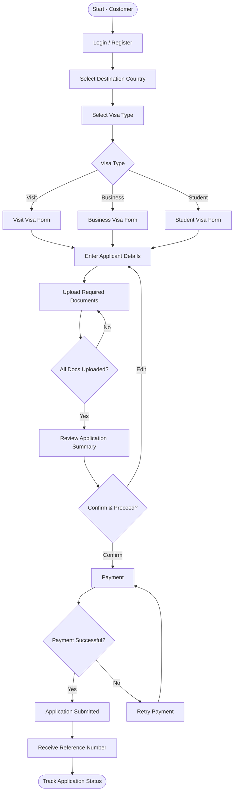
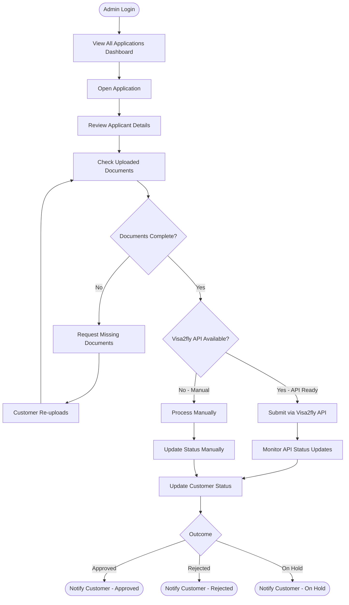
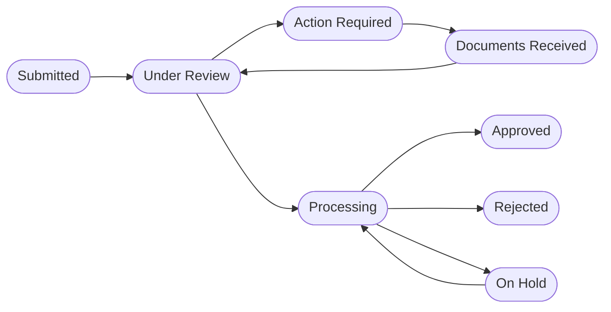

# Edunomo Visa Services Module — Workflow (V1)

> **Version:** 1.0 – MVP / V1 · **Status:** Draft · **Prepared by:** TechHelp Solutions
>
> **Note (from source):** Visa2fly API integration is planned but not yet confirmed. All references to Visa2fly are marked as dependent on API availability and final API documentation.

## Overview

The Edunomo Visa Services module enables customers to apply for visas through the Edunomo platform. Edunomo acts as a service layer — collecting applicant information, managing documents, processing payments, and coordinating with operations staff. Where available, Edunomo will forward applications to the Visa2fly API for processing.

**Edunomo does not rebuild or replicate Visa2fly functionality.** It provides a user-friendly interface and an operations dashboard to manage the visa application lifecycle.

### Supported Visa Types (V1)

| Visa Type | Description | Typical Use Case |
|---|---|---|
| Visit Visa | Short-term entry for tourism or family visits | Holidays, family reunions |
| Business Visa | Entry for business-related activities | Meetings, conferences, trade |
| Student Visa | Entry for study at an approved institution | University, language schools |

*Additional visa types may be added in future versions based on demand.*

## Actors / Roles

- **Customer**
  - Registers/logs in to the Edunomo platform
  - Selects destination country and visa type
  - Completes the application form and uploads required documents
  - Makes payment through the platform
  - Submits the application and tracks its status
- **Edunomo Admin / Operations**
  - Views and manages all incoming visa applications
  - Reviews applicant details and uploaded documents
  - Requests missing or incorrect documents from the customer
  - Manually processes or forwards applications to Visa2fly *(if API is available)*
  - Updates application status and communicates with the customer
- **External Visa API (Visa2fly)**
  - ⚠️ Integration is dependent on API availability and final API documentation.
  - Receives application data forwarded by Edunomo Admin
  - Processes the application with the respective embassy/consulate
  - Returns status updates to Edunomo
  - Edunomo is not responsible for Visa2fly's internal processing

## Workflows

### Customer Workflow



**Detailed Flow**

1. **Login / Register** — Customer creates an account or logs in to Edunomo. Required: Name, email, phone, password. Email/phone verification on first registration.
2. **Select Destination Country** — Customer selects the destination country; the system displays available visa types for that country.
3. **Select Visa Type** — Customer selects one of the supported visa types: Visit Visa, Business Visa, or Student Visa. The system displays the relevant requirements and document checklist. In the chart, each type routes to its own form: Visit Visa Form, Business Visa Form, or Student Visa Form.
4. **Enter Applicant Details** — Customer fills in the application form. Fields include: Full name, date of birth, nationality, passport number, passport expiry, contact details, travel dates, purpose of travel. Additional fields are shown based on visa type (e.g. university name for Student Visa).
5. **Upload Required Documents** — Customer uploads required documents based on visa type and destination. Supported formats: PDF, JPG, PNG. The system validates file size and format. The customer can save progress and return later. If not all documents are uploaded (**All Docs Uploaded? = No**), the flow loops back to the upload step.
6. **Review Application Summary** — Customer reviews all entered details and uploaded documents before submission and can edit any section before proceeding (**Confirm & Proceed? = Edit** returns to Enter Applicant Details).
7. **Payment** — Customer views the service fee breakdown and pays via the integrated payment gateway. Payment confirmation is issued on success. The application is not submitted until payment is confirmed. On failure (**Payment Successful? = No**), the customer proceeds to Retry Payment, which loops back to Payment.
8. **Application Submitted / Receive Reference Number** — After successful payment, the application is submitted to Edunomo and the customer receives a submission confirmation with an Application Reference Number.
9. **Track Application Status** — Customer can log in and view the current status of their application. Status updates are reflected in real time (or near real time based on Admin updates), and the customer receives notifications on status changes.

### Admin / Operations Workflow



**Detailed Flow**

1. **Admin Login / View Applications** — Admin logs in to the Edunomo Admin Dashboard and views all submitted applications with filters: status, visa type, date, destination.
2. **Open Application / Review Applicant Details** — Admin opens an application and reviews all submitted details. Admin can flag incorrect or incomplete information.
3. **Check Uploaded Documents** — Admin reviews uploaded documents and verifies they are legible, valid, and complete.
4. **Documents Complete? = No → Request Missing Documents** — If documents are missing or incorrect, Admin sends a request to the customer. The customer receives an email/in-app notification to re-upload, and the application status is set to `Action Required`. After the customer re-uploads (Customer Re-uploads), the flow loops back to Check Uploaded Documents.
5. **Documents Complete? = Yes → Visa2fly API Available?** — ⚠️ This step is dependent on Visa2fly API availability and final API documentation.
   - **Yes - API Ready → Submit via Visa2fly API** — Once all documents are verified, Admin initiates submission to Visa2fly via the API, then monitors API status updates. The API response is logged and reflected in the application record.
   - **No - Manual → Process Manually** — If the Visa2fly API is not available, Admin processes the application manually and updates the status accordingly (Update Status Manually).
6. **Update Customer Status** — Admin updates the application status visible to the customer. This triggers a notification to the customer on key status changes. Admin monitors status updates returned by Visa2fly *(if integrated)*; for manual processing, Admin updates the status manually.
7. **Outcome** — The outcome branches to `Approved`, `Rejected`, or `On Hold`, and the customer is notified accordingly (Notify Customer - Approved / Notify Customer - Rejected / Notify Customer - On Hold).

## Statuses

Status enumeration (from the doc PDF):

| Status | Description |
|---|---|
| `Submitted` | Application received by Edunomo after payment |
| `Under Review` | Admin is reviewing applicant details and documents |
| `Action Required` | Customer needs to provide additional information or documents |
| `Documents Received` | Customer has re-submitted requested documents |
| `Processing` | Application has been forwarded for processing *(via Visa2fly API or manual)* |
| `Approved` | Visa approved; customer is notified |
| `Rejected` | Visa rejected; reason communicated to customer |
| `On Hold` | Application paused pending external factors |

The doc PDF states the status flow linearly as:

```
Submitted → Under Review → Action Required (if docs missing) → Documents Received → Processing → Approved / Rejected / On Hold
```

The chart draws the Application Status Flow with loop-backs:



> **Conflict note (chart vs doc):** The doc's linear chain shows `Documents Received` flowing directly to `Processing`, while the chart routes `Documents Received` back to `Under Review` (which then leads to `Processing`). The chart also shows an `On Hold` → `Processing` loop-back (resume) that the doc's linear chain does not include. Both representations are documented here; neither has been silently picked over the other.

## Rules / Conditions

- Email/phone verification is required on first registration.
- Available visa types are displayed per selected destination country; the requirements and document checklist shown depend on the selected visa type.
- Additional application-form fields are shown based on visa type (e.g. university name for Student Visa).
- Document uploads: supported formats are PDF, JPG, PNG; the system validates file size and format.
- The customer can save progress and return later during document upload.
- The customer can edit any section before proceeding to payment (permissions: edit application is allowed before payment only).
- The application is not submitted until payment is confirmed.
- On payment failure, the customer is notified, the application is held in draft, and the customer can retry payment.
- If documents are missing or incorrect, Admin requests them from the customer and the application status is set to `Action Required`; the customer receives an email/in-app notification to re-upload.
- Visa2fly submission is conditional on API availability and final API documentation; if the API is unavailable, Admin processes the application manually and updates the status accordingly.
- API responses are logged and reflected in the application record.
- Status updates are reflected to the customer in real time (or near real time based on Admin updates).
- Document requirements may vary by destination country. The checklist shown to the customer will be dynamically based on the selected destination and visa type.
- Edunomo is not responsible for Visa2fly's internal processing and does not guarantee visa outcomes.

## APIs / Integrations

### External API Integration – Visa2fly

> ⚠️ **From source:** This integration is dependent on API availability and final API documentation. All details below are provisional.

**Integration Approach (Planned)**

- Edunomo Admin triggers application submission to Visa2fly via a secure API call
- Edunomo sends: applicant details, document references (URLs or encoded files), visa type, destination
- Visa2fly returns: application reference number, status updates
- Edunomo stores and displays the returned status

**What Edunomo Does NOT Do**

- Edunomo does not replicate or replace Visa2fly's internal processing
- Edunomo does not manage embassy relationships or visa quotas
- Edunomo does not guarantee visa outcomes

**Fallback (if API is unavailable)**

- Admin processes applications manually
- Admin updates status and communicates with customers directly
- API integration fields remain visible in Admin dashboard but are disabled until confirmed

**Chart note (Visa2fly API Note):** Integration is conditional. Dependent on: API availability, Final API documentation. Fallback: Admin processes manually.

### Payment Gateway

- Payments are processed via an integrated payment gateway (assumption: a compatible payment gateway will be available for integration — see Notes).

## Documents Required

### All Visa Types (Common)

- Valid passport (minimum 6 months validity, scanned copy)
- Passport-size photograph (as per destination country requirements)
- Completed application form (submitted via platform)
- Proof of payment

### Visit Visa

- Return flight itinerary
- Hotel booking or host invitation letter
- Bank statement (last 3 months)
- Travel insurance *(where applicable)*

### Business Visa

- Invitation letter from host company
- Company registration documents or business card
- Bank statement (last 3 months)
- Cover letter from employer

### Student Visa

- University/institution acceptance letter
- Proof of tuition payment or scholarship
- Academic transcripts
- Proof of accommodation
- Financial sponsorship letter *(if applicable)*

*Document requirements may vary by destination country. The checklist shown to the customer will be dynamically based on the selected destination and visa type.*

*The chart's Document Checklist cards carry condensed per-type lists (each card repeats "Valid passport (6+ months)" and "Passport photo" and abbreviates items such as "Hotel booking / invitation", "Company registration docs", "Proof of tuition / scholarship"); the doc PDF version above is the fuller enumeration and the two agree in substance.*

## Payments

Payment Flow (from the doc PDF):

1. Customer completes application form and document upload
2. System displays service fee (Edunomo service charge + visa fee if applicable)
3. Customer proceeds to checkout
4. Payment processed via integrated payment gateway
5. On success: payment confirmation email sent, application marked as paid, submission proceeds
6. On failure: customer is notified, application held in draft, customer can retry payment

**Note (from source):** Refund policy and partial payment handling are out of scope for V1.

## Notifications

| Trigger | Channel | Recipient |
|---|---|---|
| Registration complete | Email | Customer |
| Application submitted | Email + In-app | Customer |
| Payment confirmed | Email | Customer |
| Action required (docs) | Email + In-app | Customer |
| Application status change | Email + In-app | Customer |
| New application received | In-app | Admin |
| Document re-uploaded by customer | In-app | Admin |
| Application approved / rejected | Email + In-app | Customer |

*SMS notifications are out of scope for V1.*

## Permissions & Access

| Feature | Customer | Admin |
|---|---|---|
| Register / Login | ✅ | ✅ |
| Submit application | ✅ | ❌ |
| View own applications | ✅ | ❌ |
| View all applications | ❌ | ✅ |
| Edit application (before payment) | ✅ | ❌ |
| Request missing documents | ❌ | ✅ |
| Update application status | ❌ | ✅ |
| Forward to Visa2fly API | ❌ | ✅ |
| Manage visa types / destinations | ❌ | ✅ |
| View payment records | Own only | All |

## V1 Scope

### In Scope (V1 / MVP)

- Customer registration, login, and profile
- Destination and visa type selection (Visit, Business, Student)
- Application form per visa type
- Document upload and validation
- Application review screen
- Payment via integrated gateway
- Application submission and reference number
- Application status tracking (customer-facing)
- Admin dashboard: view, review, and manage applications
- Admin: request missing documents
- Admin: manually update application status
- Email notifications for key events
- In-app notifications for customers and admins
- Basic role-based access (Customer vs Admin)
- Visa2fly API integration *(conditional — if API is available and documented)*

### Out of Scope (V1)

- SMS notifications
- Multi-language support
- Bulk application submission
- Automated visa outcome prediction
- Refund / cancellation workflows
- Group visa applications
- Agent / sub-agent role
- Custom branding per destination
- Visa interview scheduling
- Full rebuild of Visa2fly functionality inside Edunomo
- Any functionality dependent on undocumented or unavailable Visa2fly API endpoints

*The chart carries condensed "V1 In Scope" and "Out of Scope (V1)" note boxes (e.g. "Rebuild Visa2fly internally"); they are subsets of the doc lists above and do not conflict.*

## Notes

- **Key Assumptions & Dependencies** (from the doc PDF):

  | Item | Assumption / Dependency |
  |---|---|
  | Visa2fly API | Integration is **conditional** on API access and documentation being provided |
  | Payment Gateway | A compatible payment gateway will be available for integration |
  | Document Storage | Secure cloud storage will be used for uploaded documents |
  | Admin Users | Admin accounts will be created and managed internally |
  | Destination Data | Initial list of supported destinations will be defined before development |
  | Visa Fees | Fee structure to be provided by Edunomo operations team |

- The chart includes a "Visa Types Supported" note box listing: Visit Visa, Business Visa, Student Visa (matches the doc).
- Admin monitors status updates returned by Visa2fly *(if integrated)*; for manual processing, Admin updates the status manually.
- This document covers the V1/MVP scope only. Future versions may expand functionality based on user feedback, API availability, and business requirements.
- Document prepared by TechHelp Solutions.

## Source Documents

- Edunomo Visa Services – Module Workflow v1 chart.pdf
- Edunomo Visa Services – Module Workflow v1 doc.pdf
